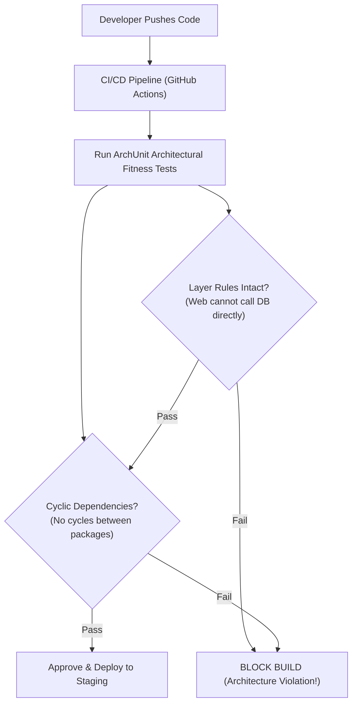

# 03. Architecture Decisions (ADRs), Governance & Fitness Functions

This chapter covers tools and techniques for documenting architectural choices (ADRs), automating governance via **Fitness Functions**, and conducting architectural risk analysis.

---

## 📝 Architecture Decision Records (ADRs)

An **ADR** is a lightweight document describing an architecture decision, its rationale, and its trade-off consequences.

### 📄 Standard ADR Document Template

```markdown
# ADR-005: Adopt Kafka for Asynchronous Order Event Streaming

## Status
Accepted (2026-09-14)

## Context
Our monolithic REST order service experiences thundering-herd availability outages during peak sales events. Upstream HTTP synchronous calls block web app worker threads.

## Decision
We will transition from synchronous HTTP REST calls between Order, Payment, and Inventory services to an Asynchronous Event-Driven Architecture using Apache Kafka.

## Consequences
### Positive:
- Decouples microservice execution, preventing cascading HTTP thread exhaustion.
- Enables independent horizontal scaling of payment and notification consumer workers.

### Negative:
- Introduces eventual consistency (requires Saga Orchestration for compensation).
- Requires operational monitoring of Kafka broker clusters and consumer lag metrics.
```

---

## 🧪 Automated Fitness Functions (ArchUnit in CI/CD)

An **Architectural Fitness Function** is an automated mechanism used to evaluate architectural characteristics and prevent architectural drift in CI/CD pipelines.



---

## ☕ Production Java Implementation: ArchUnit Architecture Fitness Test Suite

```java
package com.example.architecture.governance;

import com.tngtech.archunit.core.domain.JavaClasses;
import com.tngtech.archunit.core.importer.ClassFileImporter;
import com.tngtech.archunit.lang.ArchRule;

import static com.tngtech.archunit.lang.syntax.ArchRuleDefinition.classes;
import static com.tngtech.archunit.lang.syntax.ArchRuleDefinition.noClasses;
import static com.tngtech.archunit.library.ArchitecturalRules.assertNoCycles;
import static com.tngtech.archunit.library.DependenciesRuleDefinition.noClassesThat;

/**
 * Automated Architectural Fitness Function Suite using ArchUnit.
 */
public class ArchitectureFitnessTestSuite {

    public static void runFitnessTests(String rootPackage) {
        JavaClasses importedClasses = new ClassFileImporter().importPackages(rootPackage);

        System.out.println("[FITNESS FUNCTION] Executing Architectural Governance Suite...");

        // 1. Layered Architecture Constraint: Controller cannot access Repository directly
        ArchRule layeredRule = noClasses().that().resideInAPackage("..controller..")
                .should().accessClassesThat().resideInAPackage("..repository..");
        layeredRule.check(importedClasses);
        System.out.println("  ✓ PASS: Controller -> Repository direct access forbidden.");

        // 2. Package Dependency Cycle Constraint: Prevent circular dependencies across packages
        ArchRule noCyclesRule = slices().matching("com.example.(*)..").should().beFreeOfCycles();
        noCyclesRule.check(importedClasses);
        System.out.println("  ✓ PASS: Zero cyclic package dependencies detected.");

        // 3. Naming Convention Constraint: Interfaces should not have 'I' prefix
        ArchRule interfaceNamingRule = classes().that().areInterfaces()
                .should().haveSimpleNameNotStartingWith("I");
        interfaceNamingRule.check(importedClasses);
        System.out.println("  ✓ PASS: Interface naming conventions verified.");

        System.out.println("[FITNESS FUNCTION] All Architectural Guardrails PASSED!");
    }

    // Helper for slice cycle checking
    private static com.tngtech.archunit.library.dependencies.SlicesRuleDefinition slices() {
        return com.tngtech.archunit.library.dependencies.SlicesRuleDefinition.slices();
    }
}
```
