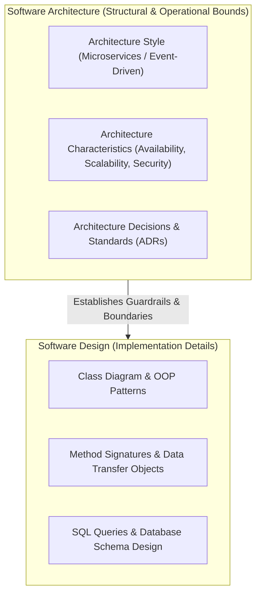

# Fundamentals of Software Architecture

A production-grade masterclass on software architecture principles, architectural characteristics ("-ilities"), architecture styles, decision governance (ADRs), and automated fitness functions. Based on Mark Richards and Neal Ford's landmark book *Fundamentals of Software Architecture*.

---

## 📐 Table of Contents

| Section | Subject | Key Concepts |
| :--- | :--- | :--- |
| **00. Cheatsheet** | [Architecture Cheatsheet](00_architecture_cheatsheet.md) | Architecture Styles Decision Matrix, Architecture Characteristics Taxonomy ("-ilities"), Coupling & Distance from Main Sequence Formulas |
| **01. Foundations & Characteristics** | [Architectural Thinking & Characteristics](01_foundations_and_characteristics/01_architectural_thinking_and_characteristics.md) | Software Architecture vs Design, 4 Expectations of an Architect, Measuring Characteristics, Afferent ($C_a$) / Efferent ($C_e$) Coupling & Instability ($I$) |
| **02. Architectural Styles** | [Monolithic, Event-Driven & Microservices](02_architectural_styles/02_monolithic_event_driven_and_microservices_styles.md) | Monolithic Styles (Layered, Pipeline, Microkernel/Plugin) vs Distributed Styles (Service-Based, Event-Driven Broker/Mediator, Space-Based, Microservices) |
| **03. Governance & Techniques** | [ADRs, Fitness Functions & Risk Analysis](03_techniques_and_governance/03_adrs_fitness_functions_and_risk_analysis.md) | Architecture Decision Records (ADR format), Automated Fitness Function Testing (ArchUnit), Architecture Risk Matrix & Storming |

---

## 🏛️ Architecture vs Design

---

## 🎯 The 4 Core Expectations of a Software Architect

1. **Make Architecture Decisions**: Guide technology choices and define architectural guardrails rather than dictating implementation code.
2. **Continually Analyze the Architecture**: Measure structural integrity, coupling, and evolutionary characteristics via automated **Fitness Functions**.
3. **Keep Abreast of Latest Trends**: Balance technology innovation with pragmatic business risk.
4. **Possess Domain Experience**: Bridge technical decisions with business domain outcomes and stakeholder negotiations.
