# 00. High-Throughput Data Pipelines Cheatsheet

A high-density reference guide summarizing stream processing engines, storage formats, SerDe benchmarks, and windowing math.

---

## ⚡ Serialization & Data Format Performance Benchmarks

| Format | Format Type | Schema Enforcement | Compression Ratio | SerDe Latency | Best Use Case |
| :--- | :--- | :--- | :--- | :--- | :--- |
| **JSON** | Text / Row | None (Ad-hoc) | Low (1x) | High (Text parsing) | Public REST APIs, Debugging |
| **Protocol Buffers** | Binary / Row | Strict (`.proto`) | High (~4x) | Low (Binary struct) | Microservice RPCs (gRPC), Internal messages |
| **Apache Avro** | Binary / Row | Schema Registry | Very High (~6x) | Low (No field tags) | Kafka Event Streaming |
| **Apache Parquet** | Binary / Columnar | Embedded Metadata | Maximum (~10x) | Medium (Column chunk read) | Data Lakehouse OLAP, Spark/DuckDB batch queries |

---

## 🪟 Stream Windowing Cheatsheet

```mermaid
gantt
    title Stream Windowing Taxonomies
    dateFormat ss
    axisFormat %S

    section 1. Tumbling Window (Non-overlapping, Fixed 10s)
    Window 1 [00s - 10s] :active, w1, 00, 10
    Window 2 [10s - 20s] :active, w2, 10, 20

    section 2. Sliding Window (Overlapping, Size 10s, Slide 5s)
    Window A [00s - 10s] :active, wa, 00, 10
    Window B [05s - 15s] :active, wb, 05, 15
    Window C [10s - 20s] :active, wc, 10, 20

    section 3. Session Window (Dynamic, Inactivity Gap 5s)
    Session 1 (User Activity) :crit, s1, 02, 08
    Inactivity Gap           :done, g1, 08, 13
    Session 2 (New Activity)  :crit, s2, 14, 22
```

### Window Mathematical Definitions
1. **Tumbling Window**: Partitioned by fixed duration $W$. Every event belongs to exactly 1 window:
   $$\text{WindowStart} = t - (t \pmod W)$$
2. **Sliding Window**: Defined by duration $W$ and slide interval $S$. An event at time $t$ belongs to $\lfloor W / S \rfloor$ windows.
3. **Session Window**: Defined by inactivity gap threshold $G$. Windows expand dynamically until no event arrives for $G$ seconds.

---

## 📊 Stream Engine & Storage Comparison Matrix

| Component | Category | Throughput | Latency | State Management | Fault Tolerance Mechanism |
| :--- | :--- | :--- | :--- | :--- | :--- |
| **Apache Kafka** | Streaming Log | 1M+ msg/sec/node | < 10ms | File Segment Log | ISR Replicas & Raft/KRaft |
| **Apache Flink** | Stream Engine | Millions events/sec | < 5ms (Event-at-a-time) | RocksDB State Backend | Chandy-Lamport Checkpointing |
| **Spark Streaming** | Micro-Batch | Millions events/sec | 100ms - 500ms | In-Memory RDDs | RDD Lineage & WAL Checkpointing |
| **ClickHouse** | Columnar OLAP | Billions rows/sec | Sub-second queries | MergeTree Engine | ReplicatedMergeTree (Raft/ZooKeeper) |
