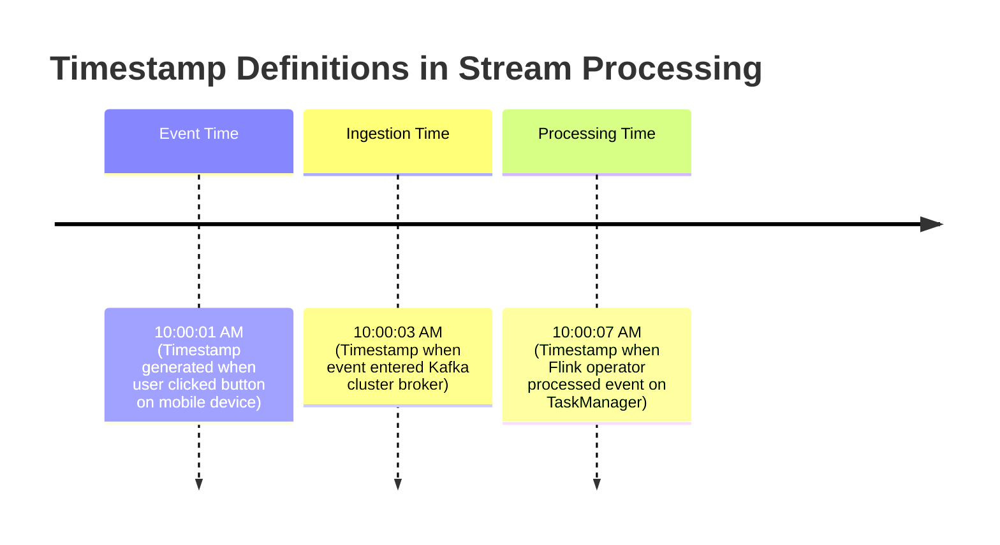

# 01. Kafka Tuning, Flink Streaming & Windowing

This chapter covers high-throughput event ingestion with Apache Kafka, stream processing execution DAGs in Apache Flink, event time semantics, and windowing operations.

---

## ⚙️ Apache Kafka Producer High-Throughput Tuning

To achieve **1 Million+ msgs/sec** per node, tuning Kafka Producer batching parameters is critical:

```properties
# Production High-Throughput Kafka Producer Properties
bootstrap.servers=kafka-node1:9092,kafka-node2:9092,kafka-node3:9092
key.serializer=org.apache.kafka.common.serialization.StringSerializer
value.serializer=org.apache.kafka.common.serialization.ByteArraySerializer

# Batching Configurations
batch.size=131072               # 128 KB batch size (default 16KB)
linger.ms=20                    # Wait up to 20ms to fill batch before sending
max.in.flight.requests.per.connection=5

# Compression & Memory
compression.type=snappy         # High compression ratio with minimal CPU overhead
buffer.memory=67108864          # 64 MB producer buffer space

# Durability Guarantees
acks=1                          # Leader ACK (use acks=all for zero data loss)
retries=10
retry.backoff.ms=100
```

---

## 🌊 Apache Flink Stream Execution Topology

```mermaid
flowchart TD
    subgraph JobManager ["Flink JobManager (Master)"]
        GraphBuilder["ExecutionGraph Builder"]
        CheckpointScheduler["Checkpoint Coordinator"]
    end

    subgraph TaskManager1 ["TaskManager 1 (Worker)"]
        Slot1["Task Slot 1: Source -> Watermark -> Map"]
        Slot2["Task Slot 2: KeyBy -> Window Aggregator"]
    end

    subgraph TaskManager2 ["TaskManager 2 (Worker)"]
        Slot3["Task Slot 3: KeyBy -> Window Aggregator"]
        Slot4["Task Slot 4: Sink (ClickHouse 2PC / Parquet S3)"]
    end

    GraphBuilder --> TaskManager1
    GraphBuilder --> TaskManager2
    Slot1 -->|Network Shuffle (KeyBy)| Slot2 & Slot3
    Slot2 --> Slot4
    Slot3 --> Slot4
```

---

## ☕ Production Java Implementation: Flink Window Aggregator with Bounded Watermarks

```java
package com.example.pipeline.streaming;

import java.io.Serializable;
import java.time.Duration;
import java.util.Objects;

/**
 * Event Data Structure containing timestamp payload.
 */
public record UserClickEvent(
    String userId,
    String pageId,
    long timestampMillis,
    long clickDurationMs
) implements Serializable {}

/**
 * Windowed Aggregation Result DTO.
 */
public record WindowedUserMetrics(
    String userId,
    long windowStart,
    long windowEnd,
    long totalClicks,
    long totalDurationMs
) implements Serializable {}

/**
 * Mock Flink DataStream Pipeline showcasing Bounded Out-of-Orderness Watermarking & Tumbling Window Aggregation.
 */
public class StreamWindowPipeline {

    public static WindowedUserMetrics aggregateWindow(
            String userId,
            long windowStart,
            long windowEnd,
            Iterable<UserClickEvent> events) {

        long clickCount = 0;
        long totalDuration = 0;

        for (UserClickEvent event : events) {
            clickCount++;
            totalDuration += event.clickDurationMs();
        }

        return new WindowedUserMetrics(userId, windowStart, windowEnd, clickCount, totalDuration);
    }

    /**
     * Watermark Strategy Generator: Allows up to 5 seconds out-of-order event arrivals.
     */
    public static class BoundedOutOfOrdernessWatermarkGenerator {
        private final long maxOutOfOrdernessMillis;
        private long currentMaxTimestamp;

        public BoundedOutOfOrdernessWatermarkGenerator(Duration maxOutOfOrderness) {
            this.maxOutOfOrdernessMillis = maxOutOfOrderness.toMillis();
            this.currentMaxTimestamp = Long.MIN_VALUE + maxOutOfOrdernessMillis;
        }

        public void onEvent(UserClickEvent event) {
            currentMaxTimestamp = Math.max(currentMaxTimestamp, event.timestampMillis());
        }

        public long extractWatermark() {
            // Watermark timestamp = Max Event Time seen - Out-of-Orderness bound
            return currentMaxTimestamp - maxOutOfOrdernessMillis - 1;
        }
    }
}
```

---

## ⏱️ Event Time vs Processing Time vs Ingestion Time



| Time Characteristic | Definition | Handles Network Delays / Replay? | Consistency Guarantee |
| :--- | :--- | :--- | :--- |
| **Event Time** | Time event actually occurred on client device. | **Yes** (Identical results when replaying stream) | Deterministic & Correct |
| **Ingestion Time** | Time event entered Kafka broker log. | Moderate (Fixed upon log append) | Non-deterministic across re-ingest |
| **Processing Time** | System wall-clock time on processing node. | **No** (Vulnerable to GC pauses & latency spikes) | Non-deterministic |
