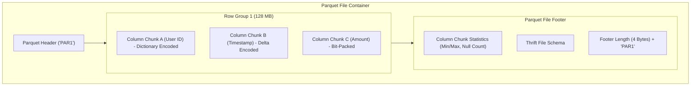
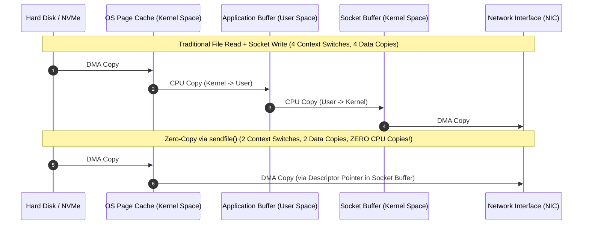

# 02. Parquet Columnar Storage & Zero-Copy I/O

This chapter covers high-throughput storage format internals (Apache Parquet), columnar compression encodings (RLE, Dictionary), off-heap DirectByteBuffers, and Linux kernel **Zero-Copy** I/O primitives (`sendfile`/`splice`).

---

## 📦 Apache Parquet Columnar File Layout

Unlike row-oriented formats (CSV / JSON) that store data record-by-record, **Apache Parquet** groups rows into **Row Groups** (128MB–1GB) and stores data vertically by column.



### ⚡ Why Columnar Storage Optimizes Analytical (OLAP) Queries:
1. **I/O Projection Pruning**: A query like `SELECT SUM(amount) FROM sales` reads **only** Column Chunk C from disk, skipping 90%+ of irrelevant row data.
2. **Predicate Pushdown**: File Footer statistics (Min/Max values per Column Chunk Page) allow queries like `WHERE amount > 1000` to skip entire Row Groups without scanning data.
3. **High Compression Ratios**: Homogeneous column data compresses up to 10x using Run-Length Encoding (RLE), Bit-Packing, and Snappy/ZSTD.

---

## ⚡ Linux Kernel Zero-Copy I/O (`sendfile`)

Traditional file transfer moves data across the user-kernel boundary 4 times and performs 4 context switches. **Zero-Copy** via `sendfile()` transfers data directly from the OS page cache to the network socket buffer in kernel space.



---

## ☕ Production Java Implementation: Zero-Copy File Channel & Off-Heap DirectByteBuffer

```java
package com.example.pipeline.io;

import java.io.File;
import java.io.RandomAccessFile;
import java.nio.ByteBuffer;
import java.nio.channels.FileChannel;
import java.nio.channels.SocketChannel;
import java.net.InetSocketAddress;

/**
 * Production Zero-Copy File Transfer & Off-Heap DirectByteBuffer Pipeline.
 */
public class ZeroCopyFilePipeline {

    /**
     * Transfers a large file over TCP network socket using Linux Kernel Zero-Copy sendfile() (FileChannel.transferTo).
     */
    public static long transferFileZeroCopy(File sourceFile, String targetHost, int targetPort) throws Exception {
        try (RandomAccessFile file = new RandomAccessFile(sourceFile, "r");
             FileChannel fileChannel = file.getChannel();
             SocketChannel socketChannel = SocketChannel.open()) {

            socketChannel.connect(new InetSocketAddress(targetHost, targetPort));
            socketChannel.configureBlocking(true);

            long fileSize = fileChannel.size();
            long totalBytesTransferred = 0;

            // Zero-Copy Kernel Transfer (sendfile syscall)
            while (totalBytesTransferred < fileSize) {
                long bytesSent = fileChannel.transferTo(
                    totalBytesTransferred,
                    fileSize - totalBytesTransferred,
                    socketChannel
                );
                totalBytesTransferred += bytesSent;
            }

            System.out.printf("[ZERO-COPY] Transferred %d bytes directly from Kernel PageCache to NIC.%n", totalBytesTransferred);
            return totalBytesTransferred;
        }
    }

    /**
     * Allocates off-heap native memory (DirectByteBuffer) bypassing JVM Garbage Collection overhead.
     */
    public static ByteBuffer allocateOffHeapBuffer(int capacityBytes) {
        // Allocates direct memory outside JVM heap heap space (not subject to GC pauses)
        ByteBuffer directBuffer = ByteBuffer.allocateDirect(capacityBytes);
        System.out.printf("[OFF-HEAP] Allocated %d bytes of Direct Off-Heap Native Memory.%n", capacityBytes);
        return directBuffer;
    }
}
```
