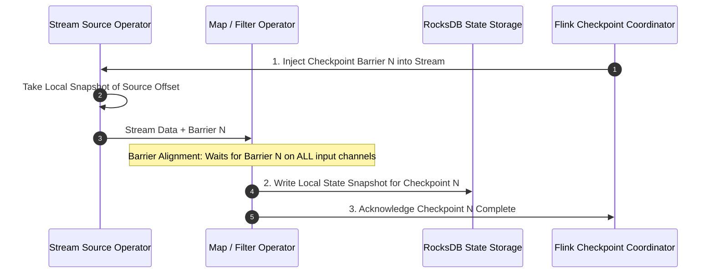
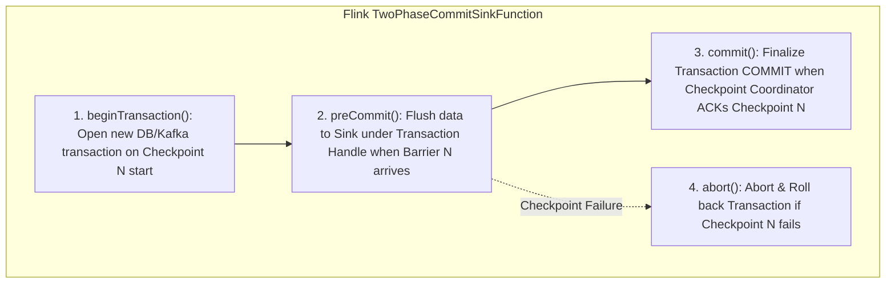
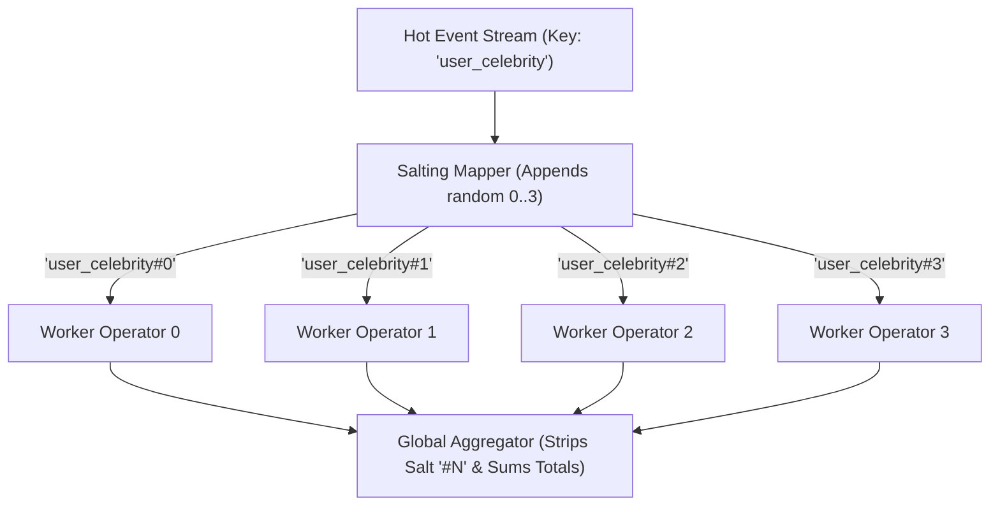

# 03. Watermarks, Checkpointing & Exactly-Once Semantics

This chapter details stateful stream fault tolerance: the Chandy-Lamport distributed snapshot algorithm, Apache Flink Two-Phase Commit (2PC) sinks for end-to-end exactly-once processing, reactive backpressure, and key salting techniques for mitigating partition skew.

---

## 📸 Chandy-Lamport Distributed Snapshot Algorithm

To recover from worker crashes without re-processing the entire stream from time zero, stream engines use **Checkpoint Barriers** injected into the stream flow.



---

## 🤝 End-to-End Exactly-Once Processing (Flink 2PC Sink)

Achieving end-to-end exactly-once semantics requires:
1. **Replayable Source**: Apache Kafka (Consumer offsets replayed to checkpoint ID).
2. **Stateful Stream Engine**: Flink Chandy-Lamport Checkpointing.
3. **Transactional Sink**: Two-Phase Commit (2PC) Sink (e.g. Kafka Producer Transaction or Database 2PC).



---

## 🌶️ Mitigating Data Skew: Key Salting & Un-salting Algorithm

When a specific key (e.g. `user_id="celebrity"`) receives 90%+ of stream traffic, single TaskManager operators become CPU/memory bottlenecks (**Partition Skew**).

**Key Salting** appends a random integer salt $0..S-1$ to high-cardinality hot keys before grouping, spreading processing evenly across parallel operators, and un-salts during global aggregation.



---

## 🐍 Production Python Implementation: Stream Key Salting & Skew Mitigator

```python
import random
from typing import Dict, List, Tuple, Any

class KeySaltingStreamProcessor:
    """Production Key Salting & Un-salting Engine for high-throughput skew mitigation."""

    def __init__(self, salt_factor: int = 4):
        self.salt_factor = salt_factor
        self.partial_counts: Dict[str, int] = {}

    def salt_key(self, raw_key: str) -> str:
        """Appends a random salt suffix between 0 and (salt_factor - 1)."""
        random_salt = random.randint(0, self.salt_factor - 1)
        return f"{raw_key}#{random_salt}"

    def extract_raw_key(self, salted_key: str) -> str:
        """Strips the salt suffix to recover the original raw key."""
        return salted_key.split("#")[0]

    def process_incoming_event(self, raw_key: str, value: int):
        """Simulates parallel worker node processing salted keys."""
        salted_key = self.salt_key(raw_key)
        
        # Parallel worker update
        self.partial_counts[salted_key] = self.partial_counts.get(salted_key, 0) + value

    def aggregate_unsalted_results(self) -> Dict[str, int]:
        """Global reducer that un-salts keys and merges partial aggregations."""
        global_results: Dict[str, int] = {}
        for salted_key, count in self.partial_counts.items():
            raw_key = self.extract_raw_key(salted_key)
            global_results[raw_key] = global_results.get(raw_key, 0) + count
        return global_results


# Demonstration
if __name__ == "__main__":
    processor = KeySaltingStreamProcessor(salt_factor=4)

    # Simulate 100,000 events for a hot key ('celebrity_post')
    for _ in range(100000):
        processor.process_incoming_event("celebrity_post", 1)

    print(f"[SALTING] Partition Partial Counts (Distributed across 4 workers):")
    for k, v in processor.partial_counts.items():
        print(f"  Worker Bucket '{k}': {v} events")

    global_totals = processor.aggregate_unsalted_results()
    print(f"[UNSALTING] Final Aggregated Count for 'celebrity_post': {global_totals['celebrity_post']}")
```

---

## 🌊 Reactive Streams Backpressure & Flow Control

When downstream sinks (e.g. Database / ElasticSearch) cannot keep pace with upstream stream velocity:
1. **Credit-Based Flow Control**: Downstream task managers grant explicit "credits" (buffer capacity) to upstream producers. Producers only send data when credits > 0.
2. **Buffer Pool Exhaustion**: When downstream buffers fill, upstream operators block, cascading backpressure all the way to Kafka Consumer source operators, which pause pulling from Kafka.
