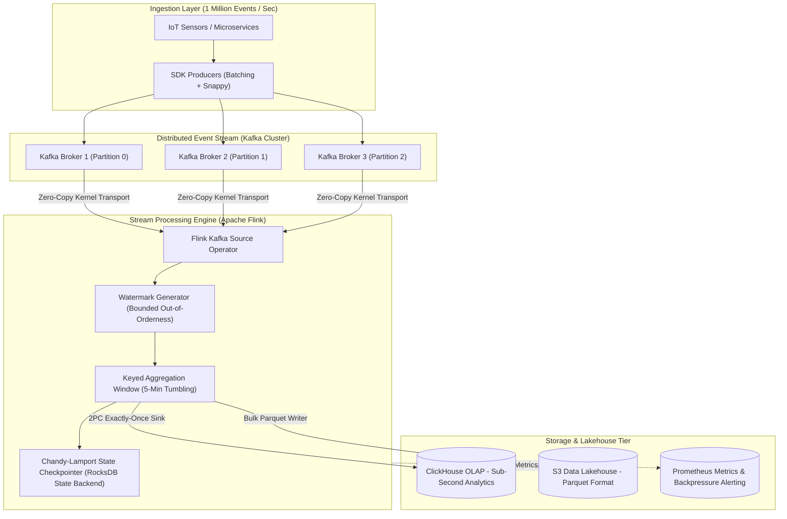
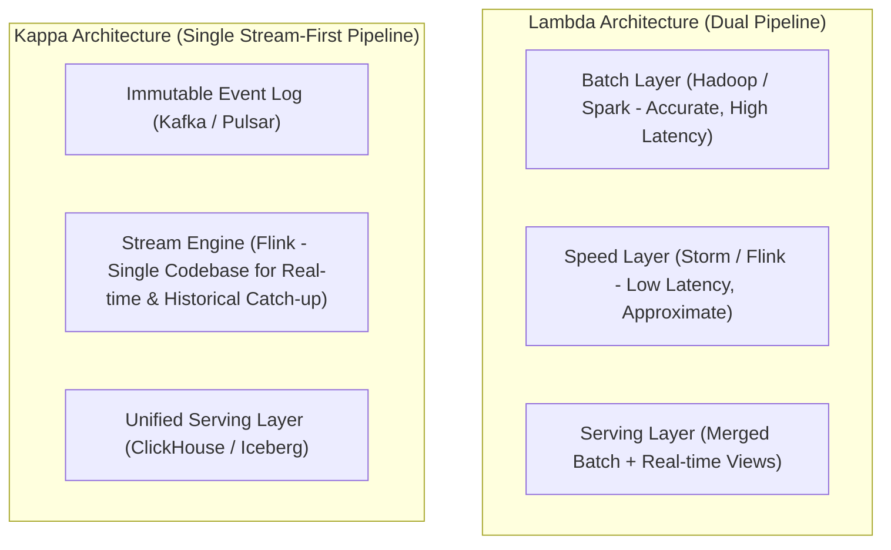

# High-Throughput Data Pipelines

A production-grade masterclass on architecting, implementing, and operating high-throughput stream and batch data processing pipelines. Covers 1M+ QPS ingestion, stream processing (Kafka, Flink, Spark), columnar storage formats (Parquet/Avro), zero-copy I/O, Chandy-Lamport checkpointing, exactly-once semantics, and backpressure management.

---

## 📐 Table of Contents

| Section | Subject | Key Concepts |
| :--- | :--- | :--- |
| **00. Cheatsheet** | [Pipeline Cheatsheet](00_pipeline_cheatsheet.md) | Lambda vs Kappa Architecture Comparison, SerDe Benchmark Table, Windowing Cheat Sheet, Watermark Formulas |
| **01. Ingestion & Streaming** | [Kafka, Flink & Windowing](01_ingestion_and_streaming/01_kafka_flink_and_windowing.md) | High-throughput Kafka tuning (batch.size, linger.ms, compression), Flink stream execution DAG, Tumbling/Sliding/Session Windows |
| **02. Storage & Compression** | [Parquet, Columnar & Zero-Copy](02_storage_formats_and_compression/02_parquet_columnar_and_zero_copy.md) | Row-based vs Columnar storage, Parquet Page Layout (Dictionary, Bit-packing, RLE), Linux Kernel Zero-Copy (`sendfile`/`splice`), DirectByteBuffer |
| **03. Fault Tolerance & Exactly-Once** | [Watermarks, Checkpoints & Exactly-Once](03_fault_tolerance_and_exactly_once/03_watermarks_checkpoints_and_exactly_once.md) | Chandy-Lamport Distributed Snapshots, Flink 2PC Sink (`TwoPhaseCommitSinkFunction`), Reactive Streams Backpressure, Key Salting for Skew |

---

## 🏗️ 1 Million QPS High-Throughput Pipeline Architecture

---

## 🏛️ Lambda Architecture vs Kappa Architecture

| Architecture | Pipeline Topology | Codebase Maintenance | Replay Capability | Primary Disadvantage |
| :--- | :--- | :--- | :--- | :--- |
| **Lambda** | Dual (Batch + Speed) | High (2 separate codebases) | Excellent | Logic drift between batch and real-time streams |
| **Kappa** | Single (Stream-only) | Low (1 unified codebase) | Excellent (Replay Kafka log) | Requires stream engine capable of historical backfill |
