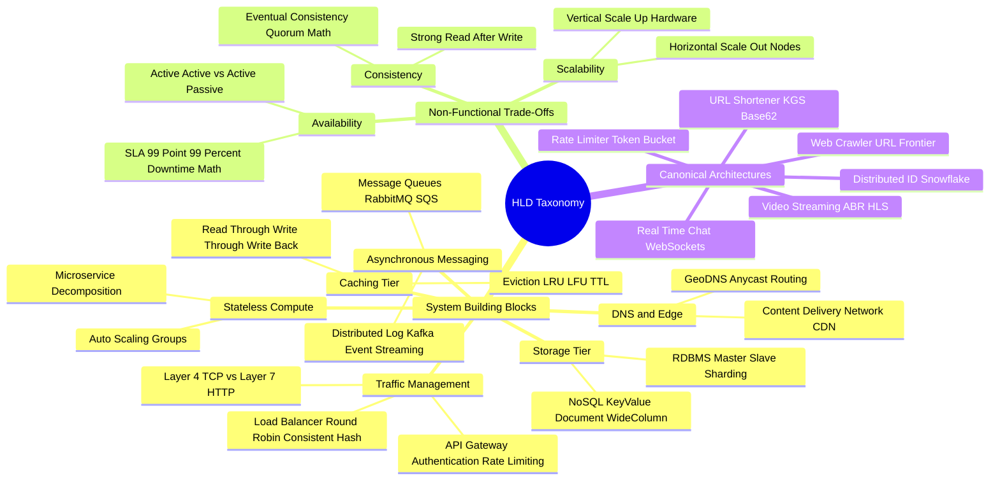

# High-Level System Design (HLD) Mind Map

This document presents a structured visual breakdown of distributed system design components, architectural patterns, and scalability bottlenecks.

---

## 1. Visual Taxonomy

---

## 2. Component Reference Table

| Component | Primary Function | Failure Modes & Scaling Bottlenecks |
| :--- | :--- | :--- |
| **API Gateway** | Request routing, SSL termination, authentication, rate limiting | Single point of failure if not deployed in multi-region active-active clusters |
| **Load Balancer** | Distributes incoming HTTP/TCP traffic across application nodes | Connection exhaustion on Layer 7 proxies during sudden traffic surges |
| **Redis Cache** | Sub-millisecond in-memory read acceleration | Cache stampede / thundering herd on key expiration; Out-Of-Memory (OOM) eviction |
| **Message Queue (Kafka)** | Decouples synchronous API calls via asynchronous pub/sub | Consumer group lag during spike events; partition skew |
| **Database Sharding** | Partitions relational tables across multiple database nodes | Cross-shard JOIN operations and distributed 2PC transaction overhead |
| **CDN (Edge)** | Caches static assets (images, video segments) near users | High cache miss penalty; purge synchronization latency |
