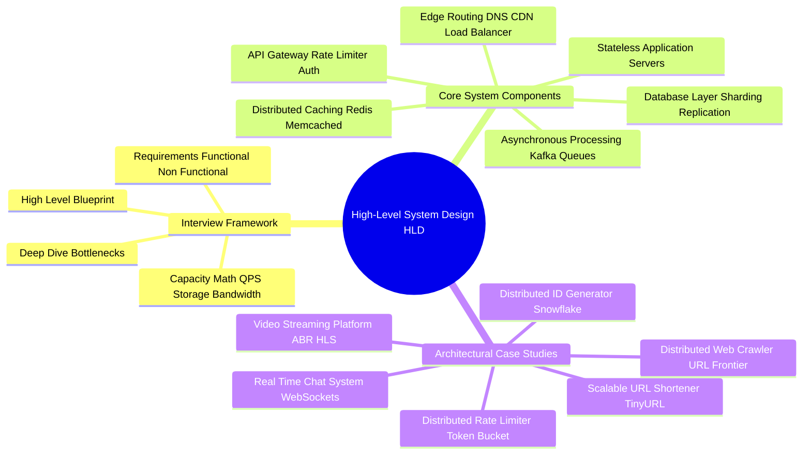

# High-Level System Design (HLD) Technical Study Guide

Welcome to the **High-Level System Design (HLD) Technical Study Guide**. This repository contains deep-dive chapters covering the canonical 4-Step System Design Interview Framework, back-of-the-envelope capacity estimation, distributed trade-offs, and 6 complete production system design architectures (Distributed ID Generator, Rate Limiter, URL Shortener, Distributed Web Crawler, Real-Time Chat System, and Video Streaming Platform).

---

## 1. Executive Summary & The 4-Step Interview Framework

High-Level System Design (HLD) interviews evaluate a candidate's ability to architect scalable, resilient, fault-tolerant distributed systems under real-world traffic and business constraints.

```
 The 4-Step System Design Interview Workflow:
 1. Requirements Clarification & Scope (Functional vs Non-Functional, SLAs/SLOs)
 2. Back-of-the-Envelope Capacity Estimation (QPS, Storage 5-yr, Network Gbps, RAM cache)
 3. High-Level Architecture Blueprint (Clients, CDN, Load Balancers, Gateways, App Servers, Storage)
 4. Deep Dive & Bottleneck Resolution (DB Sharding, Caching, Auto-scaling, Failover, Monitoring)
```

---

## 2. Interactive Architecture Mind Map



---

## 3. Study Guide Chapter Index

| Chapter | Title | Focus Areas |
| :--- | :--- | :--- |
| **[00: Recommended Resources](00_Recommended_Books_and_Resources.md)** | Reading List & Reference Material | Books (*System Design Interview Vol 1 & 2*, *DDIA*), ByteByteGo, High Scalability |
| **[00: Architecture Mind Map](00_HLD_MindMap.md)** | Interactive Taxonomy | Full visual breakdown of Load Balancers, Caching, Sharding, and Messaging |
| **[Chapter 1](01_system_design_interview_framework.md)** | 4-Step Interview Framework & Estimation Math | Functional vs Non-Functional, 99.99% availability math, QPS, 80/20 RAM cache rule |
| **[System Design 1](02_distributed_id_generator_snowflake.md)** | Distributed ID Generator (Snowflake) | 64-bit ID layout, 41-bit timestamp epoch, worker node bits, sequence counter, clock drift |
| **[System Design 2](03_distributed_rate_limiter.md)** | Distributed Rate Limiter | Token Bucket vs Leaky Bucket vs Sliding Window Counter, Redis + Lua scripts, HTTP 429 |
| **[System Design 3](04_url_shortener_tinyurl.md)** | Scalable URL Shortener (TinyURL) | Base62 encoding vs Key Generation Service (KGS), 301 vs 302 redirects, DB sharding |
| **[System Design 4](05_distributed_web_crawler.md)** | Distributed Web Crawler | URL Frontier (Priority + Politeness queues), Fetchers, DNS cache, SimHash deduplication |
| **[System Design 5](06_chat_messaging_system_whatsapp.md)** | Real-Time Chat System (WhatsApp / Slack) | WebSockets vs Long Polling, Cassandra message history, Redis presence, Push notifications |
| **[System Design 6](07_video_streaming_youtube.md)** | Video Streaming Platform (YouTube / Netflix) | Adaptive Bitrate Streaming (ABR), Transcoding DAG pipeline, HLS/MPEG-DASH, Multi-CDN |

---

## 4. Quick Links & Navigation

* Return to [Master Repository Index](../README.md)
* Next Chapter: **[Chapter 1: The 4-Step System Design Interview Framework](01_system_design_interview_framework.md)**
