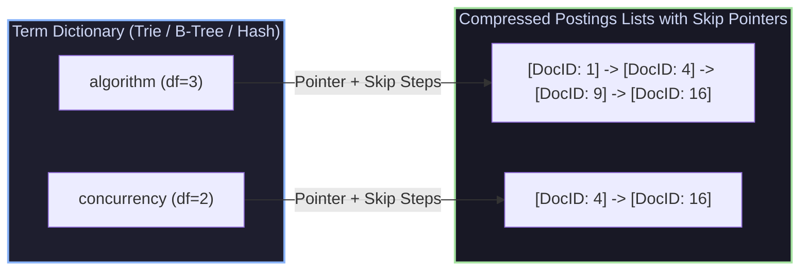

# Inverted Index Architecture, Index Compression & Skip Pointers

## 1. Inverted Index Architecture & Postings Lists

An **Inverted Index** maps terms to the list of documents (and exact word offset positions) containing those terms.



### 1.1 Skip Pointers Acceleration
Standard postings list intersection takes $O(P_1 + P_2)$ comparisons. Adding **Skip Pointers** every $S = \lceil \sqrt{P} \rceil$ entries allows skipping large blocks of non-matching DocIDs during `AND` boolean queries:

```
Postings List: [ 3 ] -------> [ 16 ] -------> [ 42 ] -------> [ 89 ]
                 |              |              |              |
                v              v              v              v
               [ 3, 5, 8, 12 ] [ 16, 21, 30 ] [ 42, 50, 71 ] [ 89, 95, 102 ]
```

When matching against target DocID $45$:
1. Check Skip Pointer $16 \le 45 \implies$ Advance to $16$.
2. Check Skip Pointer $42 \le 45 \implies$ Advance to $42$.
3. Check Skip Pointer $89 > 45 \implies$ Stop skipping! Search linearly inside the block starting at $42$.

---

## 2. Inverted Index Compression Codecs

Uncompressed 32-bit integer postings require massive RAM and disk storage. **$d$-gap encoding** replaces absolute DocIDs with relative differences ($d_i = \text{DocID}_i - \text{DocID}_{i-1}$), allowing compact variable-length byte codecs:

### 2.1 Variable Byte (VB) Codec
Encodes integers using a variable number of 8-bit bytes. The highest bit (bit 7) serves as a continuation flag:

```cpp
// Variable Byte Encoding Primitive
void EncodeVB(uint32_t val, std::vector<uint8_t>& bytes) {
    while (true) {
        uint8_t byte = val % 128;
        if (val < 128) {
            bytes.push_back(byte); // High bit 0 terminates byte sequence
            break;
        } else {
            bytes.push_back(byte | 0x80); // High bit 1 indicates more bytes follow
            val /= 128;
        }
    }
}
```

---

## 3. Production-Grade C++ Engine: Compressed Inverted Index with Skip Pointers

The following C++ engine builds a compressed inverted index with $d$-gap Variable Byte encoding and Skip-Pointer posting intersection:

```cpp
#include <iostream>
#include <vector>
#include <string>
#include <unordered_map>
#include <cmath>
#include <algorithm>

class VariableByteCodec {
public:
    static std::vector<uint8_t> Encode(const std::vector<uint32_t>& numbers) {
        std::vector<uint8_t> stream;
        for (uint32_t n : numbers) {
            while (true) {
                uint8_t byte = n & 0x7F;
                if (n < 128) {
                    stream.push_back(byte);
                    break;
                } else {
                    stream.push_back(byte | 0x80);
                    n >>= 7;
                }
            }
        }
        return stream;
    }

    static std::vector<uint32_t> Decode(const std::vector<uint8_t>& stream) {
        std::vector<uint32_t> numbers;
        uint32_t current = 0;
        int shift = 0;

        for (uint8_t byte : stream) {
            if ((byte & 0x80) == 0) {
                current |= (static_cast<uint32_t>(byte) << shift);
                numbers.push_back(current);
                current = 0;
                shift = 0;
            } else {
                current |= (static_cast<uint32_t>(byte & 0x7F) << shift);
                shift += 7;
            }
        }
        return numbers;
    }
};

struct SkipPointer {
    size_t doc_index; // Index in uncompressed array
    uint32_t doc_id;
};

class CompressedInvertedIndex {
private:
    struct IndexEntry {
        std::vector<uint8_t> compressed_dgaps;
        std::vector<SkipPointer> skips;
        uint32_t doc_frequency = 0;
    };

    std::unordered_map<std::string, IndexEntry> dictionary;

public:
    void AddTerm(const std::string& term, const std::vector<uint32_t>& doc_ids) {
        if (doc_ids.empty()) return;

        IndexEntry entry;
        entry.doc_frequency = doc_ids.size();

        // 1. Calculate d-gaps
        std::vector<uint32_t> dgaps;
        dgaps.push_back(doc_ids[0]);
        for (size_t i = 1; i < doc_ids.size(); ++i) {
            dgaps.push_back(doc_ids[i] - doc_ids[i - 1]);
        }

        // 2. Compress d-gaps via Variable Byte Codec
        entry.compressed_dgaps = VariableByteCodec::Encode(dgaps);

        // 3. Generate Skip Pointers every sqrt(P) entries
        size_t skip_interval = static_cast<size_t>(std::sqrt(doc_ids.size()));
        if (skip_interval > 1) {
            for (size_t i = 0; i < doc_ids.size(); i += skip_interval) {
                entry.skips.push_back({i, doc_ids[i]});
            }
        }

        dictionary[term] = entry;
    }

    std::vector<uint32_t> IntersectAND(const std::string& term1, const std::string& term2) {
        if (dictionary.find(term1) == dictionary.end() || dictionary.find(term2) == dictionary.end()) {
            return {};
        }

        // Decode d-gaps back to DocIDs
        std::vector<uint32_t> dgaps1 = VariableByteCodec::Decode(dictionary[term1].compressed_dgaps);
        std::vector<uint32_t> dgaps2 = VariableByteCodec::Decode(dictionary[term2].compressed_dgaps);

        std::vector<uint32_t> p1(dgaps1.size()), p2(dgaps2.size());
        p1[0] = dgaps1[0]; for (size_t i = 1; i < dgaps1.size(); ++i) p1[i] = p1[i-1] + dgaps1[i];
        p2[0] = dgaps2[0]; for (size_t i = 1; i < dgaps2.size(); ++i) p2[i] = p2[i-1] + dgaps2[i];

        // Skip Pointer Intersect
        std::vector<uint32_t> result;
        size_t i = 0, j = 0;
        const auto& skips1 = dictionary[term1].skips;

        while (i < p1.size() && j < p2.size()) {
            if (p1[i] == p2[j]) {
                result.push_back(p1[i]);
                i++; j++;
            } else if (p1[i] < p2[j]) {
                // Try skip pointer advance on p1
                bool skipped = false;
                for (const auto& skip : skips1) {
                    if (skip.doc_index > i && skip.doc_id <= p2[j]) {
                        i = skip.doc_index;
                        skipped = true;
                    }
                }
                if (!skipped) i++;
            } else {
                j++;
            }
        }
        return result;
    }
};

int main() {
    CompressedInvertedIndex index;

    std::vector<uint32_t> postings_algo = {2, 5, 10, 15, 20, 45, 80, 100};
    std::vector<uint32_t> postings_search = {5, 15, 45, 90, 100};

    index.AddTerm("algorithm", postings_algo);
    index.AddTerm("search", postings_search);

    std::vector<uint32_t> match = index.IntersectAND("algorithm", "search");

    std::cout << "Matching DocIDs for ('algorithm' AND 'search'): [ ";
    for (uint32_t id : match) std::cout << id << " ";
    std::cout << "]" << std::endl;

    return 0;
}
```

---

## 4. Summary & Verification

1. **$d$-Gap Compression**: Storing differences between sorted DocIDs drastically reduces integer magnitude, enabling 70-80% memory footprint reductions via Variable Byte codecs.
2. **Skip Pointers Acceleration**: Placing $\sqrt{P}$ skip points allows skipping entire non-matching blocks during postings list intersection.
