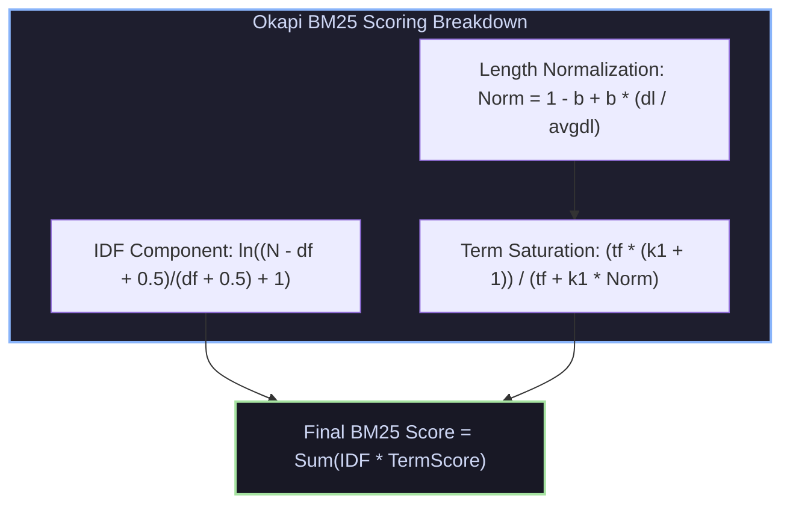
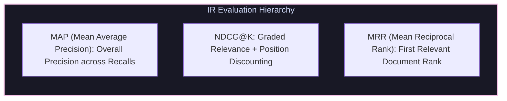

# Scoring, Okapi BM25, Vector Space Model & IR Evaluation Metrics

## 1. Vector Space Model & Okapi BM25 Ranking

The **Vector Space Model** represents documents and queries as high-dimensional vectors in term space, measuring relevance via Cosine Similarity:
$$\text{Cosine Similarity}(V(q), V(d)) = \frac{V(q) \cdot V(d)}{\|V(q)\| \|V(d)\|}$$



### 1.1 Okapi BM25 Formulation
Okapi BM25 (Robertson et al.) improves upon standard TF-IDF by enforcing **non-linear term frequency saturation** and **document length penalty**:

$$\text{BM25}(D, Q) = \sum_{t \in Q} \ln \left( \frac{N - \text{df}_t + 0.5}{\text{df}_t + 0.5} + 1 \right) \cdot \frac{\text{tf}_{t,D} \cdot (k_1 + 1)}{\text{tf}_{t,D} + k_1 \left( 1 - b + b \cdot \frac{|D|}{\text{avgdl}} \right)}$$

* **$k_1$ Parameter (Default $1.2 \dots 2.0$)**: Controls term frequency saturation. As $\text{tf} \to \infty$, score contribution asymptotically approaches $k_1 + 1$.
* **$b$ Parameter (Default $0.75$)**: Controls length normalization penalty. $b=1$ scales score strictly by document length ratio; $b=0$ ignores document length completely.

---

## 2. Dynamic Top-$K$ Query Pruning: WAND (Weak AND)

Instead of scoring all documents matching query terms, the **WAND Algorithm** (Broder et al.) dynamically prunes candidate documents that cannot enter the top-$K$ heap:

1. Each postings list maintains an upper bound score $U_t = \max_{d} \text{Score}(t, d)$.
2. Postings lists are sorted by current DocID.
3. Sum upper bounds $U_t$ along sorted lists until $\sum U_t \ge \theta$ (Current $K$-th highest score threshold).
4. If candidate DocID fails threshold, advance posting pointers without evaluating full BM25 expression!

---

## 3. Search Engine Evaluation Metrics

Evaluating search relevance requires standard offline test collections (Cranfield paradigm):



### 3.1 Normalized Discounted Cumulative Gain (NDCG@K)
Evaluates ranked search results with multi-level graded relevance (e.g., $0 = \text{Irrelevant}$, $1 = \text{Relevant}$, $2 = \text{Highly Relevant}$):

$$\text{DCG}@K = \sum_{i=1}^K \frac{2^{\text{rel}_i} - 1}{\log_2(i + 1)}, \quad \text{NDCG}@K = \frac{\text{DCG}@K}{\text{IDCG}@K}$$

---

## 4. Production-Grade C++ Engine: Okapi BM25 Search & NDCG@K Evaluator

The following C++ engine implements the Okapi BM25 ranking algorithm and an automated NDCG@K evaluator:

```cpp
#include <iostream>
#include <vector>
#include <string>
#include <unordered_map>
#include <cmath>
#include <algorithm>
#include <numeric>

struct Document {
    int id;
    std::vector<std::string> tokens;
};

class OkapiBM25SearchEngine {
private:
    double k1 = 1.5;
    double b = 0.75;
    size_t total_docs = 0;
    double avg_doc_len = 0.0;

    std::unordered_map<int, double> doc_lengths;
    std::unordered_map<std::string, std::unordered_map<int, int>> inverted_index; // Term -> (DocID -> TF)
    std::unordered_map<std::string, double> idf_cache;

public:
    void IndexDocuments(const std::vector<Document>& docs) {
        total_docs = docs.size();
        double sum_len = 0.0;

        for (const auto& doc : docs) {
            doc_lengths[doc.id] = doc.tokens.size();
            sum_len += doc.tokens.size();

            for (const auto& token : doc.tokens) {
                inverted_index[token][doc.id]++;
            }
        }
        avg_doc_len = sum_len / total_docs;

        // Precompute IDF
        for (const auto& [term, postings] : inverted_index) {
            double df = postings.size();
            idf_cache[term] = std::log((total_docs - df + 0.5) / (df + 0.5) + 1.0);
        }
    }

    std::vector<std::pair<int, double>> Search(const std::vector<std::string>& query, int top_k) {
        std::unordered_map<int, double> doc_scores;

        for (const auto& term : query) {
            if (inverted_index.find(term) == inverted_index.end()) continue;

            double idf = idf_cache[term];
            const auto& postings = inverted_index[term];

            for (const auto& [doc_id, tf] : postings) {
                double len_norm = 1.0 - b + b * (doc_lengths[doc_id] / avg_doc_len);
                double tf_sat = (tf * (k1 + 1.0)) / (tf + k1 * len_norm);
                doc_scores[doc_id] += idf * tf_sat;
            }
        }

        std::vector<std::pair<int, double>> ranked(doc_scores.begin(), doc_scores.end());
        std::sort(ranked.begin(), ranked.end(), [](const auto& a, const auto& b) {
            return a.second > b.second;
        });

        if (ranked.size() > static_cast<size_t>(top_k)) ranked.resize(top_k);
        return ranked;
    }
};

class SearchEvaluator {
public:
    static double CalculateNDCG(const std::vector<int>& retrieved_doc_ids,
                                const std::unordered_map<int, int>& ground_truth_relevance,
                                int k) {
        double dcg = 0.0;
        int eval_k = std::min(static_cast<int>(retrieved_doc_ids.size()), k);

        for (int i = 0; i < eval_k; ++i) {
            int doc_id = retrieved_doc_ids[i];
            int rel = ground_truth_relevance.count(doc_id) ? ground_truth_relevance.at(doc_id) : 0;
            dcg += (std::pow(2, rel) - 1.0) / std::log2(i + 2);
        }

        // Calculate Ideal DCG (IDCG)
        std::vector<int> ideal_rels;
        for (const auto& [doc_id, rel] : ground_truth_relevance) ideal_rels.push_back(rel);
        std::sort(ideal_rels.rbegin(), ideal_rels.rend());

        double idcg = 0.0;
        int ideal_k = std::min(static_cast<int>(ideal_rels.size()), k);
        for (int i = 0; i < ideal_k; ++i) {
            idcg += (std::pow(2, ideal_rels[i]) - 1.0) / std::log2(i + 2);
        }

        return (idcg > 0.0) ? (dcg / idcg) : 0.0;
    }
};

int main() {
    std::vector<Document> corpus = {
        {1, {"distributed", "systems", "consensus", "raft", "paxos"}},
        {2, {"distributed", "database", "storage", "engine", "raft"}},
        {3, {"parallel", "computer", "architecture", "simd", "gpu"}}
    };

    OkapiBM25SearchEngine engine;
    engine.IndexDocuments(corpus);

    std::vector<std::string> query = {"distributed", "raft"};
    auto results = engine.Search(query, 3);

    std::cout << "BM25 Search Results for Query ['distributed', 'raft']:" << std::endl;
    std::vector<int> retrieved_ids;
    for (const auto& [doc_id, score] : results) {
        std::cout << "  Doc ID: " << doc_id << " | BM25 Score: " << score << std::endl;
        retrieved_ids.push_back(doc_id);
    }

    // Ground truth relevance labels: Doc 1 = 3 (Very Relevant), Doc 2 = 2 (Relevant), Doc 3 = 0 (Irrelevant)
    std::unordered_map<int, int> relevance = {{1, 3}, {2, 2}, {3, 0}};
    double ndcg_3 = SearchEvaluator::CalculateNDCG(retrieved_ids, relevance, 3);

    std::cout << "\nSearch Evaluation Metric: NDCG@3 = " << ndcg_3 << std::endl;
    return 0;
}
```

---

## 5. Summary & Key Engineering Principles

1. **Length Normalization & Term Saturation**: Okapi BM25 prevents long document bias and term-stuffing manipulation.
2. **Dynamic Top-$K$ Pruning**: WAND uses postings upper bounds to skip 80%+ of document evaluation calls.
3. **NDCG Metric Superiority**: Evaluates search quality with graded relevance labels and logarithmic rank position discounting.
