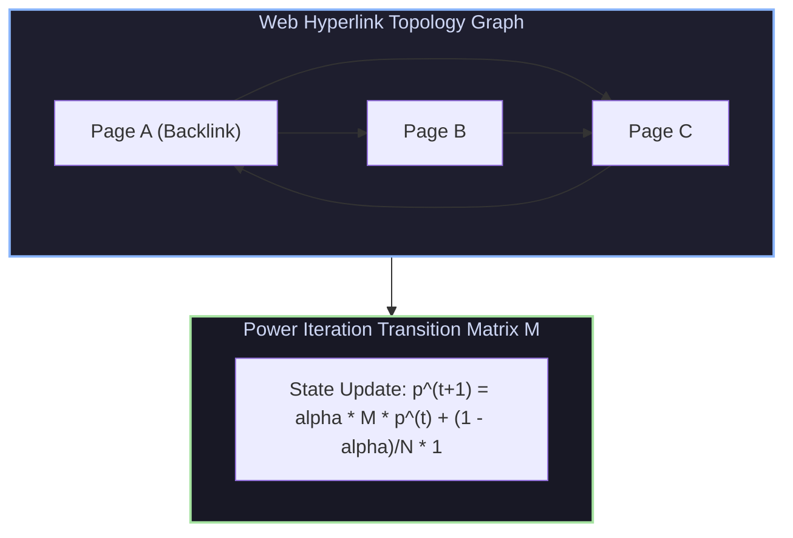
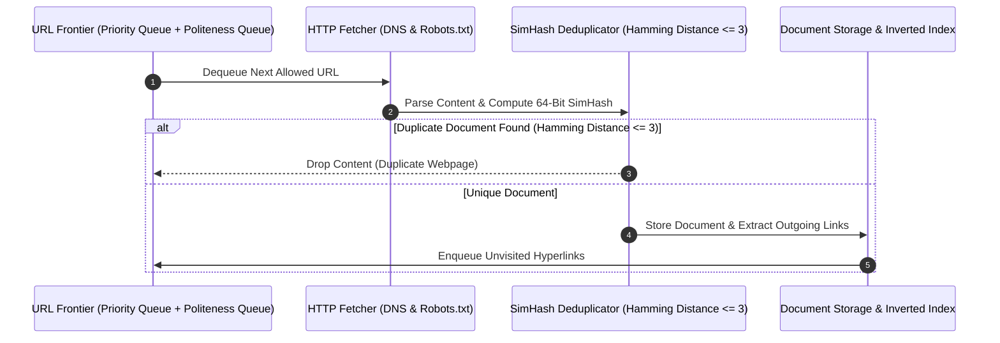

# Link Analysis (PageRank), Web Crawling, SimHash Deduplication & Learning to Rank

## 1. Link Analysis & PageRank Power Iteration

Google's **PageRank** (Page & Brin) computes the global importance of web pages by modeling a random surfer traversing the web hyperlink graph.



### 1.1 PageRank Formula & Teleportation
To solve **Dead-ends** (pages without outgoing links) and **Spider Traps** (loops that absorb rank), PageRank adds a random **Teleportation factor** ($1 - \alpha$):

$$\mathbf{p}^{(t+1)} = \alpha \mathbf{M} \mathbf{p}^{(t)} + \frac{1 - \alpha}{N} \mathbf{1}$$

where $\alpha \approx 0.85$. Power iteration converges to the dominant eigenvector of the stochastic transition matrix $\mathbf{M}$.

---

## 2. Web Crawler Architecture & SimHash Deduplication

Web crawlers fetch billions of web documents continuously while preserving domain politeness and filtering near-duplicate content.



### 2.1 SimHash Near-Duplicate Deduplication (Charikar et al.)
SimHash projects arbitrary document feature vectors into a 64-bit fingerprint:

1. Hash each token $t_i$ to a 64-bit integer $h(t_i)$.
2. Compute weighted vector $V$: For each bit $b \in [0 \dots 63]$, add $+w_i$ if bit $b$ of $h(t_i)$ is 1, else subtract $-w_i$.
3. Convert $V$ to 64-bit fingerprint: Output bit $b = 1$ if $V[b] > 0$, else $0$.
4. **Near-Duplicate Invariant**: If two documents have high Jaccard similarity, their SimHash fingerprints differ by $\le 3$ bits (Hamming Distance $\le 3$).

---

## 3. Learning to Rank (L2R)

Modern search engines replace hand-tuned BM25 weighting formulas with **Learning to Rank (L2R)** models that combine hundreds of signals (BM25, PageRank, Anchor Text, User Click-Through Rates):

1. **Pointwise L2R**: Regresses relevance score per document independently (e.g., Linear Regression).
2. **Pairwise L2R (LambdaMART / RankNet)**: Optimizes relative pairwise ordering of document pairs $(d_i \succ d_j)$.
3. **Listwise L2R (AdaRank / SoftRank)**: Directly optimizes list-level ranking metrics (NDCG, MAP).

---

## 4. Production-Grade C++ Engine: PageRank Matrix Engine & 64-Bit SimHash Deduplicator

The following C++ engine implements PageRank Power Iteration and 64-bit SimHash near-duplicate detection:

```cpp
#include <iostream>
#include <vector>
#include <string>
#include <unordered_map>
#include <cmath>
#include <functional>
#include <cstdint>

class PageRankEngine {
public:
    static std::vector<double> ComputePageRank(const std::vector<std::vector<int>>& adj_matrix, 
                                               double alpha = 0.85, double tol = 1e-6) {
        int N = adj_matrix.size();
        std::vector<double> p(N, 1.0 / N);
        std::vector<double> p_next(N, 0.0);

        // Compute out-degrees
        std::vector<int> out_degree(N, 0);
        for (int i = 0; i < N; ++i) {
            for (int j = 0; j < N; ++j) {
                if (adj_matrix[i][j]) out_degree[i]++;
            }
        }

        bool converged = false;
        int iter = 0;

        while (!converged && iter < 100) {
            std::fill(p_next.begin(), p_next.end(), (1.0 - alpha) / N);

            for (int i = 0; i < N; ++i) {
                if (out_degree[i] > 0) {
                    double share = alpha * p[i] / out_degree[i];
                    for (int j = 0; j < N; ++j) {
                        if (adj_matrix[i][j]) p_next[j] += share;
                    }
                } else {
                    // Dead-end: Distribute rank equally across all nodes
                    double share = alpha * p[i] / N;
                    for (int j = 0; j < N; ++j) p_next[j] += share;
                }
            }

            // Check convergence L1 norm
            double diff = 0.0;
            for (int i = 0; i < N; ++i) diff += std::abs(p_next[i] - p[i]);
            if (diff < tol) converged = true;

            p = p_next;
            iter++;
        }

        std::cout << "[PageRank Engine] Power Iteration Converged in " << iter << " Iterations." << std::endl;
        return p;
    }
};

class SimHashDeduplicator {
public:
    static uint64_t ComputeSimHash(const std::vector<std::string>& tokens) {
        std::vector<int> v(64, 0);
        std::hash<std::string> hasher;

        for (const auto& token : tokens) {
            uint64_t hash_val = static_cast<uint64_t>(hasher(token));
            for (int bit = 0; bit < 64; ++bit) {
                if ((hash_val >> bit) & 1) v[bit] += 1;
                else v[bit] -= 1;
            }
        }

        uint64_t fingerprint = 0;
        for (int bit = 0; bit < 64; ++bit) {
            if (v[bit] > 0) fingerprint |= (1ULL << bit);
        }
        return fingerprint;
    }

    static int HammingDistance(uint64_t h1, uint64_t h2) {
        return __builtin_popcountll(h1 ^ h2);
    }
};

int main() {
    std::cout << "--- 1. PageRank Power Iteration Benchmark ---" << std::endl;
    // 4-Page Web Graph: 0 -> 1, 0 -> 2, 1 -> 2, 2 -> 0, 3 -> 2 (Dead-end node)
    std::vector<std::vector<int>> web_graph = {
        {0, 1, 1, 0},
        {0, 0, 1, 0},
        {1, 0, 0, 0},
        {0, 0, 1, 0}
    };

    std::vector<double> ranks = PageRankEngine::ComputePageRank(web_graph);
    for (size_t i = 0; i < ranks.size(); ++i) {
        std::cout << "  Page " << i << " PageRank Score: " << ranks[i] << std::endl;
    }

    std::cout << "\n--- 2. SimHash Document Deduplication Benchmark ---" << std::endl;
    std::vector<std::string> doc1 = {"information", "retrieval", "search", "engine", "manning"};
    std::vector<std::string> doc2 = {"information", "retrieval", "search", "engine", "buttcher"};
    std::vector<std::string> doc3 = {"parallel", "computer", "architecture", "cuda", "gpu"};

    uint64_t fp1 = SimHashDeduplicator::ComputeSimHash(doc1);
    uint64_t fp2 = SimHashDeduplicator::ComputeSimHash(doc2);
    uint64_t fp3 = SimHashDeduplicator::ComputeSimHash(doc3);

    std::cout << "SimHash Fingerprint Doc 1: 0x" << std::hex << fp1 << std::endl;
    std::cout << "SimHash Fingerprint Doc 2: 0x" << std::hex << fp2 << std::endl;
    std::cout << "SimHash Fingerprint Doc 3: 0x" << std::hex << fp3 << std::dec << std::endl;

    int dist_1_2 = SimHashDeduplicator::HammingDistance(fp1, fp2);
    int dist_1_3 = SimHashDeduplicator::HammingDistance(fp1, fp3);

    std::cout << "\nHamming Distance (Doc 1 vs Doc 2): " << dist_1_2 
              << " (" << (dist_1_2 <= 3 ? "NEAR DUP!" : "UNIQUE") << ")" << std::endl;
    std::cout << "Hamming Distance (Doc 1 vs Doc 3): " << dist_1_3 
              << " (" << (dist_1_3 <= 3 ? "NEAR DUP!" : "UNIQUE") << ")" << std::endl;

    return 0;
}
```

---

## 5. Summary & Key Takeaways

1. **PageRank Stability**: Random teleportation ($\alpha = 0.85$) resolves graph dead-ends and spider traps, guaranteeing power iteration convergence.
2. **SimHash Near-Deduplication**: Maps high-dimensional text documents to 64-bit integers where Hamming distance $\le 3$ detects near-duplicate web pages in $O(1)$ time.
3. **Learning to Rank**: LambdaMART pairwise gradient boosting optimizes ranking ordering directly against list-level NDCG metrics.
