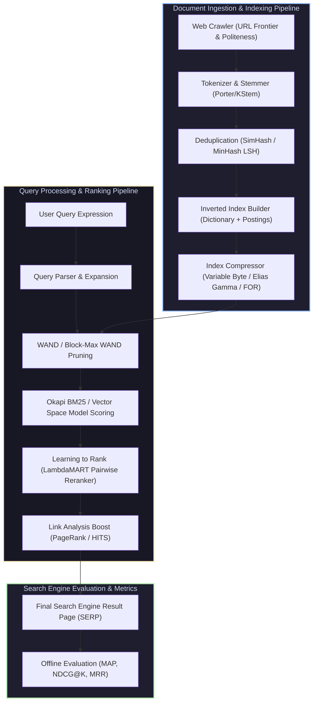

# Information Retrieval & Search Engines (Manning IIR + Büttcher)

Welcome to the **Information Retrieval & Search Engines Masterclass Module**. This module synthesizes the core algorithms, data structures, and evaluation metrics from the two foundational search engine text bibles: **Introduction to Information Retrieval** (Manning, Raghavan, Schütze - Stanford/Cambridge) and **Information Retrieval: Implementing and Evaluating Search Engines** (Büttcher, Clarke, Cormack - MIT Press).

---

## 1. End-to-End Search Engine Pipeline Architecture

---

## 2. Module Navigation Map

| File | Description | Core Topics |
| :--- | :--- | :--- |
| **[`00_ir_cheatsheet.md`](00_ir_cheatsheet.md)** | 30-Second Search Engine Cheatsheet | TF-IDF, Okapi BM25 formula, Variable Byte encoding math, NDCG@K / MAP / MRR metrics, PageRank power iteration, SimHash Hamming distance, WAND pruning logic. |
| **[`01_postings_index_compression_and_skip_pointers.md`](01_inverted_index_and_compression/01_postings_index_compression_and_skip_pointers.md)** | Inverted Index & Compression | Dictionary layouts, Positional Indexing, Skip Pointers ($O(\sqrt{P})$ intersection), Variable Byte (VB) & Elias Gamma $d$-gap compression, Complete C++ Index Engine, Mermaid diagram. |
| **[`02_bm25_vector_space_and_ir_metrics.md`](02_scoring_bm25_vector_space_and_evaluation/02_bm25_vector_space_and_ir_metrics.md)** | Scoring, BM25 & Evaluation | Vector Space Model, Okapi BM25 ranking ($k_1, b$ saturation & length normalization), WAND pruning, MAP, NDCG@K, MRR, Complete C++ BM25 Engine & NDCG Evaluator, Mermaid flowchart. |
| **[`03_pagerank_crawling_simhash_and_l2r.md`](03_pagerank_web_crawling_and_learning_to_rank/03_pagerank_crawling_simhash_and_l2r.md)** | PageRank, Crawling, SimHash & L2R | PageRank Power Iteration, Teleportation ($\alpha=0.85$), Web Crawler URL Frontier, SimHash / MinHash LSH deduplication, Learning to Rank (LambdaMART), Complete C++ PageRank & SimHash Engine, Mermaid diagram. |

---

## 3. Key Search Engineering Laws & Theorems

1. **Heaps' Law (Vocabulary Growth)**: The number of unique terms $M$ in a document corpus of $T$ total tokens grows as:
   $$M = k \cdot T^b \quad (\text{where } 30 \le k \le 100 \text{ and } b \approx 0.5)$$
2. **Zipf's Law (Term Frequency)**: The frequency $f_i$ of the $i$-th most frequent term is inversely proportional to its rank $i$:
   $$f_i \propto \frac{1}{i}$$
3. **Okapi BM25 Saturation Theorem**: BM25 limits term frequency contribution to an upper bound $k_1 + 1$, avoiding term-stuffing manipulation that plagues linear TF-IDF weighting models.
