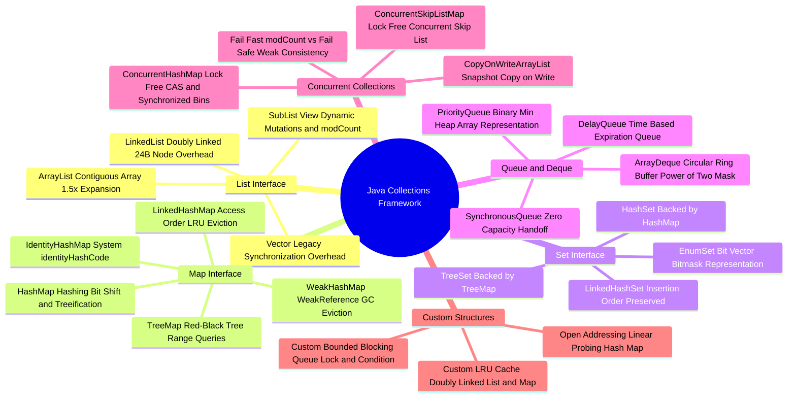

# Java Collections Framework Mind Map

```mermaid
mindmap
  root((Java Collections Framework))
    List Interface
      ArrayList Contiguous Array 1.5x Expansion
      LinkedList Doubly Linked 24B Node Overhead
      Vector Legacy Synchronization Overhead
      SubList View Dynamic Mutations and modCount
    Map Interface
      HashMap Hashing Bit Shift and Treeification
      LinkedHashMap Access Order LRU Eviction
      TreeMap Red-Black Tree Range Queries
      IdentityHashMap System identityHashCode
      WeakHashMap WeakReference GC Eviction
    Set Interface
      HashSet Backed by HashMap
      TreeSet Backed by TreeMap
      LinkedHashSet Insertion Order Preserved
      EnumSet Bit Vector Bitmask Representation
    Queue and Deque
      ArrayDeque Circular Ring Buffer Power of Two Mask
      PriorityQueue Binary Min Heap Array Representation
      SynchronousQueue Zero Capacity Handoff
      DelayQueue Time Based Expiration Queue
    Concurrent Collections
      ConcurrentHashMap Lock Free CAS and Synchronized Bins
      CopyOnWriteArrayList Snapshot Copy on Write
      ConcurrentSkipListMap Lock Free Concurrent Skip List
      Fail Fast modCount vs Fail Safe Weak Consistency
    Custom Structures
      Custom LRU Cache Doubly Linked List and Map
      Custom Bounded Blocking Queue Lock and Condition
      Open Addressing Linear Probing Hash Map
```
