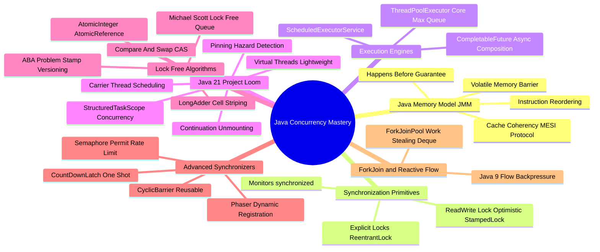

# Java Concurrency Architecture Mind Map

This document presents a structured visual breakdown of Java concurrency primitives, memory model mechanics, and Project Loom Virtual Threads.

---

## 1. Visual Taxonomy

---

## 2. Component Reference Table

| Primitive | Primary Use Case | Performance Hazard / Caveat |
| :--- | :--- | :--- |
| **`synchronized`** | Basic intrinsic monitor locking | Lock contention under high concurrency; causes Virtual Thread **Pinning** if IO blocking inside |
| **`ReentrantLock`** | Advanced locking (fairness, `tryLock()`, conditions) | Must manually unlock in `finally` block to prevent thread deadlocks |
| **`Volatile`** | Guarantees field visibility across threads | Guarantees **visibility** only, NOT atomicity (`volatile count++` is not thread-safe) |
| **`LongAdder`** | High-concurrency numeric counter accumulation | Higher memory footprint than `AtomicLong` due to internal cell-striping array |
| **`Virtual Threads`** | Massive I/O-bound concurrency ($100\text{K+}$ threads) | Avoid using for heavy CPU-bound math calculations (does not increase CPU cores) |
| **`Phaser`** | Multi-phase dynamic worker synchronization | Complex phase state tracking; risk of deadlock if a registered thread crashes |
