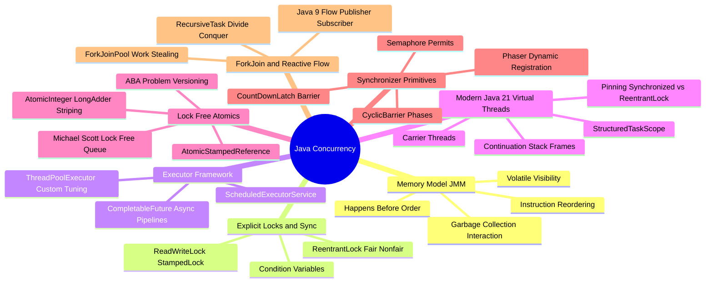

# Java Concurrency & Multithreading Technical Study Guide

Welcome to the **Java Concurrency & Multithreading Technical Study Guide**. This repository contains deep-dive chapters, theoretical explanations, and executable Java 21+ code files covering thread fundamentals, Java Memory Model (JMM) visibility & reordering, locks & executors, CompletableFuture, concurrent collections, Project Loom Virtual Threads & Structured Concurrency, lock-free atomics & the ABA problem, advanced synchronizers (`Phaser`, `CyclicBarrier`), ForkJoin work-stealing, and Java 9 Flow Reactive Streams.

---

## 1. Executive Summary & Concurrency Hierarchy

Java Concurrency has evolved from raw `Thread` management and `synchronized` blocks to high-performance lock-free data structures, asynchronous `CompletableFuture` pipelines, and Java 21+ **Virtual Threads (Project Loom)**.

```
 Concurrency Evolution Spectrum:
 JDK 1.0 - 1.4: Raw Thread, Runnable, synchronized, wait(), notify()
 JDK 5 - 6:     java.util.concurrent (JUC), ReentrantLock, ExecutorService, Atomics, BlockingQueue
 JDK 7 - 8:     ForkJoinPool, Work-Stealing, CompletableFuture, Lambdas
 JDK 9 - 17:    Flow API (Reactive Streams), VarHandle
 JDK 21+:       Virtual Threads (JEP 444), Structured Concurrency (JEP 453), Scoped Values
```

---

## 2. Interactive Architecture Mind Map



---

## 3. Study Guide File Index

| File | Type | Focus Areas |
| :--- | :--- | :--- |
| **[00: Recommended Resources](00_Recommended_Books_and_Resources.md)** | Reference | Books (*Java Concurrency in Practice*, *Concurrent Programming in Java*), JSR-133 JMM Spec |
| **[00: Architecture Mind Map](00_Concurrency_MindMap.md)** | Visual | Interactive visual breakdown of JMM, Locks, Virtual Threads, Atomics, and Synchronizers |
| **[00: Theory Guide](00_theory.md)** | Theory | Core concurrency theory, race conditions, deadlocks, livelocks, thread states |
| **[01: Threads & Synchronization](01_threads_sync.java)** | Code | Thread lifecycle, `Runnable`, `Callable`, `synchronized` monitors, `wait()` / `notifyAll()` |
| **[02: Locks & Executors](02_locks_executors.java)** | Code | `ReentrantLock`, `ReentrantReadWriteLock`, `StampedLock`, `ThreadPoolExecutor` tuning |
| **[03: CompletableFuture](03_completablefuture.java)** | Code | Async pipelines, `supplyAsync()`, `thenApply()`, `thenCombine()`, `allOf()`, exception handling |
| **[04: Concurrent Collections](04_concurrent_collections.java)** | Code | `ConcurrentHashMap` bucket locking, `CopyOnWriteArrayList`, `ArrayBlockingQueue`, `ConcurrentSkipListMap` |
| **[05: Advanced Concurrency](05_advanced.java)** | Code | Thread-safety hazards, deadlock detection, ThreadLocal memory leaks, custom thread pools |
| **[06: Virtual Threads & Loom](06_virtual_threads_loom.java)** | Code (Java 21+) | **Virtual Threads (Project Loom):** `Thread.ofVirtual()`, Carrier Threads, Pinning hazards, `StructuredTaskScope` |
| **[06: Virtual Threads Guide](06_virtual_threads_loom.md)** | Theory (Java 21+) | In-depth breakdown of JEP 444 Virtual Threads, Continuation stack un-mounting, & Structured Concurrency |
| **[07: Lock-Free Atomics & ABA](07_lock_free_atomics_aba.java)** | Code | `AtomicInteger`, `LongAdder` cell-striping, **ABA Problem**, `AtomicStampedReference`, Michael-Scott Lock-Free Queue |
| **[08: Advanced Synchronizers](08_synchronizers_phaser_barrier.java)** | Code | `Phaser` (dynamic registration), `CyclicBarrier`, `CountDownLatch`, `Semaphore`, `Exchanger` |
| **[09: ForkJoin Work-Stealing](09_forkjoin_work_stealing.java)** | Code | `ForkJoinPool`, `RecursiveTask<T>`, `RecursiveAction`, Work-Stealing Deque, Divide-and-Conquer parallelism |
| **[10: Reactive Streams Flow](10_reactive_streams_flow.java)** | Code | Java 9 `java.util.concurrent.Flow` (`Publisher`, `Subscriber`, `Subscription`, `Processor`), Backpressure |
| **[JMM Memory Model Sub-module](jmm/00_theory.md)** | Theory & Code | Happens-before relationship, Volatile visibility, CPU cache line false sharing, Instruction reordering |

---

## 4. Quick Links & Navigation

* Return to [Master Repository Index](../../README.md)
* Next File: **[00: Recommended Resources](00_Recommended_Books_and_Resources.md)**
