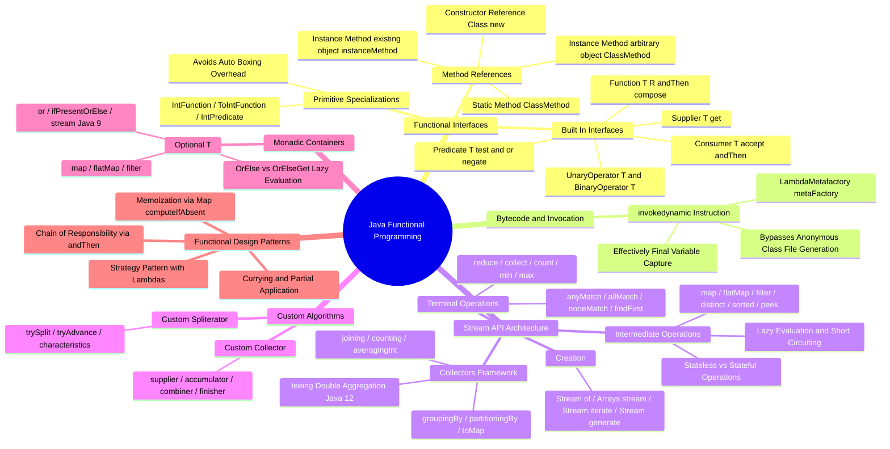

# Java Functional Programming Mind Map

```mermaid
mindmap
  root((Java Functional Programming))
    Functional Interfaces
      Built In Interfaces
        Function T R andThen compose
        Consumer T accept andThen
        Supplier T get
        Predicate T test and or negate
        UnaryOperator T and BinaryOperator T
      Primitive Specializations
        IntFunction / ToIntFunction / IntPredicate
        Avoids Auto Boxing Overhead
      Method References
        Static Method ClassMethod
        Instance Method arbitrary object ClassMethod
        Instance Method existing object instanceMethod
        Constructor Reference Class new
    Bytecode and Invocation
      invokedynamic Instruction
        LambdaMetafactory metaFactory
        Bypasses Anonymous Class File Generation
        Effectively Final Variable Capture
    Stream API Architecture
      Creation
        Stream of / Arrays stream / Stream iterate / Stream generate
      Intermediate Operations
        map / flatMap / filter / distinct / sorted / peek
        Stateless vs Stateful Operations
        Lazy Evaluation and Short Circuiting
      Terminal Operations
        reduce / collect / count / min / max
        anyMatch / allMatch / noneMatch / findFirst
      Collectors Framework
        groupingBy / partitioningBy / toMap
        joining / counting / averagingInt
        teeing Double Aggregation Java 12
    Custom Algorithms
      Custom Collector
        supplier / accumulator / combiner / finisher
      Custom Spliterator
        trySplit / tryAdvance / characteristics
    Monadic Containers
      Optional T
        map / flatMap / filter
        or / ifPresentOrElse / stream Java 9
        OrElse vs OrElseGet Lazy Evaluation
    Functional Design Patterns
      Currying and Partial Application
      Strategy Pattern with Lambdas
      Chain of Responsibility via andThen
      Memoization via Map computeIfAbsent
```
