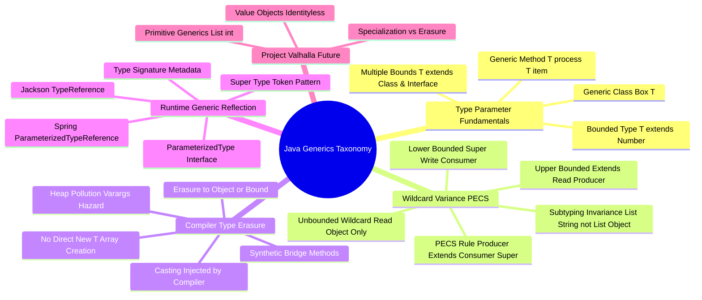

# Java Generics Architecture Mind Map

This document presents a structured visual breakdown of Java Generics syntax, wildcard variance, compiler type erasure, reflection type tokens, and JDK Project Valhalla.

---

## 1. Visual Taxonomy

---

## 2. Component Reference Table

| Concept | Primary Rule / Mechanism | Common Pitfall / Hazard |
| :--- | :--- | :--- |
| **Invariance** | `List<String>` is NOT a subtype of `List<Object>` | Attempting to pass `List<String>` to a method expecting `List<Object>` |
| **Upper Bound `<? extends T>`** | Use when retrieving data (Producer). Read as `T`; CANNOT write elements | Attempting `list.add(item)` on `List<? extends Number>` triggers compile error |
| **Lower Bound `<? super T>`** | Use when inserting data (Consumer). Write `T`; Read only as `Object` | Attempting to read specific subtype from `List<? super Integer>` returns `Object` |
| **Type Erasure** | Removes generic types at compile time (`List<String>` $\to$ `List`) | Cannot check `if (obj instanceof List<String>)` or create `new T()` |
| **Bridge Methods** | Synthetic methods generated by `javac` to preserve override signatures | Reflections methods returning 2 methods for same name (`ACC_BRIDGE`) |
| **Super Type Tokens** | Anonymous subclass captures `ParameterizedType` at runtime | Instantializing non-anonymous instance loses generic type arguments |
