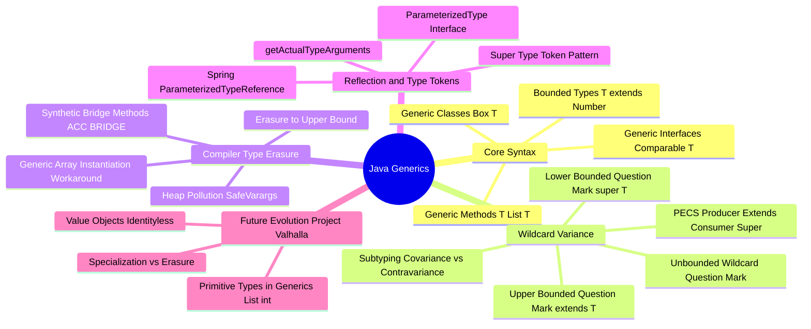

# Java Generics Technical Study Guide

Welcome to the **Java Generics Technical Study Guide**. This repository contains deep-dive theory guides, interactive mind maps, and production Java code files covering generic classes & interfaces, bounded type parameters, the PECS principle (`Producer Extends, Consumer Super`), compiler Type Erasure mechanics, synthetic Bridge Methods, Reflection Super Type Tokens, and JDK Project Valhalla Primitive Generics.

---

## 1. Executive Summary & Generics Philosophy

Java Generics (introduced in Java 5 via JSR 14) provide **compile-time type safety** and eliminate explicit casting.

Key Architectural Highlights:
* **Compile-Time Type Enforcement:** Catches type mismatches at compile time rather than throwing `ClassCastException` at runtime.
* **Type Erasure:** The Java compiler erases all generic type parameters at compile time, replacing them with upper bounds (e.g., `Object` or `Number`), ensuring 100% backward compatibility with pre-Java 5 bytecode.
* **Synthetic Bridge Methods:** When extending generic classes or implementing generic interfaces, `javac` generates synthetic `ACC_BRIDGE` methods to preserve polymorphic method dispatch.
* **PECS Principle:** Governs wildcard selection: **Producer Extends, Consumer Super**. Read from `<? extends T>` (Producer); Write to `<? super T>` (Consumer).
* **Super Type Tokens:** Preserves generic type metadata at runtime via anonymous inner class subclassing (used by Spring's `ParameterizedTypeReference<T>` and Jackson's `TypeReference<T>`).

---

## 2. Interactive Architecture Mind Map

---

## 3. Study Guide File Index

| File | Type | Focus Areas |
| :--- | :--- | :--- |
| **[00: Recommended Resources](00_Recommended_Books_and_Resources.md)** | Reference | Books (*Effective Java* Items 26–33, *Java Generics and Collections*), JLS Chapter 4 & 8 |
| **[00: Architecture Mind Map](00_Generics_MindMap.md)** | Visual | Visual breakdown of Bounded Types, PECS, Type Erasure, Bridge Methods, and Type Tokens |
| **[00: Complete Theory Guide](00_theory.md)** | Theory | Comprehensive theory: type parameters, wildcards, type erasure, and JDK Collections usage |
| **[01: Basics of Generics](01_basics.java)** | Code | Generic classes, interfaces, generic methods, multiple bounds (`T extends A & B`) |
| **[02: Wildcards & PECS](02_wildcards_pecs.java)** | Code | Unbounded `<?>`, Upper-bounded `<? extends T>`, Lower-bounded `<? super T>`, PECS in `Collections.copy()` |
| **[03: Advanced Generics](03_advanced.java)** | Code | Recursive type bounds (`<T extends Comparable<T>>`), generic DAO pattern, type inference |
| **[04: Type Erasure & Bridge Methods](04_type_erasure_bridge_methods.java)** | Code | Compiler type erasure, synthetic `ACC_BRIDGE` methods, Heap Pollution, `@SafeVarargs`, generic array creation |
| **[05: Reflection & Type Tokens](05_reflection_type_tokens.java)** | Code | Runtime generic reflection (`ParameterizedType`), Super Type Tokens (Neal Gafter pattern), Spring `ParameterizedTypeReference` |
| **[06: Project Valhalla Preview](06_project_valhalla_preview.md)** | Theory | Primitive Types in Generics (`List<int>`), Universal Generics, Value Objects, Specialization vs Erasure |

---

## 4. Quick Links & Navigation

* Return to [Master Repository Index](../../README.md)
* Next File: **[00: Recommended Resources](00_Recommended_Books_and_Resources.md)**
