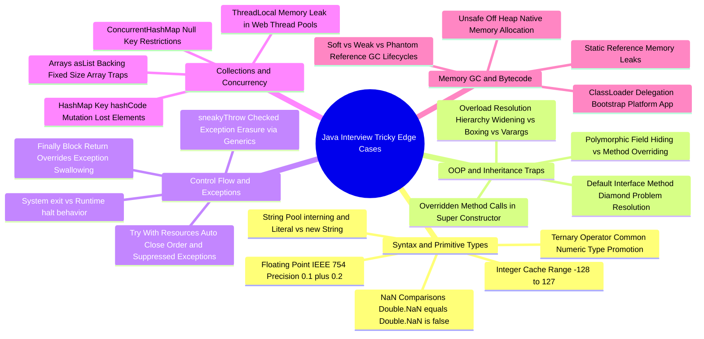

# Java Interview Questions & Edge Cases Mind Map

```mermaid
mindmap
  root((Java Interview Tricky Edge Cases))
    Syntax and Primitive Types
      Integer Cache Range -128 to 127
      Floating Point IEEE 754 Precision 0.1 plus 0.2
      NaN Comparisons Double.NaN equals Double.NaN is false
      Ternary Operator Common Numeric Type Promotion
      String Pool interning and Literal vs new String
    OOP and Inheritance Traps
      Polymorphic Field Hiding vs Method Overriding
      Overridden Method Calls in Super Constructor
      Overload Resolution Hierarchy Widening vs Boxing vs Varargs
      Default Interface Method Diamond Problem Resolution
    Control Flow and Exceptions
      Finally Block Return Overrides Exception Swallowing
      sneakyThrow Checked Exception Erasure via Generics
      Try With Resources Auto Close Order and Suppressed Exceptions
      System exit vs Runtime halt behavior
    Collections and Concurrency
      HashMap Key hashCode Mutation Lost Elements
      Arrays asList Backing Fixed Size Array Traps
      ThreadLocal Memory Leak in Web Thread Pools
      ConcurrentHashMap Null Key Restrictions
    Memory GC and Bytecode
      ClassLoader Delegation Bootstrap Platform App
      Static Reference Memory Leaks
      Soft vs Weak vs Phantom Reference GC Lifecycles
      Unsafe Off Heap Native Memory Allocation
```
