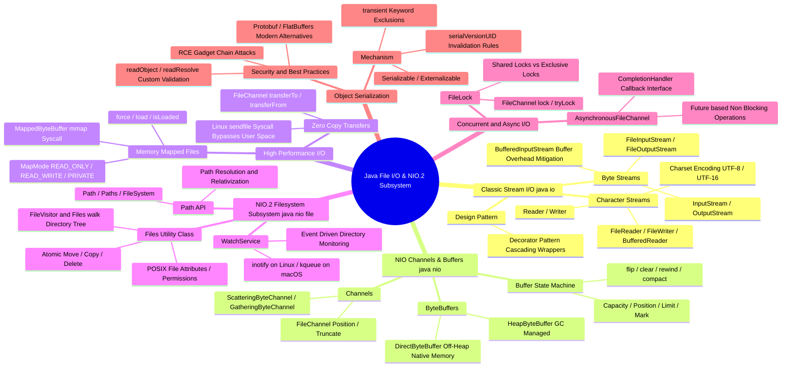

# Java File I/O & NIO.2 Mind Map

```mermaid
mindmap
  root((Java File I/O & NIO.2 Subsystem))
    Classic Stream I/O java io
      Byte Streams
        InputStream / OutputStream
        FileInputStream / FileOutputStream
        BufferedInputStream Buffer Overhead Mitigation
      Character Streams
        Reader / Writer
        FileReader / FileWriter / BufferedReader
        Charset Encoding UTF-8 / UTF-16
      Design Pattern
        Decorator Pattern Cascading Wrappers
    NIO Channels & Buffers java nio
      Buffer State Machine
        Capacity / Position / Limit / Mark
        flip / clear / rewind / compact
      ByteBuffers
        HeapByteBuffer GC Managed
        DirectByteBuffer Off-Heap Native Memory
      Channels
        FileChannel Position / Truncate
        ScatteringByteChannel / GatheringByteChannel
    High Performance I/O
      Memory Mapped Files
        MappedByteBuffer mmap Syscall
        MapMode READ_ONLY / READ_WRITE / PRIVATE
        force / load / isLoaded
      Zero Copy Transfers
        FileChannel transferTo / transferFrom
        Linux sendfile Syscall Bypasses User Space
    NIO.2 Filesystem Subsystem java nio file
      Path API
        Path / Paths / FileSystem
        Path Resolution and Relativization
      Files Utility Class
        Atomic Move / Copy / Delete
        FileVisitor and Files walk Directory Tree
        POSIX File Attributes / Permissions
      WatchService
        Event Driven Directory Monitoring
        inotify on Linux / kqueue on macOS
    Concurrent and Async I/O
      FileLock
        Shared Locks vs Exclusive Locks
        FileChannel lock / tryLock
      AsynchronousFileChannel
        Future based Non Blocking Operations
        CompletionHandler Callback Interface
    Object Serialization
      Mechanism
        Serializable / Externalizable
        serialVersionUID Invalidation Rules
        transient Keyword Exclusions
      Security and Best Practices
        RCE Gadget Chain Attacks
        readObject / readResolve Custom Validation
        Protobuf / FlatBuffers Modern Alternatives
```
