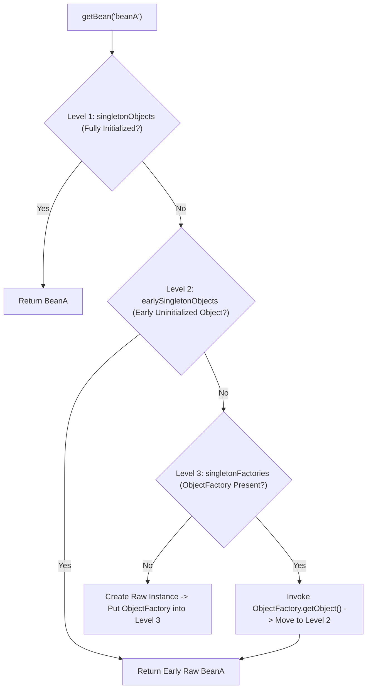

# Chapter 1: Custom IoC Container Implementation from Scratch

Inversion of Control (IoC) transfers the responsibility of object creation, assembly, and lifecycle management from application code to a central container framework.

---

## 📌 1. 3-Level Cache Circular Dependency Resolution Architecture

When Bean A depends on Bean B, and Bean B depends on Bean A ($A \to B \to A$), naive instantiation causes `StackOverflowError`.

Spring and production IoC containers solve this using a **3-Level Cache Pattern**:



### The 3 Cache Maps
1. **`singletonObjects` (1st Level Cache)**: Stores fully initialized, post-processed, ready-to-use singleton beans.
2. **`earlySingletonObjects` (2nd Level Cache)**: Stores early unpopulated raw bean instances (or early AOP proxies) to resolve circular references.
3. **`singletonFactories` (3rd Level Cache)**: Stores `ObjectFactory<?>` lambdas used to generate early bean references or dynamic proxies.

---

## 📌 2. Complete Custom IoC Container Implementation (Java)

Below is a complete, working implementation of a custom Lightweight IoC Container in Java supporting `@Component`, `@Inject`, component scanning, and circular dependency resolution.

```java
package com.custom.ioc;

import java.lang.annotation.*;
import java.lang.reflect.*;
import java.util.*;
import java.util.concurrent.ConcurrentHashMap;

// --- Custom Annotations ---
@Retention(RetentionPolicy.RUNTIME)
@Target(ElementType.TYPE)
public @interface Component {
    String value() default "";
}

@Retention(RetentionPolicy.RUNTIME)
@Target({ElementType.FIELD, ElementType.CONSTRUCTOR})
public @interface Inject {}

// --- IoC Container Engine ---
public class SimpleIoCContainer {
    // 1st Level Cache: Fully initialized beans
    private final Map<String, Object> singletonObjects = new ConcurrentHashMap<>();
    // 2nd Level Cache: Early raw bean references (resolves circular dependencies)
    private final Map<String, Object> earlySingletonObjects = new HashMap<>();
    // 3rd Level Cache: Singleton ObjectFactories
    private final Map<String, ObjectFactory<?>> singletonFactories = new HashMap<>();

    // Set of beans currently being created (detects unresolvable prototype loops)
    private final Set<String> singletonsCurrentlyInCreation = Collections.newSetFromMap(new ConcurrentHashMap<>());
    // Bean Definitions Registry
    private final Map<String, Class<?>> beanDefinitions = new HashMap<>();

    @FunctionalInterface
    public interface ObjectFactory<T> {
        T getObject();
    }

    public void register(Class<?> clazz) {
        String beanName = getBeanName(clazz);
        beanDefinitions.put(beanName, clazz);
    }

    @SuppressWarnings("unchecked")
    public <T> T getBean(String beanName) {
        Object singleton = getSingleton(beanName, true);
        if (singleton != null) {
            return (T) singleton;
        }
        return (T) createBean(beanName);
    }

    protected Object getSingleton(String beanName, boolean allowEarlyReference) {
        Object singletonObject = singletonObjects.get(beanName);
        if (singletonObject == null && singletonsCurrentlyInCreation.contains(beanName)) {
            synchronized (singletonObjects) {
                singletonObject = earlySingletonObjects.get(beanName);
                if (singletonObject == null && allowEarlyReference) {
                    ObjectFactory<?> singletonFactory = singletonFactories.get(beanName);
                    if (singletonFactory != null) {
                        singletonObject = singletonFactory.getObject();
                        earlySingletonObjects.put(beanName, singletonObject);
                        singletonFactories.remove(beanName);
                    }
                }
            }
        }
        return singletonObject;
    }

    private Object createBean(String beanName) {
        Class<?> clazz = beanDefinitions.get(beanName);
        if (clazz == null) {
            throw new RuntimeException("No bean definition found for: " + beanName);
        }

        singletonsCurrentlyInCreation.add(beanName);
        Object beanInstance;

        try {
            // 1. Instantiate Raw Object via Default Constructor
            Constructor<?> constructor = clazz.getDeclaredConstructor();
            constructor.setAccessible(true);
            beanInstance = constructor.newInstance();

            // 2. Put ObjectFactory into 3rd Level Cache BEFORE populating properties
            final Object rawBean = beanInstance;
            singletonFactories.put(beanName, () -> rawBean);

            // 3. Inject Dependencies (Field Injection)
            populateBean(beanInstance, clazz);

            // 4. Move to 1st Level Cache
            synchronized (singletonObjects) {
                singletonObjects.put(beanName, beanInstance);
                earlySingletonObjects.remove(beanName);
                singletonFactories.remove(beanName);
            }
            return beanInstance;
        } catch (Exception e) {
            throw new RuntimeException("Error creating bean: " + beanName, e);
        } finally {
            singletonsCurrentlyInCreation.remove(beanName);
        }
    }

    private void populateBean(Object instance, Class<?> clazz) throws IllegalAccessException {
        for (Field field : clazz.getDeclaredFields()) {
            if (field.isAnnotationPresent(Inject.class)) {
                field.setAccessible(true);
                String targetBeanName = getBeanName(field.getType());
                Object dependency = getBean(targetBeanName);
                field.set(instance, dependency);
            }
        }
    }

    private String getBeanName(Class<?> clazz) {
        Component comp = clazz.getAnnotation(Component.class);
        if (comp != null && !comp.value().isEmpty()) {
            return comp.value();
        }
        String name = clazz.getSimpleName();
        return Character.toLowerCase(name.charAt(0)) + name.substring(1);
    }
}
```
