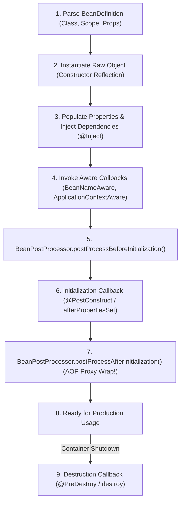
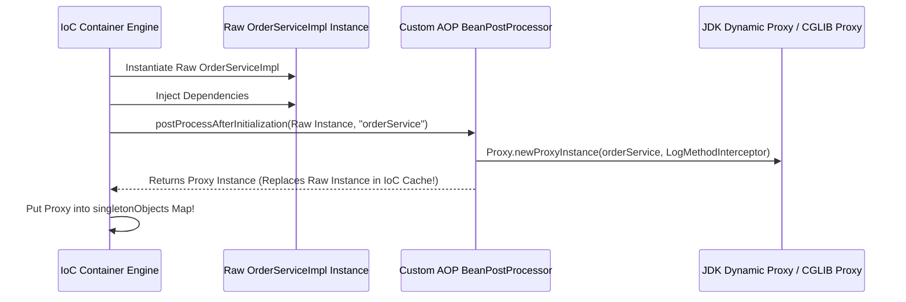

# Chapter 2: Bean Lifecycle, Scopes & Post-Processors

Detailed mechanics of the Bean execution pipeline, lifecycle callbacks, scopes, and `BeanPostProcessor` proxy generation.

---

## 📌 1. Complete Bean Lifecycle Pipeline (8 Steps)



---

## 📌 2. Bean Scopes Comparison

| Scope | Instance Lifetime & Allocation Strategy | Best Use Case |
|---|---|---|
| **Singleton** *(Default)* | Exactly 1 shared instance per IoC container instance. Cached in `singletonObjects`. | Stateless services, Repositories, Controllers. |
| **Prototype** | Creates a new instance every time `getBean()` or injection occurs. Never cached. | Stateful objects, Builders, Command objects. |
| **Request** | 1 instance per HTTP Request lifecycle. Bound to `HttpServletRequest` attributes. | Web user search parameters, request tracing. |
| **Session** | 1 instance per HTTP Session. Bound to `HttpSession` attributes. | Shopping Cart, User Authentication state. |
| **Application** | 1 instance per `ServletContext` web application scope. | Web app global settings. |

---

## 📌 3. Custom `BeanPostProcessor` for AOP Proxy Wrapping

`BeanPostProcessor` allows intercepting bean creation to wrap raw instances in Dynamic Proxies (used by `@Transactional`, `@Async`, and Security Filters).



### Java Code: Custom Logging `BeanPostProcessor`
```java
package com.custom.ioc;

import java.lang.reflect.Proxy;

public class LoggingBeanPostProcessor implements BeanPostProcessor {

    @Override
    public Object postProcessBeforeInitialization(Object bean, String beanName) {
        // Run prior to @PostConstruct
        return bean;
    }

    @Override
    public Object postProcessAfterInitialization(Object bean, String beanName) {
        Class<?> beanClass = bean.getClass();
        
        // Wrap with JDK Dynamic Proxy if class has @LogExecution annotation
        if (beanClass.isAnnotationPresent(LogExecution.class)) {
            return Proxy.newProxyInstance(
                beanClass.getClassLoader(),
                beanClass.getInterfaces(),
                (proxy, method, args) -> {
                    System.out.println("[LOG START] Executing method: " + method.getName());
                    long start = System.currentTimeMillis();
                    
                    Object result = method.invoke(bean, args);
                    
                    long elapsed = System.currentTimeMillis() - start;
                    System.out.println("[LOG END] Completed " + method.getName() + " in " + elapsed + " ms");
                    return result;
                }
            );
        }
        return bean;
    }
}
```
