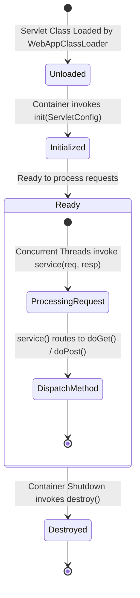
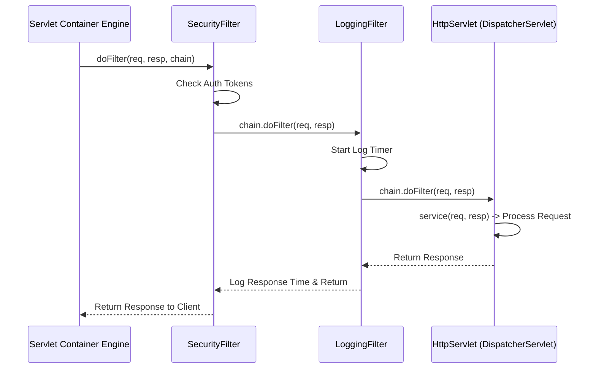
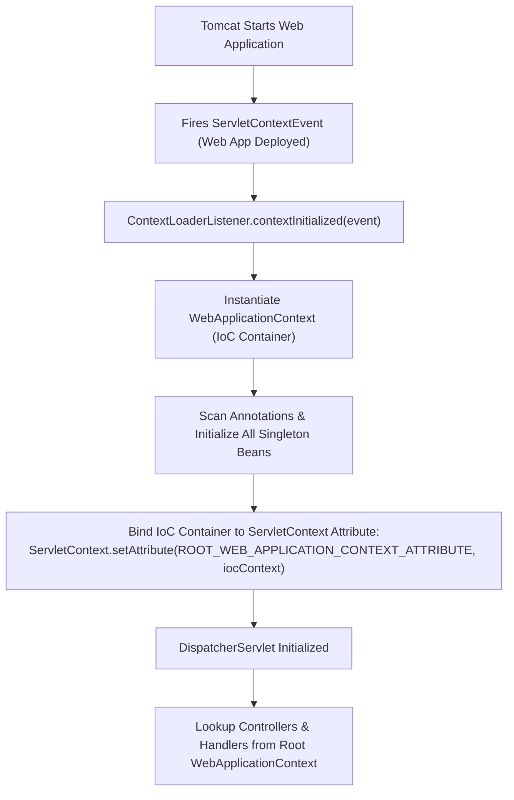

# Chapter 3: Servlet Container Internals, Lifecycle & Bridge Architecture

Explores Servlet Container mechanics (`init`/`service`/`destroy`), `FilterChain` processing, and the `ContextLoaderListener` bridge to IoC `WebApplicationContext`.

---

## 📌 1. Servlet Interface & Lifecycle

A **Servlet** is a Java component managed by a Servlet Container (Tomcat, Jetty) that processes incoming requests and generates responses.



### Lifecycle Methods
1. **`init(ServletConfig config)`**: Executed **exactly once** when the container loads the Servlet.
2. **`service(ServletRequest req, ServletResponse resp)`**: Executed **concurrently by multiple worker threads** for every incoming HTTP request.
3. **`destroy()`**: Executed **exactly once** when the web application shuts down.

---

## 📌 2. `FilterChain` Execution Mechanism (Chain of Responsibility)

Servlet Filters inspect or modify requests/responses prior to reaching the target Servlet.



---

## 📌 3. `ContextLoaderListener` Bridge Architecture

How does an IoC container (like Spring) integrate seamlessly with a Servlet Container (like Tomcat)?



### Java Code: Custom `ContextLoaderListener` Bridge Implementation
```java
package com.custom.servlet;

import com.custom.ioc.SimpleIoCContainer;
import javax.servlet.ServletContext;
import javax.servlet.ServletContextEvent;
import javax.servlet.ServletContextListener;

public class ContextLoaderListener implements ServletContextListener {

    public static final String IOC_CONTAINER_ATTRIBUTE = "COM_CUSTOM_IOC_CONTAINER";

    @Override
    public void contextInitialized(ServletContextEvent sce) {
        System.out.println("[Web Container] Initializing Root IoC WebApplicationContext...");
        
        // 1. Instantiate Custom IoC Container
        SimpleIoCContainer iocContainer = new SimpleIoCContainer();
        
        // 2. Register & Initialize Beans
        iocContainer.register(UserDao.class);
        iocContainer.register(UserService.class);
        iocContainer.getBean("userService"); // Pre-instantiate singletons
        
        // 3. Bind IoC Container instance to ServletContext attribute!
        ServletContext servletContext = sce.getServletContext();
        servletContext.setAttribute(IOC_CONTAINER_ATTRIBUTE, iocContainer);
        
        System.out.println("[Web Container] Root IoC Container successfully bound to ServletContext!");
    }

    @Override
    public void contextDestroyed(ServletContextEvent sce) {
        System.out.println("[Web Container] Shutting down IoC Container...");
    }
}
```
