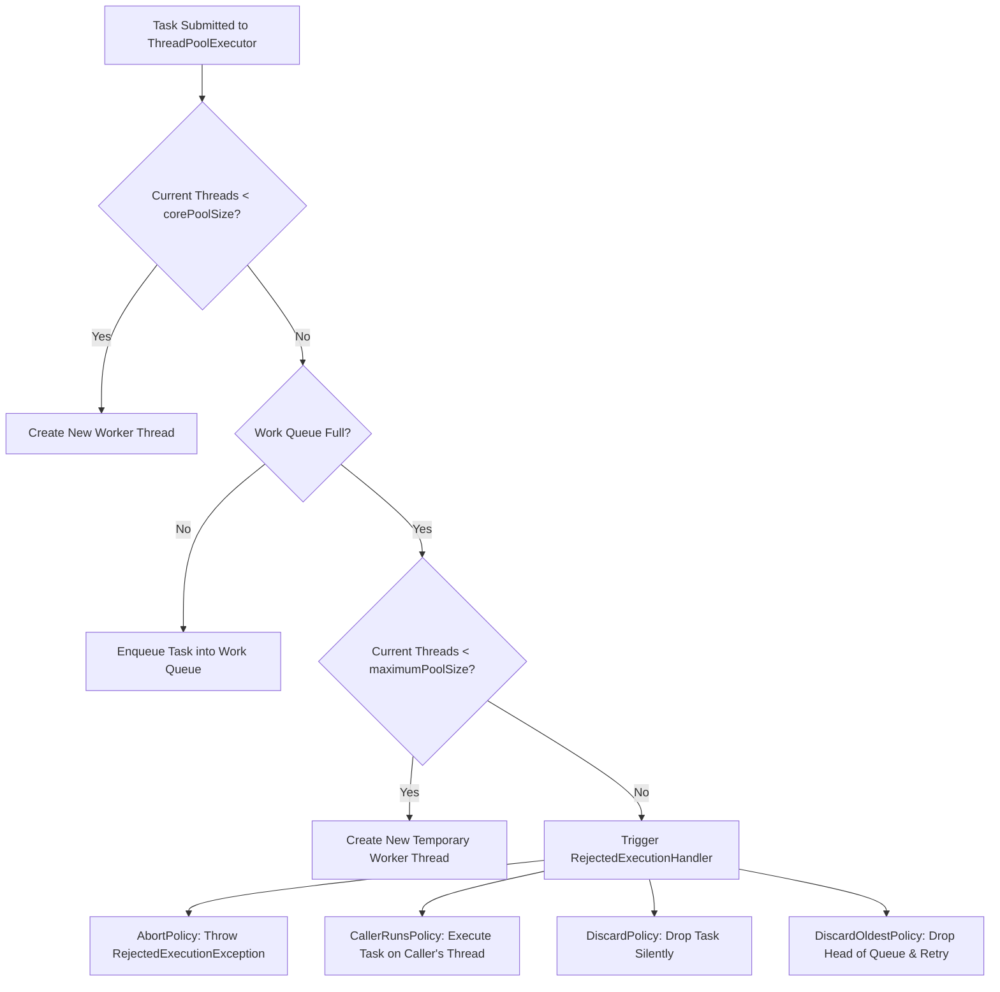

# Java Concurrency Cheatsheet — 30-Second Interview & Architecture Reference

---

## ⚡ Concurrency Primitives Matrix

| Primitive | Mechanism | Primary Use Case | Reentrant? | Lock-Free? |
|---|---|---|---|---|
| `synchronized` | JVM Intrinsic Monitor | Block mutual exclusion & visibility | Yes | No |
| `volatile` | CPU Memory Barrier | Single-variable read/write visibility | N/A | Yes |
| `ReentrantLock` | AQS FIFO Queue | Explicit locking with timeouts/interrupts | Yes | No |
| `ReentrantReadWriteLock` | Split Read/Write Locks | High-read, low-write concurrent access | Yes | No |
| `StampedLock` | Optimistic Version Validation | High-read throughput without lock overhead | No | Optimistic |
| `AtomicInteger` / `AtomicReference` | Hardware CAS (`cmpxchg`) | Lock-free thread-safe counter / pointer | N/A | Yes |
| `LongAdder` | Striped Cells Array | High-contention counter aggregation | N/A | Yes |

---

## 🚀 ThreadPoolExecutor Rejection Decision Tree

---

## 🛡️ Safe Publication Rules

To publish an object safely, both its reference and state must be made visible to other threads simultaneously:

1. **Static Initializer**: Initializing an object reference from a static initializer (`public static final Object obj = new Object();`).
2. **Volatile Reference**: Storing a reference to it into a `volatile` field or `AtomicReference`.
3. **Final Field**: Storing a reference to it into a `final` field of a properly constructed object.
4. **Lock Guard**: Storing a reference to it into a field guarded by a lock.

---

## 🧠 Memory Model Happens-Before Rules

1. **Program Order Rule**: Each action in a thread happens-before every action in that thread that comes later in program order.
2. **Monitor Lock Rule**: An unlock on a monitor lock happens-before every subsequent lock on that same monitor lock.
3. **Volatile Variable Rule**: A write to a `volatile` field happens-before every subsequent read of that same `volatile` field.
4. **Thread Start Rule**: A call to `Thread.start()` on a thread happens-before every action in the started thread.
5. **Thread Termination Rule**: Any action in a thread happens-before any other thread detects that thread has terminated (via `Thread.join()` or `isAlive()`).
6. **Transitivity**: If $A \to B$ and $B \to C$, then $A \to C$.

---

## 📐 Thread Pool Sizing Formula

$$\text{Optimal Thread Count} = N_{\text{CPU}} \times U_{\text{CPU}} \times \left(1 + \frac{W}{C}\right)$$

Where:
- $N_{\text{CPU}}$: Number of available CPU cores (`Runtime.getRuntime().availableProcessors()`)
- $U_{\text{CPU}}$: Target CPU utilization ($0 \le U_{\text{CPU}} \le 1$)
- $W/C$: Ratio of Wait time (I/O blocking) to Compute time (CPU work)
