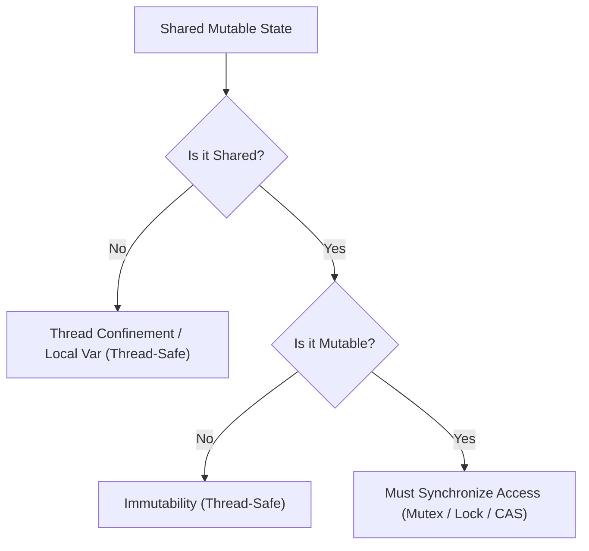
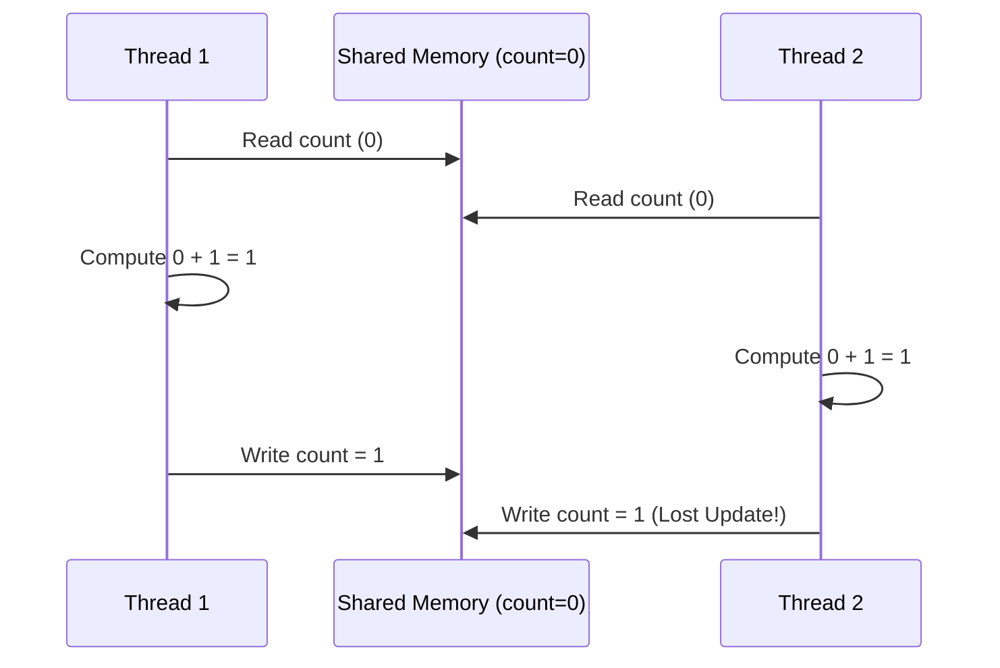
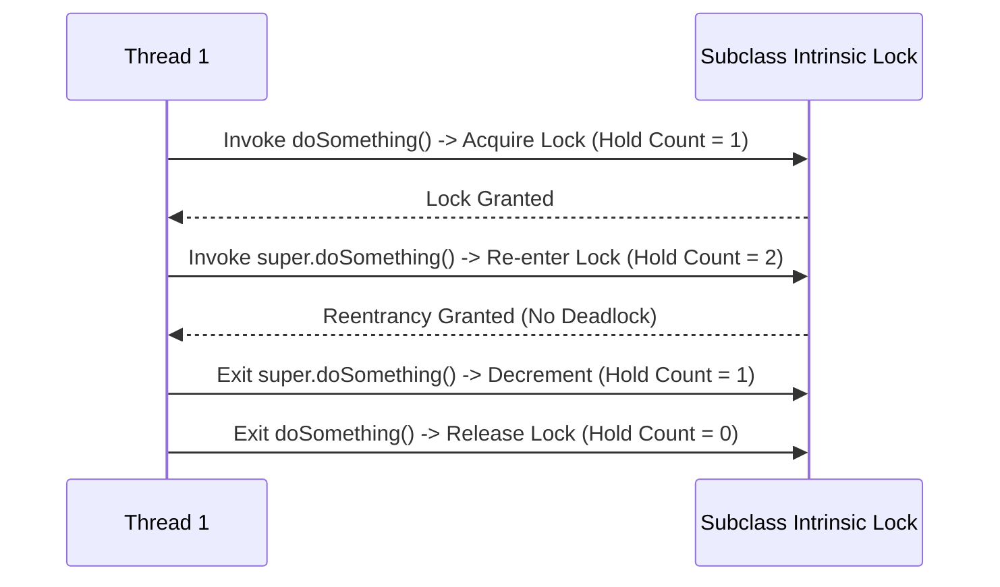

# Chapter 2: Thread Safety

A class is **thread-safe** if it behaves correctly when accessed from multiple threads, regardless of the scheduling or interleaving of the execution of those threads by the runtime environment, and with no additional synchronization or other coordination on the part of the calling code.

---

## 📊 Shared Mutable State & Thread Safety Spectrum



---

## 📌 Race Conditions & Atomicity

A **race condition** occurs when the correctness of a computation depends on the relative timing or interleaving of threads at runtime.

### 1. Check-Then-Act (Lazy Initialization Bug)
```java
// ❌ RACE CONDITION: Check-Then-Act
public class LazyInitRace {
    private ExpensiveObject instance = null;

    public ExpensiveObject getInstance() {
        if (instance == null) { // Check
            instance = new ExpensiveObject(); // Act (Two threads can see null and instantiate twice!)
        }
        return instance;
    }
}
```

### 2. Read-Modify-Write (Un-atomic Increment)
```java
// ❌ RACE CONDITION: count++ is NOT atomic (Read, Add 1, Write Back)
public class UnsafeCounter {
    private int count = 0;

    public void increment() {
        count++; // 3 distinct CPU instructions!
    }
    public int getCount() { return count; }
}
```



---

## 📌 Intrinsic Locks & Reentrancy

Java provides intrinsic locks via the `synchronized` block/method. Intrinsic locks act as **mutexes** (mutually exclusive locks).

### Reentrancy Mechanics
When a thread requests a lock held by another thread, the requesting thread blocks. But if a thread requests a lock that **it already holds**, the request succeeds!



```java
public class Widget {
    public synchronized void doSomething() {
        // ...
    }
}

public class LoggingWidget extends Widget {
    @Override
    public synchronized void doSomething() {
        System.out.println("Calling doSomething");
        super.doSomething(); // Re-enters lock on same Widget instance!
    }
}
```

---

## 📌 Guarding State with Locks

- Every shared mutable variable must be guarded by **exactly one lock**.
- For every invariant that involves more than one variable, **all variables involved in that invariant must be guarded by the same lock**.

```java
// ✅ Correct: Guarding both upper and lower bounds with the same lock
public class SynchronizedFactorizer implements Servlet {
    private BigInteger lastNumber;
    private BigInteger[] lastFactors;

    public synchronized void service(ServletRequest req, ServletResponse resp) {
        BigInteger i = extractFromRequest(req);
        if (i.equals(lastNumber)) {
            encodeIntoResponse(resp, lastFactors);
        } else {
            BigInteger[] factors = factor(i);
            lastNumber = i;
            lastFactors = factors;
            encodeIntoResponse(resp, factors);
        }
    }
}
```
