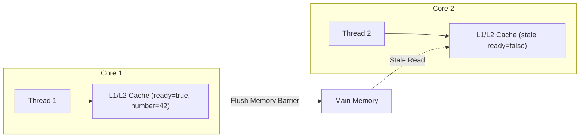
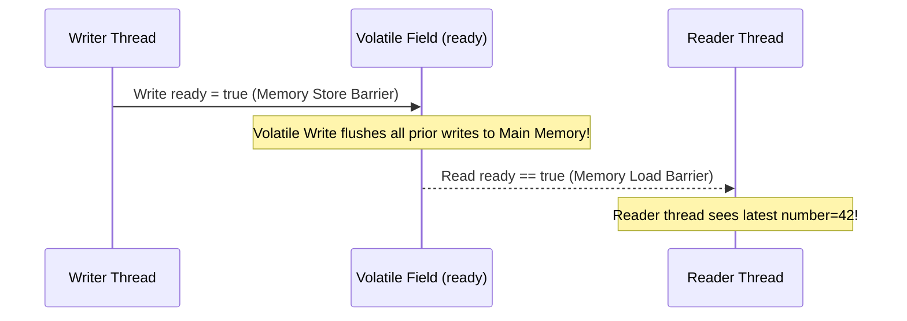
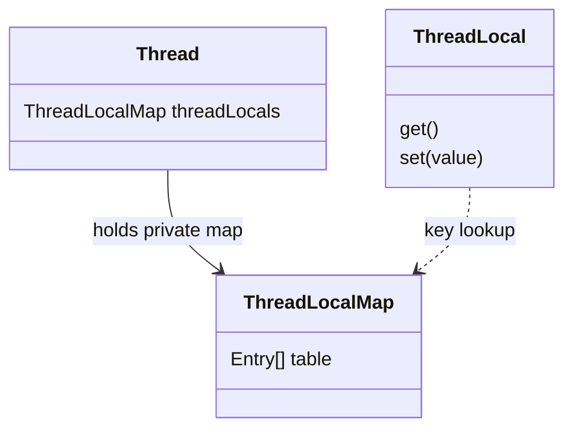

# Chapter 3: Sharing Objects

Focuses on sharing and publishing objects so that they can be accessed safely by multiple threads simultaneously.

---

## 📌 Visibility & The Java Memory Model

In a multithreaded environment without synchronization, the compiler, processor, and runtime may reorder operations or cache values in CPU registers/L1 caches, making writes by one thread invisible to another.



### ❌ Visibility Failure Example (Non-volatile Flag)
```java
public class NoVisibility {
    private static boolean ready;
    private static int number;

    private static class ReaderThread extends Thread {
        public void run() {
            while (!ready) {
                Thread.yield();
            }
            System.out.println(number); // Might print 0 or loop forever due to reordering/caching!
        }
    }

    public static void main(String[] args) {
        new ReaderThread().start();
        number = 42;
        ready = true;
    }
}
```

---

## 📌 Volatile Variables

Declaring a field `volatile` instructs the JVM and compiler not to reorder instructions involving that variable and guarantees that writes are immediately flushed to main memory and reads always fetch the latest value.



### When to use `volatile`?
- Use when writes do not depend on the current value (e.g. status flags: `volatile boolean shutdownRequested;`).
- Do NOT use for `count++` (atomic compound operations require locking or `AtomicInteger`).

---

## 📌 Publication and Escape

**Publication**: Making an object available outside its current scope.
**Escape**: An object published when it should not have been.

### ❌ Escape in Constructor (Publishing `this` before construction finishes)
```java
// ❌ DANGEROUS: Publishing 'this' via event listener inside constructor!
public class ThisEscape {
    public ThisEscape(EventSource source) {
        source.registerListener(new EventListener() {
            public void onEvent(Event e) {
                doSomething(e); // Can run BEFORE ThisEscape constructor finishes!
            }
        });
    }
}
```

---

## 📌 Thread Confinement & `ThreadLocal`

If data is accessed only from a single thread, no synchronization is needed (**Thread Confinement**).



```java
public class ConnectionHolder {
    private static final ThreadLocal<Connection> connectionHolder =
        ThreadLocal.withInitial(() -> DriverManager.getConnection(DB_URL));

    public static Connection getConnection() {
        return connectionHolder.get(); // Each thread gets its own isolated DB Connection!
    }
}
```
