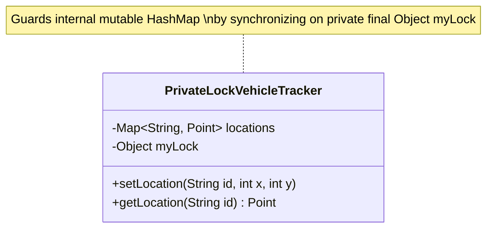

# Chapter 4: Composing Objects

Techniques for composing thread-safe classes out of existing components while preserving invariants.

---

## 📌 Designing Thread-Safe Classes

1. Identify the variables that make up the object's state.
2. Identify the invariants that constrain the state variables.
3. Establish a policy for managing concurrent access to the object's state.

---

## 📌 Instance Confinement & Java Monitor Pattern

Confining an object inside another object ensures that all code paths accessing the inner object are known and guarded by the outer lock.



```java
public class PrivateLockVehicleTracker {
    private final Map<String, Point> locations;
    private final Object myLock = new Object(); // Private lock prevents client external lock interference!

    public PrivateLockVehicleTracker(Map<String, Point> locations) {
        this.locations = deepCopy(locations);
    }

    public Point getLocation(String id) {
        synchronized (myLock) {
            Point p = locations.get(id);
            return p == null ? null : new Point(p); // Defensive Copy!
        }
    }

    public void setLocation(String id, int x, int y) {
        synchronized (myLock) {
            Point old = locations.get(id);
            if (old == null) throw new IllegalArgumentException("No such ID: " + id);
            old.x = x;
            old.y = y;
        }
    }
}
```

---

## 📌 Delegating Thread Safety

If all state variables of a class are thread-safe and independent, and there are no state transitions that depend on multiple variables, the class can delegate its thread safety to its underlying fields.

```java
public class DelegatingVehicleTracker {
    private final ConcurrentMap<String, Point> locations;
    private final Map<String, Point> unmodifiableMap;

    public DelegatingVehicleTracker(Map<String, Point> points) {
        locations = new ConcurrentHashMap<>(points);
        unmodifiableMap = Collections.unmodifiableMap(locations);
    }

    // Delegated directly to ConcurrentHashMap! No explicit synchronized required!
    public Map<String, Point> getLocations() {
        return unmodifiableMap;
    }

    public Point getLocation(String id) {
        return locations.get(id);
    }
}
```
