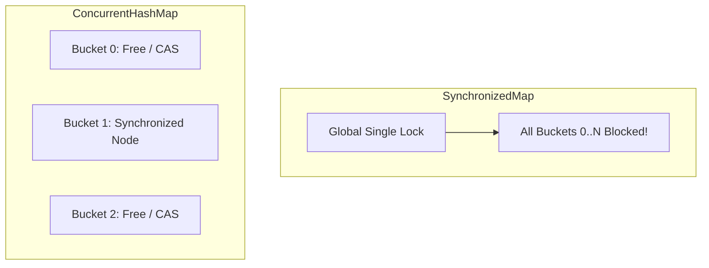
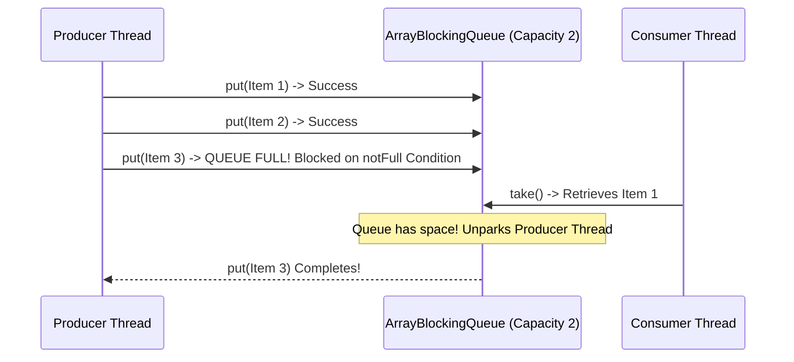

# Chapter 5: Building Blocks

High-level concurrency building blocks from `java.util.concurrent`: Concurrent Collections, Blocking Queues, Latches, Barriers, Semaphores, and Memoizer caches.

---

## 📌 Concurrent Collections vs Synchronized Collections

Legacy synchronized collections (`Vector`, `Hashtable`, `Collections.synchronizedList`) synchronize every method call on a single lock, bottlenecking throughput.

`ConcurrentHashMap` uses lock striping / bucket-level CAS & synchronized nodes, allowing concurrent reads and writes without locking the whole map.



---

## 📌 Blocking Queues & Producer-Consumer Pattern

`BlockingQueue` provides blocking `put()` (when queue is full) and `take()` (when queue is empty).



---

## 📌 Synchronizers: Latches, Barriers, Semaphores

### 1. `CountDownLatch` (One-Shot Gate)
Causes one or more threads to wait until a set of operations being performed in other threads completes.

```java
CountDownLatch startGate = new CountDownLatch(1);
CountDownLatch endGate   = new CountDownLatch(nThreads);

for (int i = 0; i < nThreads; i++) {
    new Thread(() -> {
        try {
            startGate.await(); // Wait for master start signal!
            doWork();
        } finally {
            endGate.countDown();
        }
    }).start();
}

startGate.countDown(); // Releases all nThreads simultaneously!
endGate.await();       // Waits until all nThreads complete!
```

### 2. `CyclicBarrier` (Reusable Rendezvous Point)
Allows a set of threads to all wait for each other to reach a common barrier point.

---

## 📌 Building a Scalable Result Cache (Memoizer)

A production-grade thread-safe result cache using `ConcurrentHashMap` and `FutureTask` to avoid duplicate expensive computations under high concurrency.

```java
public class Memoizer<A, V> implements Computable<A, V> {
    private final ConcurrentMap<A, Future<V>> cache = new ConcurrentHashMap<>();
    private final Computable<A, V> c;

    public Memoizer(Computable<A, V> c) { this.c = c; }

    public V compute(final A arg) throws InterruptedException {
        while (true) {
            Future<V> f = cache.get(arg);
            if (f == null) {
                Callable<V> eval = () -> c.compute(arg);
                FutureTask<V> ft = new FutureTask<>(eval);
                f = cache.putIfAbsent(arg, ft); // Atomic Check-and-Put!
                if (f == null) {
                    f = ft;
                    ft.run(); // Call compute inside current thread
                }
            }
            try {
                return f.get();
            } catch (ExecutionException e) {
                cache.remove(arg, f); // Remove failed Future on error!
                throw launderThrowable(e.getCause());
            }
        }
    }
}
```
