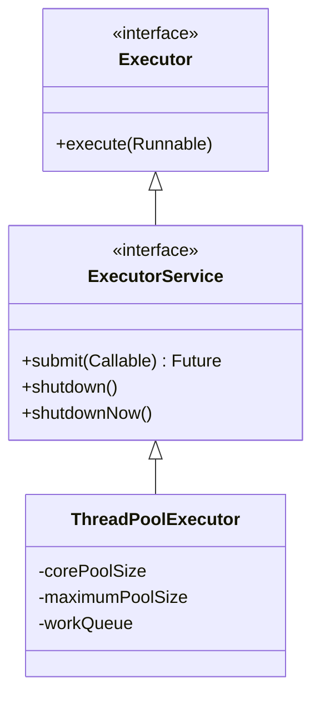
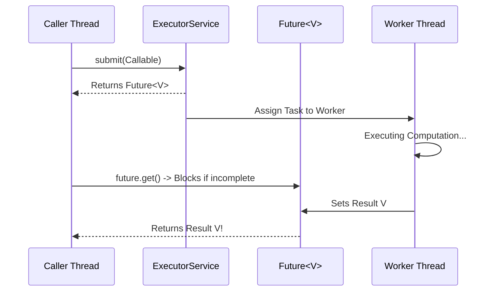

# Chapter 6: Task Execution

Decoupling task submission from execution policy using the Executor Framework.

---

## 📌 Thread vs Task Decoupling

Executing tasks explicitly in threads (`new Thread(runnable).start()`) suffers from 3 major flaws:
1. Thread creation overhead (stack memory, OS thread allocation).
2. Resource exhaustion (unbounded thread creation crashes the OS with `OutOfMemoryError`).
3. Lack of management, monitoring, and cancellation.

### The `Executor` Interface
```java
public interface Executor {
    void execute(Runnable command);
}
```

---

## 📌 Executor Framework & Thread Pool Types



### Standard Factory Methods (`Executors`)
- `Executors.newFixedThreadPool(int nThreads)`: Bound thread pool with unbounded `LinkedBlockingQueue`.
- `Executors.newCachedThreadPool()`: Unbound thread pool using `SynchronousQueue`; reuses idle threads or creates new ones.
- `Executors.newSingleThreadExecutor()`: Single worker thread executing tasks sequentially.
- `Executors.newScheduledThreadPool(int corePoolSize)`: Fixed thread pool for delayed or periodic execution.

---

## 📌 Callable and Future

While `Runnable` produces no return value and cannot throw checked exceptions, `Callable<V>` returns a value of type `V` and can throw checked exceptions.



```java
Callable<String> task = () -> {
    // Perform heavy processing...
    return "Result";
};

Future<String> future = executor.submit(task);
try {
    String result = future.get(5, TimeUnit.SECONDS); // Block with timeout!
} catch (TimeoutException e) {
    future.cancel(true); // Cancel if timed out!
}
```
