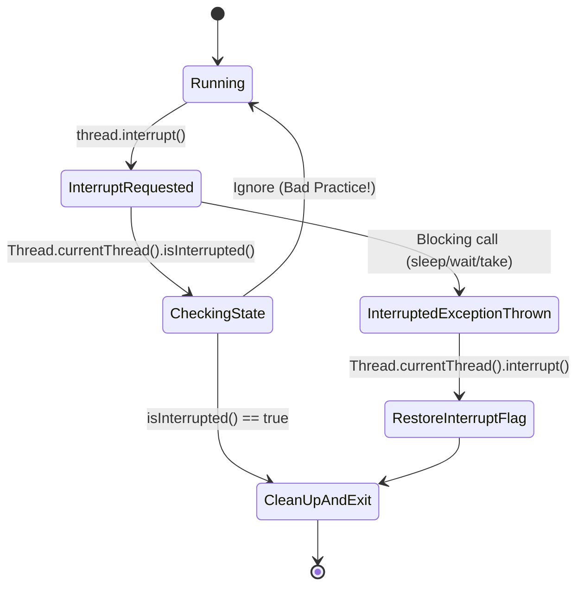

# Chapter 7: Cancellation and Shutdown

Safely stopping long-running tasks, service shutdown, and JVM cleanup.

---

## 📌 Task Interruption & Interruption Policy

There is no safe way to force a thread to stop immediately in Java (`Thread.stop()` is deprecated because it unlocks all monitors, leaving objects in corrupted states).

Instead, Java uses **cooperative interruption**. Interruption does not compel a thread to stop; it merely alerts the thread that cancellation has been requested.



### 🛠 How to Respond to Interruption

#### 1. Propagate the `InterruptedException`
```java
public Item takeItem() throws InterruptedException {
    return queue.take(); // Propagate directly to caller!
}
```

#### 2. Restore the Interrupt Status (If catching in non-throwing context)
```java
public void run() {
    try {
        while (!Thread.currentThread().isInterrupted()) {
            doWork();
        }
    } catch (InterruptedException e) {
        // Restore interrupted status so callers further up stack know!
        Thread.currentThread().interrupt();
    }
}
```

---

## 📌 JVM Shutdown Hooks & Uncaught Exception Handlers

### Uncaught Exception Handlers
When a thread terminates due to an uncaught exception, the JVM queries the thread's `UncaughtExceptionHandler`:

```java
Thread.setDefaultUncaughtExceptionHandler((thread, throwable) -> {
    logger.error("Thread " + thread.getName() + " died with uncaught exception", throwable);
});
```

### Shutdown Hooks
JVM shutdown hooks are unstarted threads registered with `Runtime`:

```java
Runtime.getRuntime().addShutdownHook(new Thread(() -> {
    logger.info("JVM Shutting down. Closing database connection pools...");
    connectionPool.close();
}));
```
