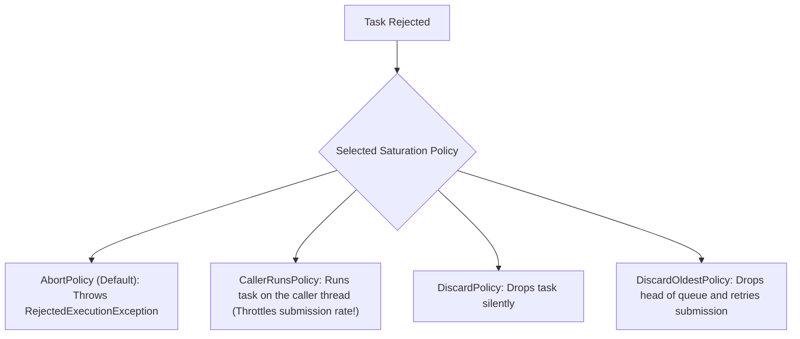

# Chapter 8: Applying Thread Pools

Configuration, sizing, saturation policies, and thread pool extension hooks.

---

## 📌 Thread Pool Sizing

### CPU-Bound vs I/O-Bound Workloads

- **CPU-Bound Tasks**: $N_{\text{threads}} = N_{\text{CPU}} + 1$ (the $+1$ provides a spare thread in case of a page fault or OS context pause).
- **I/O-Bound Tasks** (Network, DB, File I/O):
  $$N_{\text{threads}} = N_{\text{CPU}} \times U_{\text{CPU}} \times \left(1 + \frac{W}{C}\right)$$

If tasks spend 80% of time waiting for DB query responses ($W/C = 4/1 = 4$), on an 8-core CPU at 100% utilization:
$$N_{\text{threads}} = 8 \times 1.0 \times (1 + 4) = 40 \text{ threads}$$

---

## 📌 Saturation Policies (`RejectedExecutionHandler`)

When the work queue and maximum thread pool are both full, new tasks submitted to `ThreadPoolExecutor` are rejected via the active `RejectedExecutionHandler`:



```java
ThreadPoolExecutor executor = new ThreadPoolExecutor(
    10,                          // corePoolSize
    50,                          // maximumPoolSize
    60L, TimeUnit.SECONDS,       // keepAliveTime
    new ArrayBlockingQueue<>(100),// Bounded Work Queue
    new ThreadFactoryBuilder().setNameFormat("worker-%d").build(),
    new ThreadPoolExecutor.CallerRunsPolicy() // Saturation Policy!
);
```
