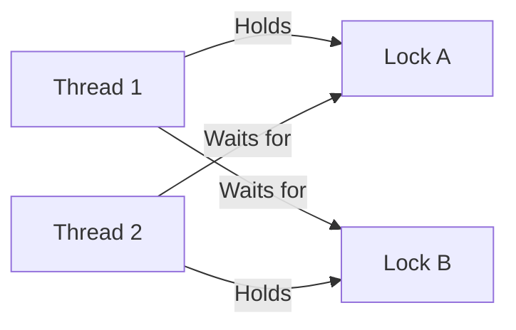
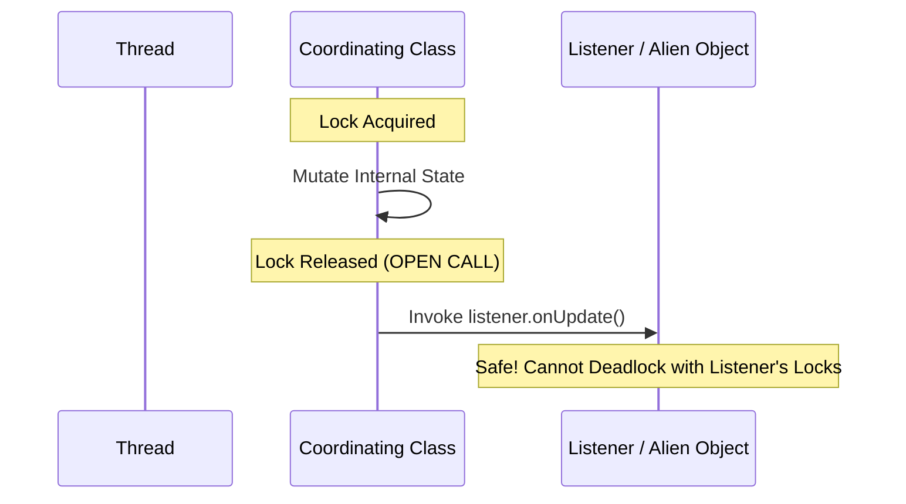

# Chapter 10: Avoiding Liveness Hazards

Deadlocks, lock-ordering bugs, open calls, starvation, and livelocks.

---

## 📌 Lock-Ordering Deadlocks

A **deadlock** occurs when two or more threads hold locks that the others need, creating a cyclic dependency graph.



### ❌ Dynamic Lock Order Deadlock Example
```java
// ❌ DEADLOCK HAZARD: If Thread 1 calls transferMoney(A, B, 100) 
// and Thread 2 calls transferMoney(B, A, 50) simultaneously!
public void transferMoney(Account fromAccount, Account toAccount, DollarAmount amount) {
    synchronized (fromAccount) {
        synchronized (toAccount) {
            fromAccount.debit(amount);
            toAccount.credit(amount);
        }
    }
}
```

### ✅ Solution: Lock Ordering via Hash Code or System Identity
```java
// ✅ Deadlock-Free: Lock acquisition order is strictly enforced!
public void transferMoney(Account fromAccount, Account toAccount, DollarAmount amount) {
    int fromHash = System.identityHashCode(fromAccount);
    int toHash   = System.identityHashCode(toAccount);

    if (fromHash < toHash) {
        synchronized (fromAccount) {
            synchronized (toAccount) {
                new Helper().transfer();
            }
        }
    } else if (fromHash > toHash) {
        synchronized (toAccount) {
            synchronized (fromAccount) {
                new Helper().transfer();
            }
        }
    } else {
        // Tie-breaker lock for hash collision:
        synchronized (tieLock) {
            synchronized (fromAccount) {
                synchronized (toAccount) {
                    new Helper().transfer();
                }
            }
        }
    }
}
```

---

## 📌 Open Calls

Invoking a method without holding any locks is called an **open call**. Open calls prevent deadlocks between cooperating objects.



---

## 📌 Starvation and Livelock

- **Starvation**: A thread is perpetually denied access to CPU execution or locks (e.g. un-ending high priority thread execution).
- **Livelock**: Threads continuously change their state in response to each other without making forward progress (e.g. two polite people in a hallway stepping side-to-side in unison).
