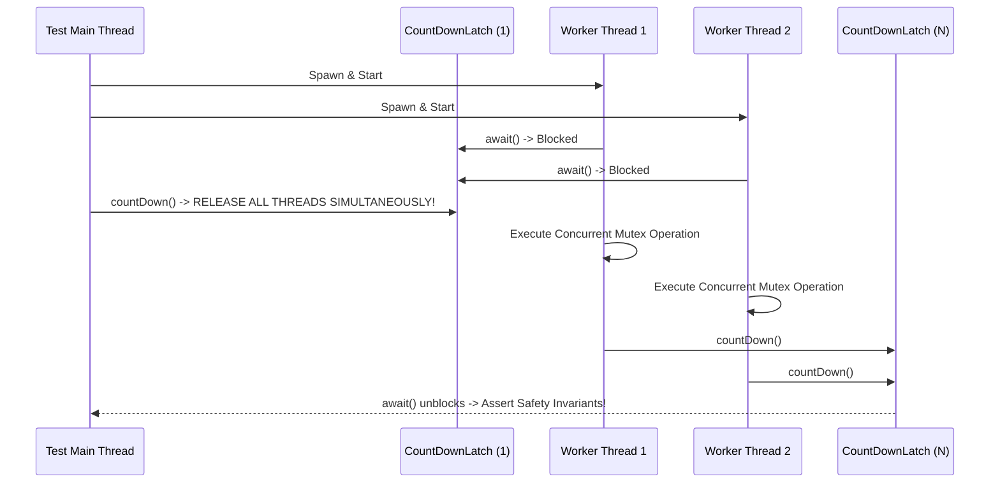

# Chapter 12: Testing Concurrent Programs

Testing for correctness, race conditions, safety invariants, and throughput performance.

---

## 📌 Safety & Correctness Testing Harness

Testing race conditions requires maximizing thread interleaving and ensuring all worker threads release simultaneously (**Start Gate Pattern**).



---

## 📌 Microbenchmarking with JMH (Java Microbenchmark Harness)

Never write manual `System.currentTimeMillis()` benchmark loops for Java concurrent code! The JVM JIT compiler performs dead code elimination, loop unrolling, and constant folding that corrupts custom benchmark results.

Always use **JMH**:

```java
@BenchmarkMode(Mode.Throughput)
@OutputTimeUnit(TimeUnit.MILLISECONDS)
@State(Scope.Benchmark)
public class ConcurrentMapBenchmark {
    private ConcurrentMap<String, String> map = new ConcurrentHashMap<>();

    @Benchmark
    public String testGet() {
        return map.get("key"); // Prevents dead code elimination by returning result!
    }
}
```
