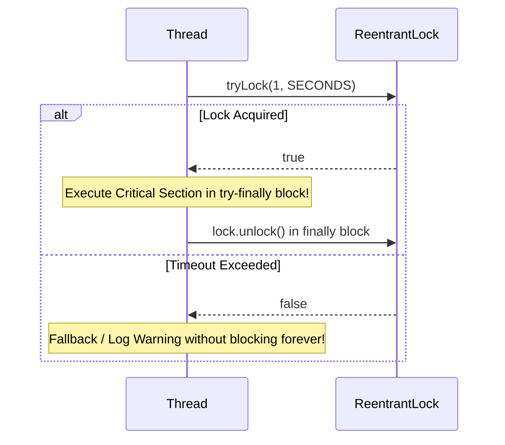
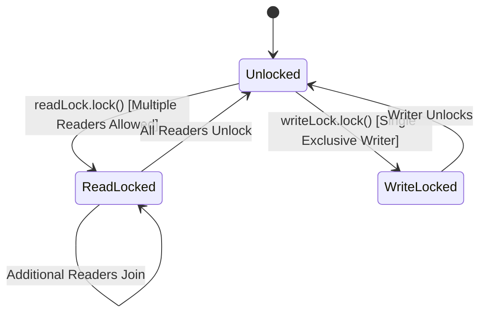

# Chapter 13: Explicit Locks

`ReentrantLock`, timed/interruptible lock acquisition, `ReentrantReadWriteLock`, and modern `StampedLock`.

---

## 📌 `ReentrantLock` vs `synchronized`

`ReentrantLock` implements `Lock` interface, offering explicit features missing from intrinsic `synchronized` blocks:
1. **Timed Lock Acquisition**: `tryLock(timeout, unit)` avoids indefinite waiting.
2. **Interruptible Lock Acquisition**: `lockInterruptibly()` responds to `Thread.interrupt()`.
3. **Fairness Selection**: Fair locking (`new ReentrantLock(true)`) queues waiting threads in FIFO order.
4. **Non-Block-Structured Locking**: Lock can be acquired in one method and released in another.



```java
Lock lock = new ReentrantLock();
// ...
lock.lock();
try {
    // Perform thread-safe work...
} finally {
    lock.unlock(); // ALWAYS unlock in finally block!
}
```

---

## 📌 `ReentrantReadWriteLock` & `StampedLock`

### Read-Write Lock Rule
- **Multiple Readers** can hold the Read Lock simultaneously (high read concurrency).
- **Only One Writer** can hold the Write Lock (exclusive access).



### Modern Java 8 `StampedLock` Optimistic Reading
`StampedLock` improves read performance by allowing **optimistic reads** that do not acquire a read lock at all!

```java
public class Point {
    private double x, y;
    private final StampedLock sl = new StampedLock();

    public double distanceFromOrigin() {
        long stamp = sl.tryOptimisticRead(); // Non-blocking optimistic stamp!
        double currentX = x, currentY = y;
        if (!sl.validate(stamp)) { // Check if a write lock occurred during read!
            stamp = sl.readLock(); // Fallback to pessimistic read lock
            try {
                currentX = x;
                currentY = y;
            } finally {
                sl.unlockRead(stamp);
            }
        }
        return Math.sqrt(currentX * currentX + currentY * currentY);
    }
}
```
