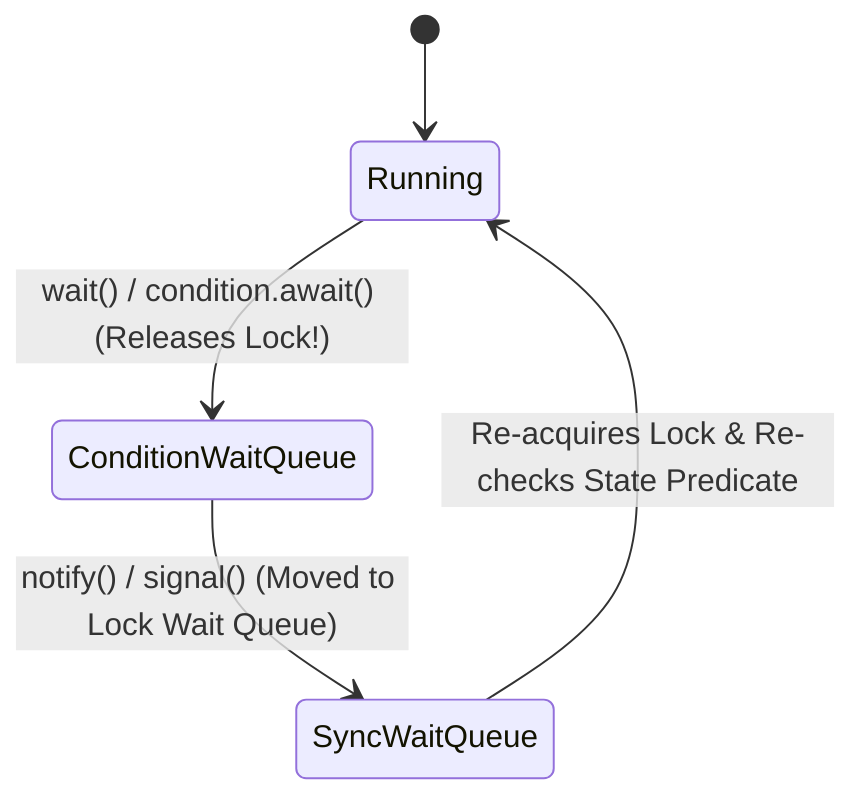
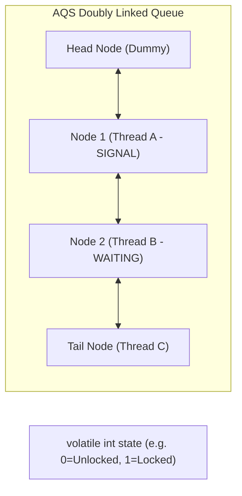

# Chapter 14: Building Custom Synchronizers

Managing state dependencies, Condition queues, and AbstractQueuedSynchronizer (AQS) internal architecture.

---

## 📌 Condition Queues (`wait` / `notifyAll`)

A **condition queue** allows a thread to suspend execution until a state predicate becomes true.



### ⚠️ Golden Rule for Condition Waiting
> **Always test condition predicates in a `while` loop, NEVER an `if` statement!** (Guards against spurious wakeups and state changes between signal and lock acquisition).

```java
synchronized (lock) {
    while (!statePredicate()) {
        lock.wait(); // Re-evaluates state predicate on wakeup!
    }
    // Perform action appropriate to state
}
```

---

## 📌 AbstractQueuedSynchronizer (AQS) Deep Dive

`AbstractQueuedSynchronizer` (AQS) is the framework underlying `ReentrantLock`, `CountDownLatch`, `Semaphore`, `ReentrantReadWriteLock`, and `FutureTask`.

### AQS Core State & FIFO Wait Queue

AQS maintains an atomic `int state` variable and a FIFO doubly-linked CLH lock queue:



- **Exclusive Mode** (`tryAcquire` / `tryRelease`): Used by `ReentrantLock`.
- **Shared Mode** (`tryAcquireShared` / `tryReleaseShared`): Used by `CountDownLatch` and `Semaphore`.

---

## 📌 Custom Synchronizer Example via AQS (Boolean Latch)

```java
public class BooleanLatch {
    private static class Sync extends AbstractQueuedSynchronizer {
        protected int tryAcquireShared(int ignore) {
            // Succeeded if latch is open (state == 1), else fail (-1)
            return (getState() == 1) ? 1 : -1;
        }

        protected boolean tryReleaseShared(int ignore) {
            setState(1); // Open latch
            return true; // Releases waiting threads in shared mode
        }
    }

    private final Sync sync = new Sync();

    public boolean isSignalled() { return sync.getState() == 1; }
    public void signal() { sync.releaseShared(1); }
    public void await() throws InterruptedException { sync.acquireSharedInterruptibly(1); }
}
```
