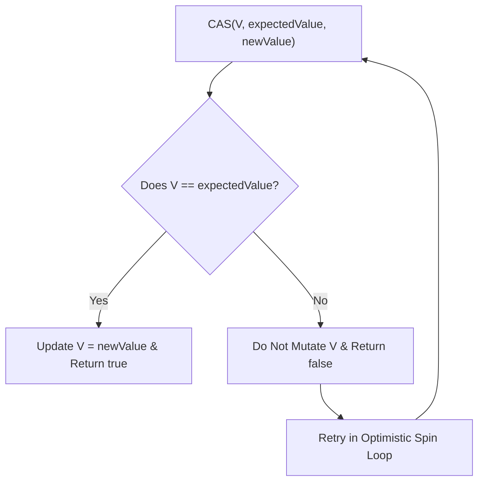

# Chapter 15: Atomic Variables and Nonblocking Synchronization

Hardware CAS (`Compare-And-Swap`), atomic variable classes, and non-blocking algorithms.

---

## 📌 Hardware Compare-And-Swap (CAS)

Locking introduces performance penalties: context switches, kernel transitions, and priority inversion.

Hardware CAS instructions (e.g. x86 `cmpxchg`) execute atomically at the CPU level:



### Atomic Spin Loop (Lock-Free Counter Increment)
```java
public class CasCounter {
    private SimulatedCAS value;

    public int increment() {
        int v;
        do {
            v = value.get();
        } while (v != value.compareAndSwap(v, v + 1)); // Retries until CAS succeeds!
        return v + 1;
    }
}
```

---

## 📌 Non-Blocking Treiber Stack Implementation

```mermaid
flowchart LR
    subgraph Treiber Stack (CAS Top Pointer)
        Top["volatile Node top"] --> NodeA["Node A (Head)"]
        NodeA --> NodeB["Node B"]
        NodeB --> Null["null"]
    end

    NewNode["New Node C"] -. CAS Push .-> Top
```

```java
public class ConcurrentStack<E> {
    private final AtomicReference<Node<E>> top = new AtomicReference<>();

    private static class Node<E> {
        final E item;
        Node<E> next;
        Node(E item) { this.item = item; }
    }

    public void push(E item) {
        Node<E> newHead = new Node<>(item);
        Node<E> oldHead;
        do {
            oldHead = top.get();
            newHead.next = oldHead;
        } while (!top.compareAndSet(oldHead, newHead)); // Atomic Pointer Swap!
    }

    public E pop() {
        Node<E> oldHead;
        Node<E> newHead;
        do {
            oldHead = top.get();
            if (oldHead == null) return null;
            newHead = oldHead.next;
        } while (!top.compareAndSet(oldHead, newHead));
        return oldHead.item;
    }
}
```
