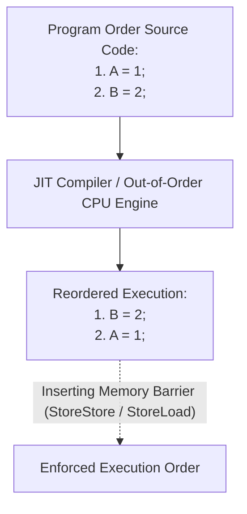
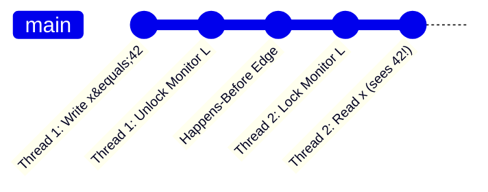

# Chapter 16: The Java Memory Model

Instruction reordering, memory barriers, Happens-Before guarantees, and initialization safety.

---

## 📌 Instruction Reordering & Hardware Memory Barriers

Compilers and Out-of-Order CPU execution engines reorder instructions to maximize execution pipeline throughput.



---

## 📌 The Happens-Before Relationship

If one operation *happens-before* another, the first is guaranteed to be visible to the second, and ordered before it.



### Complete List of Happens-Before Rules
1. **Program Order**: Each action in a thread happens-before every subsequent action in that thread.
2. **Monitor Lock**: Unlock of a monitor lock happens-before every subsequent lock of that monitor lock.
3. **Volatile Variable**: Write to a `volatile` field happens-before every subsequent read of that `volatile` field.
4. **Thread Start**: Call to `Thread.start()` happens-before every action in the started thread.
5. **Thread Join**: All actions in a thread happen-before any other thread successfully returns from `join()` on that thread.
6. **Class Initialization**: Static initializers run before any instance creation or field access.

---

## 📌 Double-Checked Locking (DCL) Fix

### ❌ Broken Double-Checked Locking (Instruction Reordering Bug)
```java
// ❌ BROKEN: Instance allocation can be reordered (1. Allocate memory, 2. Publish reference, 3. Run constructor)
// Another thread can see instance != null and use UNINITIALIZED fields!
public class DoubleCheckedLocking {
    private static Resource instance;

    public static Resource getInstance() {
        if (instance == null) {
            synchronized (DoubleCheckedLocking.class) {
                if (instance == null) {
                    instance = new Resource(); // REORDERING HAZARD!
                }
            }
        }
        return instance;
    }
}
```

### ✅ Fixed Double-Checked Locking (`volatile`)
```java
// ✅ CORRECT: Adding volatile prevents memory reordering of instance construction!
public class SafeDoubleCheckedLocking {
    private static volatile Resource instance;

    public static Resource getInstance() {
        Resource result = instance; // Read volatile once into local variable
        if (result == null) {
            synchronized (SafeDoubleCheckedLocking.class) {
                result = instance;
                if (result == null) {
                    instance = result = new Resource();
                }
            }
        }
        return result;
    }
}
```
