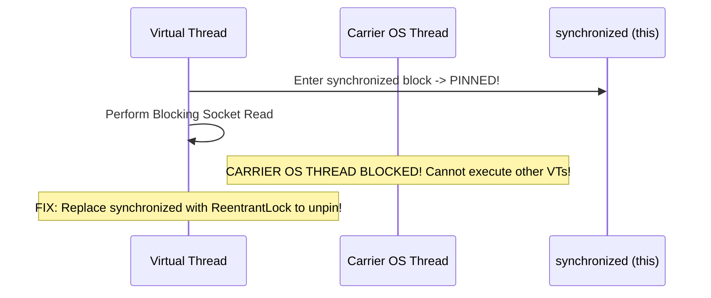

# Chapter 15: Modern Java Concurrency (Java 21+)

Project Loom Virtual Threads, Carrier Thread Pinning, `StructuredTaskScope`, and Scoped Values.

---

## 📌 Virtual Threads vs Platform OS Threads

Prior to Java 21, every `java.lang.Thread` was a 1:1 wrapper around an expensive OS kernel thread (allocating ~1 MB off-heap stack memory).

**Virtual Threads** (Project Loom, Java 21+) are user-mode lightweight threads managed entirely by the JVM runtime (N:M scheduling). Millions of virtual threads can run concurrently on a small pool of Carrier OS Threads!

```mermaid
flowchart TD
    subgraph Virtual Threads (Millions in User Space)
        VT1["Virtual Thread 1 (Stack ~1KB)"]
        VT2["Virtual Thread 2 (Stack ~1KB)"]
        VT3["Virtual Thread 3 (Blocking I/O)"]
        VT4["Virtual Thread 4 (Stack ~1KB)"]
    end

    subgraph Carrier OS Threads (Pool = CPU Cores)
        CT1["Carrier OS Thread 1"]
        CT2["Carrier OS Thread 2"]
    end

    VT1 -->|Mounted on| CT1
    VT2 -->|Mounted on| CT2
    VT3 -. Unmounted on I/O Blocking! .-> Continuation["Continuation Heap Frame"]
    VT4 -->|Mounted on free| CT1
```

### 🛠 Creating Virtual Threads
```java
// Option 1: Virtual Thread Per Task Executor (Drop-in replacement for ThreadPoolExecutor!)
try (var executor = Executors.newVirtualThreadPerTaskExecutor()) {
    IntStream.range(0, 10_000).forEach(i -> {
        executor.submit(() -> {
            // High concurrency blocking I/O operation (DB / Web Service call)
            Thread.sleep(Duration.ofSeconds(1));
            return i;
        });
    });
} // Auto-closes & awaits all 10,000 tasks!
```

---

## 📌 Carrier Thread Pinning Hazard

When a virtual thread executes inside a `synchronized` block or calling native methods (JNI), it gets **pinned** to its Carrier OS Thread. When pinned, blocking I/O will block the underlying OS thread!



### ✅ Solution: Use `ReentrantLock` instead of `synchronized` for I/O operations
```java
// ✅ Virtual thread unmounts cleanly during tryLock / lock wait!
private final ReentrantLock lock = new ReentrantLock();

public void doWork() {
    lock.lock();
    try {
        // Heavy I/O operation...
    } finally {
        lock.unlock();
    }
}
```

---

## 📌 Structured Concurrency (`StructuredTaskScope`)

Structured Concurrency treats groups of concurrent tasks running in different threads as a single unit of work, guaranteeing clean lifecycle scope and cancellation propagation.

```java
// Subtask short-circuit: If user profile OR orders fail, cancel the other subtask immediately!
try (var scope = new StructuredTaskScope.ShutdownOnFailure()) {
    Subtask<UserProfile> userTask  = scope.fork(() -> fetchUser(userId));
    Subtask<List<Order>> ordersTask = scope.fork(() -> fetchOrders(userId));

    scope.join();           // Join both subtasks
    scope.throwIfFailed();  // Throw exception if either failed

    // Both succeeded!
    return new Response(userTask.get(), ordersTask.get());
}
```
