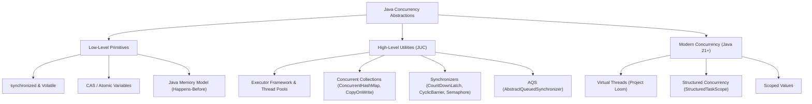

# Java Concurrency in Practice (Action) — Master Guide & Visual Roadmap

A comprehensive, production-grade guide to concurrent programming in Java based on Brian Goetz's landmark *Java Concurrency in Practice*, enriched with **Mermaid diagrams**, deep Java Memory Model (JMM) mechanics, AbstractQueuedSynchronizer (AQS) internals, and Modern Java 21+ Virtual Threads (Project Loom).

---

## 📂 Module Index & Chapter Directory

| Part | Chapter / Guide | Key Concepts | Location |
|---|---|---|---|
| **Cheatsheet** | Quick Reference | Primitives, Locks, Memory Rules | [`00_concurrency_cheatsheet.md`](./00_concurrency_cheatsheet.md) |
| **Part I** | 01. Thread Safety | State, Atomicity, Race Conditions, Reentrancy | [`01_fundamentals/01_thread_safety.md`](./01_fundamentals/01_thread_safety.md) |
| | 02. Sharing Objects | Visibility, Volatile, Safe Publication, ThreadLocal | [`01_fundamentals/02_sharing_objects.md`](./01_fundamentals/02_sharing_objects.md) |
| | 03. Composing Objects | Instance Confinement, Java Monitor Pattern | [`01_fundamentals/03_composing_objects.md`](./01_fundamentals/03_composing_objects.md) |
| | 04. Building Blocks | Concurrent Collections, Latches, Barriers, AQS Cache | [`01_fundamentals/04_building_blocks.md`](./01_fundamentals/04_building_blocks.md) |
| **Part II** | 05. Task Execution | Executor Framework, Thread Pools, Futures | [`02_structuring_applications/05_task_execution.md`](./02_structuring_applications/05_task_execution.md) |
| | 06. Cancellation & Shutdown | Interruption, JVM Shutdown Hooks, Poison Pills | [`02_structuring_applications/06_cancellation_and_shutdown.md`](./02_structuring_applications/06_cancellation_and_shutdown.md) |
| | 07. Applying Thread Pools | Sizing Formulas, Saturation Rejection Policies | [`02_structuring_applications/07_applying_thread_pools.md`](./02_structuring_applications/07_applying_thread_pools.md) |
| **Part III** | 08. Liveness Hazards | Deadlocks, Open Calls, Starvation, Livelock | [`03_liveness_performance_testing/08_liveness_hazards.md`](./03_liveness_performance_testing/08_liveness_hazards.md) |
| | 09. Performance & Scalability | Amdahl's Law, Lock Striping, Lock Splitting | [`03_liveness_performance_testing/09_performance_and_scalability.md`](./03_liveness_performance_testing/09_performance_and_scalability.md) |
| | 10. Testing Concurrent Code | Safety & Performance Testing, JMH Rules | [`03_liveness_performance_testing/10_testing_concurrent_programs.md`](./03_liveness_performance_testing/10_testing_concurrent_programs.md) |
| **Part IV** | 11. Explicit Locks | `ReentrantLock`, `ReadWriteLock`, `StampedLock` | [`04_advanced_topics/11_explicit_locks.md`](./04_advanced_topics/11_explicit_locks.md) |
| | 12. Custom Synchronizers | Condition Queues, AbstractQueuedSynchronizer (AQS) | [`04_advanced_topics/12_building_custom_synchronizers.md`](./04_advanced_topics/12_building_custom_synchronizers.md) |
| | 13. Nonblocking Synchronization | Hardware CAS, Atomic Variables, Lock-Free Queues | [`04_advanced_topics/13_atomic_variables_and_nonblocking.md`](./04_advanced_topics/13_atomic_variables_and_nonblocking.md) |
| | 14. Java Memory Model | JMM Specification, Reordering, Happens-Before | [`04_advanced_topics/14_java_memory_model.md`](./04_advanced_topics/14_java_memory_model.md) |
| **Part V** | 15. Modern Java (Java 21+) | Virtual Threads, Carrier Threads, StructuredTaskScope | [`05_modern_java_concurrency/15_virtual_threads_and_structured_concurrency.md`](./05_modern_java_concurrency/15_virtual_threads_and_structured_concurrency.md) |

---

## 🎨 Visual Overview: Java Concurrency Landscape

