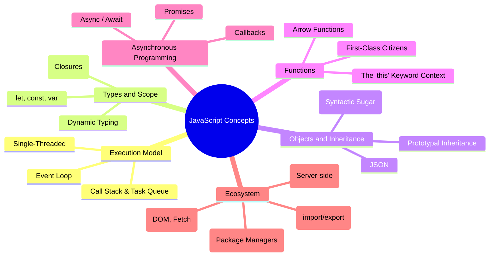

# JavaScript: Theory and Practical Examples

JavaScript is arguably the most ubiquitous programming language today. If you're coming from a statically typed, class-based language like Java or C++, JavaScript requires a significant shift in mental models.

## Mind Map: The Core Concepts

Here is a visual map of JavaScript's unique architectural features and paradigms:



---

## Chapter 1: The Execution Model (The Event Loop)

**Theory:** Unlike Java, which spawns multiple threads for concurrency, standard JavaScript is **single-threaded**. It achieves concurrency through a non-blocking I/O model and the **Event Loop**. When an async task (like a network request or a timer) starts, JS offloads it to the Web APIs (or Node C++ APIs). When the task finishes, a callback is pushed to a queue. The Event Loop constantly checks if the main Call Stack is empty; if it is, it pushes the next callback onto the stack to run.

**Example:**
```javascript
console.log("1. Script start");

// setTimeout is an async Web API. 
// Even with 0ms, it's pushed to the queue and waits for the stack to clear.
setTimeout(() => {
    console.log("3. Timeout finished");
}, 0);

console.log("2. Script end");

// Output:
// 1. Script start
// 2. Script end
// 3. Timeout finished
```

---

## Chapter 2: Variables, Scope, and Closures

**Theory:** JavaScript has function scope (`var`) and block scope (`let`, `const`). A **Closure** is created when a function remembers and accesses its lexical scope, even when that function is executing outside its original lexical scope.

**Example:**
```javascript
// Block Scoping
if (true) {
    var oldSchool = "I leak out of the block";
    let modern = "I am trapped in the block";
    const constant = "I am trapped and cannot be reassigned";
}
console.log(oldSchool); // Works
// console.log(modern); // ReferenceError!

// Closures in Action
function createCounter() {
    let count = 0; // Private variable trapped in the closure
    return function() {
        count++;
        return count;
    };
}

const counter = createCounter();
console.log(counter()); // 1
console.log(counter()); // 2
```

---

## Chapter 3: Types and Coercion

**Theory:** JS is dynamically and weakly typed. It tries to be "helpful" by implicitly converting types (coercion), which can lead to bugs. Always use strict equality (`===`) instead of loose equality (`==`) to prevent coercion.

**Example:**
```javascript
console.log(5 == "5");  // true  (String "5" is coerced to Number 5)
console.log(5 === "5"); // false (Strict check: different types)

console.log(1 + "2");   // "12"  (Number 1 coerced to String)
console.log("5" - 1);   // 4     (String "5" coerced to Number)

// Falsy values: false, 0, "", null, undefined, NaN
// Everything else is truthy.
if (!undefined) {
    console.log("Undefined is falsy!");
}
```

---

## Chapter 4: Objects and Prototypes

**Theory:** JavaScript does not have classes in the traditional OOP sense (Java/C++). Everything is an object, and objects inherit directly from other objects via the **Prototype Chain**. ES6 introduced `class` syntax, but under the hood, it is still prototypal inheritance.

**Example:**
```javascript
// 1. Standard Object Literal
const user = {
    name: "Alice",
    greet() {
        console.log(`Hi, I'm ${this.name}`);
    }
};

// 2. Prototypal Inheritance (The old way)
const admin = Object.create(user);
admin.role = "SuperUser";
admin.greet(); // "Hi, I'm Alice" (Inherited from user)

// 3. ES6 Classes (Syntactic sugar over prototypes)
class Animal {
    constructor(name) {
        this.name = name;
    }
    speak() {
        console.log(`${this.name} makes a noise.`);
    }
}

class Dog extends Animal {
    speak() {
        console.log(`${this.name} barks!`);
    }
}

const dog = new Dog("Rex");
dog.speak(); // "Rex barks!"
```

---

## Chapter 5: Functions and The `this` Keyword

**Theory:** Functions are "First-Class Citizens"—they can be passed as arguments or returned from other functions. The value of `this` in JS is notoriously tricky: in standard functions, `this` depends on *how* the function is called. In Arrow Functions (`() => {}`), `this` is lexically bound (it takes `this` from the surrounding code).

**Example:**
```javascript
const person = {
    name: "Bob",
    
    // Standard function: 'this' refers to the object calling it (person)
    sayName: function() {
        console.log(this.name);
    },
    
    // Arrow function: 'this' is inherited from the outer scope (likely Window or global)
    sayNameArrow: () => {
        console.log(this.name); 
    },
    
    // Using arrow functions to solve scoping issues inside callbacks
    delayedGreet: function() {
        setTimeout(() => {
            console.log(`Delayed Hello from ${this.name}`); // Works because arrow function preserves 'this'
        }, 1000);
    }
};

person.sayName();      // "Bob"
person.sayNameArrow(); // undefined (or throws error in strict mode)
person.delayedGreet(); // "Delayed Hello from Bob"
```

---

## Chapter 6: Asynchronous JavaScript (Promises & Async/Await)

**Theory:** Managing async code used to result in "Callback Hell" (deeply nested callbacks). Promises were introduced to flatten this out. Async/Await is modern syntactic sugar on top of Promises that makes asynchronous code look synchronous.

**Example:**
```javascript
// Simulating an API call that returns a Promise
function fetchUserData(userId) {
    return new Promise((resolve, reject) => {
        setTimeout(() => {
            if (userId === 1) resolve({ id: 1, name: "Kartik" });
            else reject("User not found!");
        }, 1000);
    });
}

// The Old Way: Promises (.then / .catch)
fetchUserData(1)
    .then(data => console.log("Promise Way:", data.name))
    .catch(error => console.error(error));

// The Modern Way: Async / Await
// Must be inside an 'async' function
async function getUser() {
    try {
        const data = await fetchUserData(1);
        console.log("Async/Await Way:", data.name);
        
        // This will throw an error and go to catch
        const badData = await fetchUserData(2); 
    } catch (error) {
        console.error("Error caught:", error);
    }
}

getUser();
```

---

## Chapter 7: The Ecosystem (Node.js & Modules)

**Theory:** JS was born in the browser, but Node.js allowed it to run on the server (by using Chrome's V8 engine). Node uses `npm` (Node Package Manager) to share code. Modern JavaScript uses ES Modules (`import` / `export`) to split code into multiple files, replacing the older CommonJS (`require()`) format used in early Node.

**Example:**
```javascript
// -- file: math.js --
export const add = (a, b) => a + b;
export default function multiply(a, b) {
    return a * b;
}

// -- file: app.js --
import multiply, { add } from './math.js';

console.log(add(2, 3));      // 5
console.log(multiply(2, 3)); // 6
```
