# Low-Level Design (LLD) Mind Map & Pattern Taxonomy

> **Purpose:** Master the classification of LLD problems, design pattern selection, and structural decision-making for Google & Amazon Staff/Senior Software Engineer interviews.

---

## 🧠 Interactive LLD Mind Map (Mermaid Diagram)

```mermaid
graph TD
    Root["LLD Mastery"]
    
    Foundations["01 Foundations"]
    Root --> Foundations
    Foundations --> SOLID["SOLID Principles (SRP, OCP, LSP, ISP, DIP)"]
    
    DesignPatterns["02 Design Patterns"]
    Root --> DesignPatterns
    
    Creational["Creational Patterns"]
    DesignPatterns --> Creational
    Creational --> Singleton["Singleton"]
    Creational --> Factory["Factory Method / Abstract Factory"]
    Creational --> Builder["Builder"]
    
    Structural["Structural Patterns"]
    DesignPatterns --> Structural
    Structural --> Decorator["Decorator (Dynamic Wrapper)"]
    Structural --> Facade["Facade (Unified Interface)"]
    Structural --> Adapter["Adapter (Interface Compatibility)"]
    
    Behavioral["Behavioral Patterns"]
    DesignPatterns --> Behavioral
    Behavioral --> Observer["Observer (Event Notification)"]
    Behavioral --> State["State (State Machine Transitions)"]
    Behavioral --> Strategy["Strategy (Pluggable Algorithms)"]
    Behavioral --> Chain["Chain of Responsibility (Filtering Pipeline)"]
    
    SystemDesigns["03 System Designs"]
    Root --> SystemDesigns
    
    Infrastructure["Infrastructure & Storage"]
    SystemDesigns --> Infrastructure
    Infrastructure --> Logging["Logging Framework (Log4j Pipeline)"]
    Infrastructure --> Cache["In-Memory Cache (LRU/LFU/FIFO O(1))"]
    Infrastructure --> RateLimiter["Distributed Rate Limiter (5 Algorithms)"]
    
    ResourceBooking["Resource Booking & Space"]
    SystemDesigns --> ResourceBooking
    ResourceBooking --> ParkingLot["Parking Lot System"]
    ResourceBooking --> MovieBooking["Movie Booking System (BookMyShow TTL)"]
    ResourceBooking --> Elevator["Elevator Control System (LOOK Algorithm)"]
    
    Finance["Finance & Expense Management"]
    SystemDesigns --> Finance
    Finance --> Splitwise["Splitwise Expense Sharing (Min Cash Flow)"]
    
    Concurrency["Concurrency & Scheduling"]
    SystemDesigns --> Concurrency
    Concurrency --> TaskScheduler["OS Task Scheduler (MLFQ Algorithm)"]
```



---

## 📊 System Problem Taxonomy & Pattern Selection Matrix

| Problem Category | Key Characteristics | Recommended Primary Patterns | Secondary / Supporting Patterns | Benchmark Problems in Repo |
|---|---|---|---|---|
| **01. Foundations** | Core OOP Principles & Refactoring | SOLID, Clean Architecture | Interfaces, Inheritance vs Composition | [`solid/`](01_foundations/solid/) |
| **02. Structural Patterns** | Dynamic Wrapping & Subsystem Simplification | Decorator, Facade | Proxy, Adapter | [`decorator/`](02_design_patterns/structural/decorator/), [`facade/`](02_design_patterns/structural/facade/) |
| **03. Behavioral Patterns** | Event Notifications & State Machine Transitions | Observer, State | Strategy, Command | [`observer/`](02_design_patterns/behavioral/observer/), [`state/`](02_design_patterns/behavioral/state/) |
| **04. Infrastructure & Utilities** | High-Throughput Pipelines & Extensible Processing | Chain of Responsibility, Strategy, Observer | Builder, Singleton | [`logging_framework/`](03_system_designs/infrastructure/logging_framework/), [`cache/`](03_system_designs/infrastructure/cache/) |
| **05. Resource & Booking Systems** | Physical/Digital Reservations & Fine-grained Locking | Facade, Strategy, State | Factory Method, ReentrantLock | [`parking_lot/`](03_system_designs/resource_booking/parking_lot/), [`movie_booking_system/`](03_system_designs/resource_booking/movie_booking_system/) |
| **06. Concurrency & Scheduling** | Multithreading, Queueing & CPU/Task Dispatching | Strategy, Command | PriorityQueue, ConcurrentHashMap | [`task_scheduler/`](03_system_designs/concurrency_scheduling/task_scheduler/) |

---

## 🎯 How to Choose the Right Pattern in an Interview

```
                      Do you need to create complex objects?
                                  │
                       ┌──────────┴──────────┐
                      YES                   NO
                       │                     │
                       ▼                     ▼
          ┌─────────────────────┐   Are you processing events or algorithm logic?
          │ Factory / Builder   │            │
          └─────────────────────┘   ┌────────┴────────┐
                                   YES               NO
                                    │                 │
                                    ▼                 ▼
                       ┌─────────────────────────┐   Are you wrapping or simplifying subsystems?
                       │ Strategy / Observer /   │            │
                       │ Chain of Responsibility │   ┌────────┴────────┐
                       └─────────────────────────┘  YES               NO
                                                     │                 │
                                                     ▼                 ▼
                                         ┌─────────────────────┐   ┌───────────────────────────┐
                                         │ Decorator / Facade  │   │ State / Concurrent Lock   │
                                         └─────────────────────┘   └───────────────────────────┘
```

---

## 📂 Reorganized Directory Mapping

```
lld/
├── 00_LLD_MindMap.md                         <-- You are here
├── 01_foundations/
│   └── solid/                                <-- SOLID Principles (SRP, OCP, LSP, ISP, DIP)
├── 02_design_patterns/
│   ├── structural/
│   │   ├── decorator/                        <-- Structural: Dynamic wrapping / Coffee shop / I/O
│   │   └── facade/                           <-- Structural: Unified system entrance
│   └── behavioral/
│       ├── observer/                         <-- Behavioral: Push/Pull event-driven notifications
│       └── state/                            <-- Behavioral: Finite state machine transitions
└── 03_system_designs/
    ├── infrastructure/
    │   ├── logging_framework/                <-- Infrastructure: Log4j pipeline (Chain, Formatter, Appender)
    │   ├── cache/                            <-- Infrastructure: O(1) Cache with LRU/LFU/FIFO + TTL
    │   └── rate_limiter/                     <-- Infrastructure: Rate Limiter (Token Bucket, Leaky Bucket, Sliding Window)
    ├── resource_booking/
    │   ├── parking_lot/                      <-- Reservation: Parking floor, spot matching & fee strategy
    │   ├── movie_booking_system/             <-- Reservation: BookMyShow (SeatLockManager TTL, Payment)
    │   └── elevator_system/                  <-- Reservation: Multi-Elevator Control System (LOOK/SCAN Algorithm)
    ├── finance/
    │   └── splitwise/                        <-- Finance: Splitwise (Equal/Exact/%, Min Cash Flow Graph Debt Simplifier)
    └── concurrency_scheduling/
        └── task_scheduler/                   <-- Concurrency: CPU Dispatcher & MLFQ Scheduling Algorithms
```
