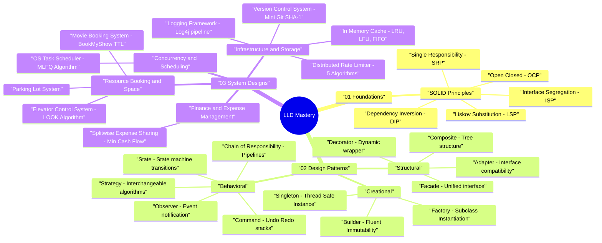

# Low-Level Design (LLD) Mind Map & Pattern Taxonomy

> **Purpose:** Master the classification of LLD problems, design pattern selection, and structural decision-making for Google & Amazon Staff/Senior Software Engineer interviews.

---

## 🧠 Interactive LLD Mind Map (Mermaid Diagram)



---

## 📊 System Problem Taxonomy & Pattern Selection Matrix

| Problem Category | Key Characteristics | Recommended Primary Patterns | Secondary / Supporting Patterns | Benchmark Problems in Repo |
|---|---|---|---|---|
| **01. Foundations** | Core OOP Principles & Refactoring | SOLID, Clean Architecture | Interfaces, Inheritance vs Composition | [`solid/`](01_foundations/solid/) |
| **02. Creational Patterns** | Object Instantiation & Immutability | Singleton, Factory, Builder | Prototype, Object Pool | [`singleton/`](02_design_patterns/creational/singleton/), [`factory/`](02_design_patterns/creational/factory/), [`builder/`](02_design_patterns/creational/builder/) |
| **03. Structural Patterns** | Dynamic Wrapping & Subsystem Simplification | Decorator, Facade, Adapter, Composite | Proxy, Bridge | [`decorator/`](02_design_patterns/structural/decorator/), [`facade/`](02_design_patterns/structural/facade/), [`adapter/`](02_design_patterns/structural/adapter/), [`composite/`](02_design_patterns/structural/composite/) |
| **04. Behavioral Patterns** | Event Notifications, Pipelines & State Machine Transitions | Observer, State, Strategy, Chain of Responsibility, Command | Mediator, Memento, Iterator | [`observer/`](02_design_patterns/behavioral/observer/), [`state/`](02_design_patterns/behavioral/state/), [`strategy/`](02_design_patterns/behavioral/strategy/), [`chain_of_responsibility/`](02_design_patterns/behavioral/chain_of_responsibility/), [`command/`](02_design_patterns/behavioral/command/) |
| **05. Infrastructure & Utilities** | High-Throughput Pipelines & Extensible Storage | Composite, Strategy, Chain of Responsibility | Builder, Singleton | [`version_control_system/`](03_system_designs/infrastructure/version_control_system/), [`logging_framework/`](03_system_designs/infrastructure/logging_framework/), [`cache/`](03_system_designs/infrastructure/cache/) |
| **06. Resource & Booking Systems** | Physical/Digital Reservations & Fine-grained Locking | Facade, Strategy, State | Factory Method, ReentrantLock | [`parking_lot/`](03_system_designs/resource_booking/parking_lot/), [`movie_booking_system/`](03_system_designs/resource_booking/movie_booking_system/) |
| **07. Concurrency & Scheduling** | Multithreading, Queueing & CPU/Task Dispatching | Strategy, Command | PriorityQueue, ConcurrentHashMap | [`task_scheduler/`](03_system_designs/concurrency_scheduling/task_scheduler/) |

---

## 🎯 How to Choose the Right Pattern in an Interview

```
                      Do you need to create complex objects?
                                   │
                        ┌──────────┴──────────┐
                       YES                   NO
                        │                     │
                        ▼                     ▼
           ┌─────────────────────┐   Are you processing events or algorithm logic?
           │ Factory / Builder / │            │
           │ Singleton           │   ┌────────┴────────┐
           └─────────────────────┘  YES               NO
                                     │                 │
                                     ▼                 ▼
                        ┌─────────────────────────┐   Are you wrapping or simplifying subsystems?
                        │ Strategy / Observer /   │            │
                        │ Chain of Responsibility │   ┌────────┴────────┐
                        │ / Command               │  YES               NO
                        └─────────────────────────┘   │                 │
                                                      ▼                 ▼
                                          ┌─────────────────────┐   ┌───────────────────────────┐
                                          │ Decorator / Facade  │   │ State / Concurrent Lock   │
                                          │ / Adapter /Composite│   │                           │
                                          └─────────────────────┘   └───────────────────────────┘
```
