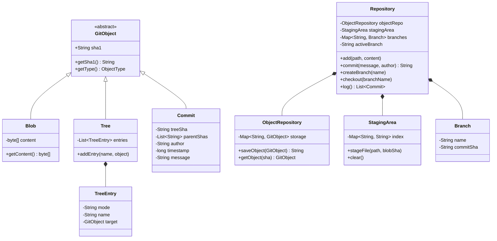

# Low-Level Design: Version Control System (Mini-Git)

> **Goal:** Design and implement a production-grade, object-oriented Version Control System (Mini-Git) incorporating Content-Addressable Storage (SHA-1 hashing), the Composite Pattern for directory trees, Staging Area Indexing, Branching, Checkout, and Commit history graph traversal.

---

## 1. System Requirements & Features

### Functional Requirements:
1. **Initialize Repository (`init`):** Initialize an empty repository with `.git` storage structures.
2. **Stage Changes (`add`):** Stage file content into the Staging Index and write SHA-1 hashed `Blob` objects to the Object Store.
3. **Commit Changes (`commit`):** Create root `Tree` objects representing staged directory structure, create a `Commit` object pointing to the root Tree and current parent `Commit`, and advance the active `Branch` ref.
4. **Branching (`branch`):** Create a new named pointer to the current `HEAD` commit ($O(1)$ complexity).
5. **Checkout (`checkout`):** Switch `HEAD` to a target branch or commit, restoring the working directory state from the target commit's root tree.
6. **Log Traversal (`log`):** Traverses the DAG commit history backwards from `HEAD` to root commit.
7. **Tree Diff (`diff`):** Calculates differences between two commit trees.

### Non-Functional Requirements:
- **Immutability:** Git objects (`Blob`, `Tree`, `Commit`) are immutable once written.
- **De-duplication:** Identical file contents generate identical SHA-1 hashes and store only 1 `Blob`.
- **Thread Safety:** Thread-safe concurrent access for staging, commits, and branch creation.

---

## 2. Object-Oriented Design & Class Diagram

---

## 3. Design Patterns Applied

1. **Composite Pattern:** `Tree` objects contain lists of `TreeEntry` items pointing to either `Blob` objects (Leaves) or other `Tree` objects (Sub-composites).
2. **Content-Addressable Strategy Pattern:** Hashing strategy (SHA-1 / SHA-256) calculates deterministic object keys based on payload header + bytes.
3. **State Pattern:** Managing repository states (`WORKING_TREE`, `STAGING_INDEX`, `COMMITTED_HEAD`).

---

## 4. Key Operation Workflows

### 1. `add(path, content)`
1. Hash `content` $\to$ SHA-1 (e.g. `8a3f...`).
2. Create `Blob` object and store in `ObjectRepository`.
3. Update `StagingArea` map: `path -> 8a3f...`.

### 2. `commit(message, author)`
1. Read `StagingArea` entries.
2. Build hierarchical `Tree` objects for directory structure $\to$ store in `ObjectRepository` $\to$ get `rootTreeSha`.
3. Get current commit SHA-1 from active `Branch` as `parentSha`.
4. Create `Commit` object `(rootTreeSha, [parentSha], author, timestamp, message)` $\to$ store in `ObjectRepository` $\to$ get `commitSha`.
5. Move active `Branch` pointer to `commitSha`.
6. Clear `StagingArea`.
