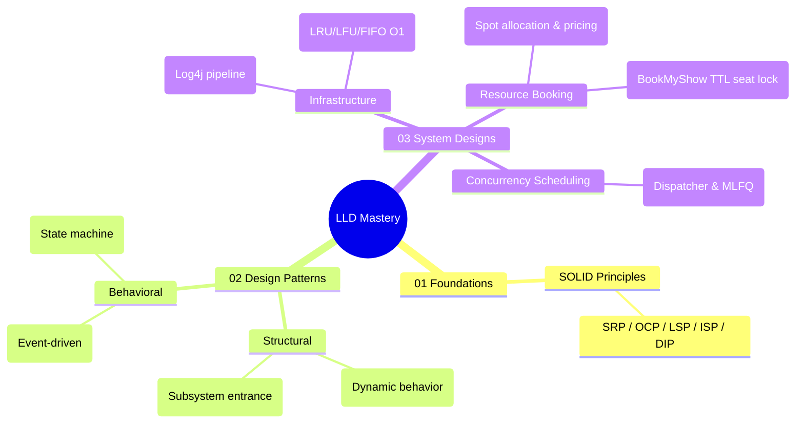

# Low-Level Design (LLD) — Google Interview Preparation

> **Goal:** Master object-oriented design principles, design patterns, and production-grade system design implementations for Google & Amazon interviews.

---

## 🧠 Interactive LLD Mind Map



👉 **Full Mind Map & Taxonomy Guide:** [`00_LLD_MindMap.md`](00_LLD_MindMap.md)

---

## 📁 Organized Repository Structure

```
lld/
├── 00_LLD_MindMap.md                                 — Mind Map, Pattern Matrix & Decision Tree
├── 01_foundations/
│   └── solid/                                        — SOLID Principles (The Foundation)
├── 02_design_patterns/
│   ├── structural/
│   │   ├── decorator/                                — Structural: Decorator Pattern
│   │   └── facade/                                   — Structural: Facade Pattern
│   └── behavioral/
│       ├── observer/                                 — Behavioral: Observer Pattern
│       └── state/                                    — Behavioral: State Pattern
└── 03_system_designs/
    ├── infrastructure/
    │   ├── logging_framework/                        — LLD: Log4j Logging Framework
    │   ├── cache/                                    — LLD: In-Memory Cache (O(1) Eviction)
    │   └── rate_limiter/                             — LLD: Rate Limiter (Token/Leaky Bucket, Sliding Log/Counter)
    ├── resource_booking/
    │   ├── parking_lot/                              — LLD: Parking Lot System
    │   └── movie_booking_system/                     — LLD: Movie Booking System (BookMyShow)
    └── concurrency_scheduling/
        └── task_scheduler/                           — LLD: OS CPU Task Scheduler (MLFQ)
```

---

## 📚 Categorized Modules & Code Maps

### 1. Foundations — [`01_foundations/`](01_foundations/)

- **SOLID Principles** ([`solid/`](01_foundations/solid/)): The 5 foundational OOP principles ([SRP](01_foundations/solid/01_S_SingleResponsibility.java), [OCP](01_foundations/solid/02_O_OpenClosed.java), [LSP](01_foundations/solid/03_L_LiskovSubstitution.java), [ISP](01_foundations/solid/04_I_InterfaceSegregation.java), [DIP](01_foundations/solid/05_D_DependencyInversion.java)).

---

### 2. Design Patterns — [`02_design_patterns/`](02_design_patterns/)

#### Structural Patterns ([`structural/`](02_design_patterns/structural/))
- **Decorator Pattern** ([`decorator/`](02_design_patterns/structural/decorator/)): Attach dynamic behavior without modifying class definitions.
- **Facade Pattern** ([`facade/`](02_design_patterns/structural/facade/)): Unified interface simplifying complex subsystem interactions.

#### Behavioral Patterns ([`behavioral/`](02_design_patterns/behavioral/))
- **Observer Pattern** ([`observer/`](02_design_patterns/behavioral/observer/)): Event-driven push/pull notifications across systems.
- **State Pattern** ([`state/`](02_design_patterns/behavioral/state/)): Finite state machine transitions for domain entities.

---

### 3. Full System Designs — [`03_system_designs/`](03_system_designs/)

#### Infrastructure & Storage ([`infrastructure/`](03_system_designs/infrastructure/))
- **Logging Framework** ([`logging_framework/`](03_system_designs/infrastructure/logging_framework/)): Log4j-style filtering pipeline with Chain of Responsibility, Formatters, and Async Appenders.
- **In-Memory Cache** ([`cache/`](03_system_designs/infrastructure/cache/)): Production $O(1)$ cache supporting pluggable LRU, LFU, FIFO eviction policies and thread-safe TTL.
- **Distributed Rate Limiter** ([`rate_limiter/`](03_system_designs/infrastructure/rate_limiter/)): High-throughput rate limiter implementing 5 core algorithms (Token Bucket, Leaky Bucket, Fixed Window, Sliding Window Log, and Sliding Window Counter) with multithreaded thread safety.

#### Resource & Reservation Systems ([`resource_booking/`](03_system_designs/resource_booking/))
- **Parking Lot System** ([`parking_lot/`](03_system_designs/resource_booking/parking_lot/)): Multi-floor vehicle-to-spot matching, Strategy-based fee calculation, and real-time display boards.
- **Movie Booking System** ([`movie_booking_system/`](03_system_designs/resource_booking/movie_booking_system/)): BookMyShow / Fandango engine featuring `ReentrantLock` fine-grained seat locking, TTL auto-expiration worker, coupon strategies, and payment integration.

#### Concurrency & Scheduling ([`concurrency_scheduling/`](03_system_designs/concurrency_scheduling/))
- **OS Task Scheduler** ([`task_scheduler/`](03_system_designs/concurrency_scheduling/task_scheduler/)): CPU process scheduler implementing FCFS, SJF, SRTF, Round-Robin, Priority, and Multi-Level Feedback Queue (MLFQ).

---

## 🎯 Interview Decision Framework

```
                      Do you need to create complex objects?
                                  │
                       ┌──────────┴──────────┐
                      YES                   NO
                       │                     │
                       ▼                     ▼
          ┌─────────────────────┐   Are you processing events or algorithm logic?
          │ Factory / Builder   │            │
          └─────────────────────┘   ┌────────┴────────┐
                                   YES               NO
                                    │                 │
                                    ▼                 ▼
                       ┌─────────────────────────┐   Are you wrapping or simplifying subsystems?
                       │ Strategy / Observer /   │            │
                       │ Chain of Responsibility │   ┌────────┴────────┐
                       └─────────────────────────┘  YES               NO
                                                     │                 │
                                                     ▼                 ▼
                                         ┌─────────────────────┐   ┌───────────────────────────┐
                                         │ Decorator / Facade  │   │ State / Concurrent Lock   │
                                         └─────────────────────┘   └───────────────────────────┘
```
