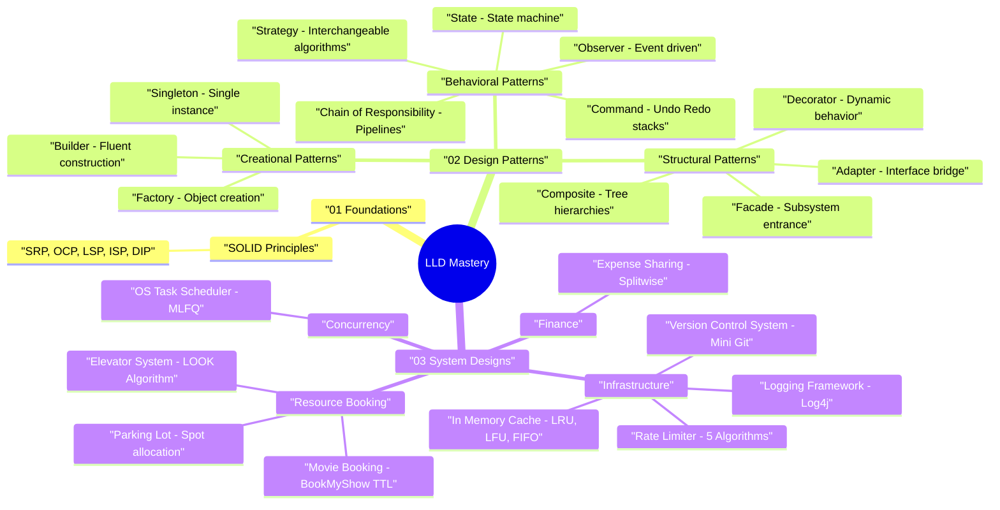

# Low-Level Design (LLD) — Google & Staff Software Engineering

> **Goal:** Master object-oriented design principles, Gang of Four (GoF) design patterns, and production-grade system design implementations for Google, Amazon, Meta, and Staff/Senior Software Engineering interviews.

---

## 🧠 Interactive LLD Mind Map



👉 **Full Mind Map & Taxonomy Guide:** [`00_LLD_MindMap.md`](00_LLD_MindMap.md)  
📚 **Recommended Books & References:** [`00_Recommended_Books_and_Resources.md`](00_Recommended_Books_and_Resources.md)

---

## 📁 Organized Repository Structure

```
lld/
├── 00_LLD_MindMap.md                                 — Mind Map, Pattern Matrix & Decision Tree
├── 01_foundations/
│   └── solid/                                        — SOLID Principles (The Foundation)
├── 02_design_patterns/
│   ├── creational/
│   │   ├── singleton/                                — Creational: Double-Checked, Bill Pugh & Enum Singleton
│   │   ├── factory/                                  — Creational: Factory Method & Abstract Factory
│   │   └── builder/                                  — Creational: Builder Pattern with Fluent API
│   ├── structural/
│   │   ├── decorator/                                — Structural: Decorator Pattern
│   │   ├── facade/                                   — Structural: Facade Pattern
│   │   ├── adapter/                                  — Structural: Adapter Pattern (Legacy Integration)
│   │   └── composite/                                — Structural: Composite Pattern (Tree Structures)
│   └── behavioral/
│       ├── observer/                                 — Behavioral: Observer Pattern
│       ├── state/                                    — Behavioral: State Pattern
│       ├── strategy/                                 — Behavioral: Strategy Pattern
│       ├── chain_of_responsibility/                  — Behavioral: Chain of Responsibility (Middleware)
│       └── command/                                  — Behavioral: Command Pattern (Undo/Redo)
└── 03_system_designs/
    ├── infrastructure/
    │   ├── version_control_system/                   — LLD: Version Control System (Mini-Git)
    │   ├── logging_framework/                        — LLD: Log4j Logging Framework
    │   ├── cache/                                    — LLD: In-Memory Cache (O(1) Eviction)
    │   └── rate_limiter/                             — LLD: Rate Limiter (Token/Leaky Bucket, Sliding Log/Counter)
    ├── resource_booking/
    │   ├── parking_lot/                              — LLD: Parking Lot System
    │   ├── movie_booking_system/                     — LLD: Movie Booking System (BookMyShow)
    │   └── elevator_system/                          — LLD: Elevator Control System (LOOK Algorithm)
    ├── finance/
    │   └── splitwise/                                — LLD: Expense Sharing System (Splitwise)
    └── concurrency_scheduling/
        └── task_scheduler/                           — LLD: OS CPU Task Scheduler (MLFQ)
```

---

## 📚 Categorized Modules & Code Maps

### 1. Foundations — [`01_foundations/`](01_foundations/)
- **SOLID Principles** ([`solid/`](01_foundations/solid/)): The 5 foundational OOP principles ([SRP](01_foundations/solid/01_S_SingleResponsibility.java), [OCP](01_foundations/solid/02_O_OpenClosed.java), [LSP](01_foundations/solid/03_L_LiskovSubstitution.java), [ISP](01_foundations/solid/04_I_InterfaceSegregation.java), [DIP](01_foundations/solid/05_D_DependencyInversion.java)).

---

### 2. Design Patterns — [`02_design_patterns/`](02_design_patterns/)

#### Creational Patterns ([`creational/`](02_design_patterns/creational/))
- **Singleton Pattern** ([`singleton/`](02_design_patterns/creational/singleton/)): Thread-safe lazy initialization (Double-Checked, Bill Pugh, Enum).
- **Factory & Abstract Factory Pattern** ([`factory/`](02_design_patterns/creational/factory/)): Decoupled product instantiation across product families.
- **Builder Pattern** ([`builder/`](02_design_patterns/creational/builder/)): Step-by-step immutable object construction with fluent chaining.

#### Structural Patterns ([`structural/`](02_design_patterns/structural/))
- **Decorator Pattern** ([`decorator/`](02_design_patterns/structural/decorator/)): Attach dynamic behavior without modifying class definitions.
- **Facade Pattern** ([`facade/`](02_design_patterns/structural/facade/)): Unified interface simplifying complex subsystem interactions.
- **Adapter Pattern** ([`adapter/`](02_design_patterns/structural/adapter/)): Bridge incompatible 3rd-party interfaces with standard system contracts.
- **Composite Pattern** ([`composite/`](02_design_patterns/structural/composite/)): Represent hierarchical tree structures uniformly.

#### Behavioral Patterns ([`behavioral/`](02_design_patterns/behavioral/))
- **Observer Pattern** ([`observer/`](02_design_patterns/behavioral/observer/)): Event-driven push/pull notifications across systems.
- **State Pattern** ([`state/`](02_design_patterns/behavioral/state/)): Finite state machine transitions for domain entities.
- **Strategy Pattern** ([`strategy/`](02_design_patterns/behavioral/strategy/)): Interchangeable runtime algorithm encapsulation.
- **Chain of Responsibility Pattern** ([`chain_of_responsibility/`](02_design_patterns/behavioral/chain_of_responsibility/)): Pipeline filtering middleware handlers.
- **Command Pattern** ([`command/`](02_design_patterns/behavioral/command/)): First-class request objects supporting Undo/Redo stacks.

---

### 3. Full System Designs — [`03_system_designs/`](03_system_designs/)

#### Infrastructure & Storage ([`infrastructure/`](03_system_designs/infrastructure/))
- **Version Control System (Mini-Git)** ([`version_control_system/`](03_system_designs/infrastructure/version_control_system/)): Content-addressable Object Database (Blobs, Trees, Commits, Tags), Staging Index, Branching, Checkout, and Commit DAG Log Traversal.  
  📄 **1-Page Revision Card:** [`00_OnePage_Revision.pdf`](03_system_designs/infrastructure/version_control_system/00_OnePage_Revision.pdf)
- **Logging Framework** ([`logging_framework/`](03_system_designs/infrastructure/logging_framework/)): Log4j-style filtering pipeline with Chain of Responsibility, Formatters, and Async Appenders.  
  📄 **1-Page Revision Card:** [`00_OnePage_Revision.pdf`](03_system_designs/infrastructure/logging_framework/00_OnePage_Revision.pdf)
- **In-Memory Cache** ([`cache/`](03_system_designs/infrastructure/cache/)): Production $O(1)$ cache supporting pluggable LRU, LFU, FIFO eviction policies and thread-safe TTL.  
  📄 **1-Page Revision Card:** [`00_OnePage_Revision.pdf`](03_system_designs/infrastructure/cache/00_OnePage_Revision.pdf)
- **Distributed Rate Limiter** ([`rate_limiter/`](03_system_designs/infrastructure/rate_limiter/)): High-throughput rate limiter implementing 5 core algorithms (Token Bucket, Leaky Bucket, Fixed Window, Sliding Window Log, and Sliding Window Counter) with multithreaded thread safety.  
  📄 **1-Page Revision Card:** [`00_OnePage_Revision.pdf`](03_system_designs/infrastructure/rate_limiter/00_OnePage_Revision.pdf)

#### Resource & Reservation Systems ([`resource_booking/`](03_system_designs/resource_booking/))
- **Parking Lot System** ([`parking_lot/`](03_system_designs/resource_booking/parking_lot/)): Multi-floor vehicle-to-spot matching, Strategy-based fee calculation, and real-time display boards.  
  📄 **1-Page Revision Card:** [`00_OnePage_Revision.pdf`](03_system_designs/resource_booking/parking_lot/00_OnePage_Revision.pdf)
- **Movie Booking System** ([`movie_booking_system/`](03_system_designs/resource_booking/movie_booking_system/)): BookMyShow / Fandango engine featuring `ReentrantLock` fine-grained seat locking, TTL auto-expiration worker, coupon strategies, and payment integration.  
  📄 **1-Page Revision Card:** [`00_OnePage_Revision.pdf`](03_system_designs/resource_booking/movie_booking_system/00_OnePage_Revision.pdf)
- **Elevator Control System** ([`elevator_system/`](03_system_designs/resource_booking/elevator_system/)): Multi-elevator control system implementing the LOOK / SCAN Elevator algorithm, state transitions (`MOVING_UP`, `MOVING_DOWN`, `DOOR_OPEN`), and real-time floor display indicators.  
  📄 **1-Page Revision Card:** [`00_OnePage_Revision.pdf`](03_system_designs/resource_booking/elevator_system/00_OnePage_Revision.pdf)

#### Finance & Expense Management ([`finance/`](03_system_designs/finance/))
- **Expense Sharing System** ([`splitwise/`](03_system_designs/finance/splitwise/)): Splitwise engine supporting Equal, Exact, and Percentage splits, user balance tracking, and the Min Cash Flow graph algorithm for debt simplification.  
  📄 **1-Page Revision Card:** [`00_OnePage_Revision.pdf`](03_system_designs/finance/splitwise/00_OnePage_Revision.pdf)

#### Concurrency & Scheduling ([`concurrency_scheduling/`](03_system_designs/concurrency_scheduling/))
- **OS Task Scheduler** ([`task_scheduler/`](03_system_designs/concurrency_scheduling/task_scheduler/)): CPU process scheduler implementing FCFS, SJF, SRTF, Round-Robin, Priority, and Multi-Level Feedback Queue (MLFQ).  
  📄 **1-Page Revision Card:** [`00_OnePage_Revision.pdf`](03_system_designs/concurrency_scheduling/task_scheduler/00_OnePage_Revision.pdf)


---

## 🎯 Interview Decision Framework

```
                      Do you need to create complex objects?
                                   │
                        ┌──────────┴──────────┐
                       YES                   NO
                        │                     │
                        ▼                     ▼
           ┌─────────────────────┐   Are you processing events or algorithm logic?
           │ Factory / Builder / │            │
           │ Singleton           │   ┌────────┴────────┐
           └─────────────────────┘  YES               NO
                                     │                 │
                                     ▼                 ▼
                        ┌─────────────────────────┐   Are you wrapping or simplifying subsystems?
                        │ Strategy / Observer /   │            │
                        │ Chain of Responsibility │   ┌────────┴────────┐
                        │ / Command               │  YES               NO
                        └─────────────────────────┘   │                 │
                                                      ▼                 ▼
                                          ┌─────────────────────┐   ┌───────────────────────────┐
                                          │ Decorator / Facade  │   │ State / Concurrent Lock   │
                                          │ / Adapter /Composite│   │                           │
                                          └─────────────────────┘   └───────────────────────────┘
```
