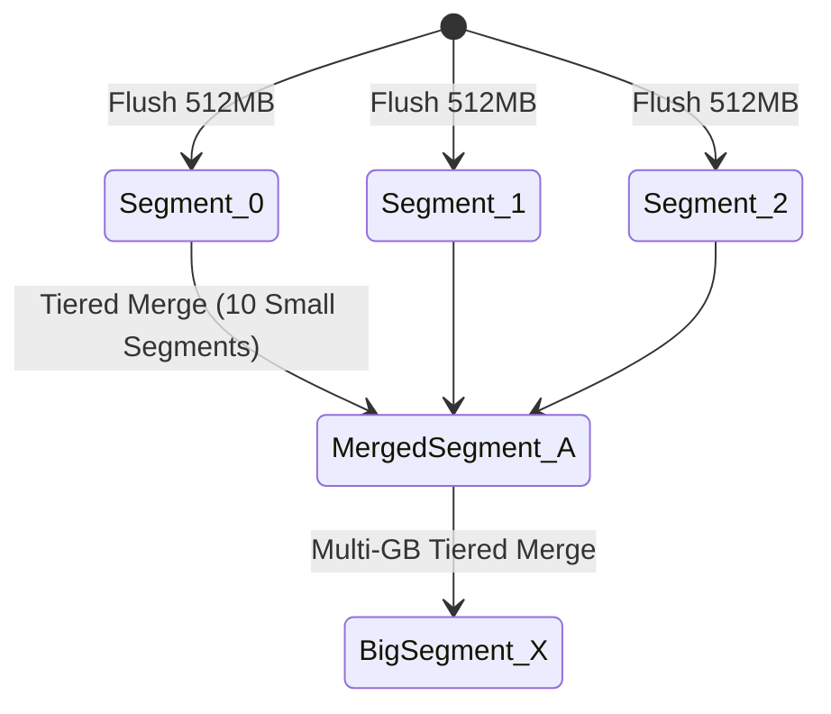

# Lucene Directory Abstraction, IndexWriter & Tiered Segment Merging

## 1. Lucene `Directory` Abstraction & Memory-Mapped I/O

Apache Lucene abstracts file system I/O behind the `org.apache.lucene.store.Directory` interface, decoupling indexing and searching logic from physical storage media.

```mermaid
flowchart TD
    subgraph CoreOS ["Operating System Kernel Space"]
        DISK["Physical Disk Storage (.tim, .tip, .doc, .dvd)"] --> PAGE_CACHE["OS Kernel Page Cache (Virtual Memory)"]
    end

    subgraph LuceneDirectory ["Lucene Directory Implementations"]
        PAGE_CACHE <==>|mmap() Zero-Copy Address Mapping| MMAP["MMapDirectory (Production Default)"]
        PAGE_CACHE <==>|FileChannel.read() Syscalls| NIO["NIOFSDirectory (Multi-Threaded I/O)"]
    end

    subgraph JVM ["JVM Heap Space"]
        MMAP --> SEARCHER["IndexSearcher (Direct Pointer Reads)"]
        NIO --> SEARCHER
    end

    style CoreOS fill:#1e1e2e,stroke:#89b4fa,stroke-width:2px,color:#cdd6f4
    style LuceneDirectory fill:#181825,stroke:#f9e2af,stroke-width:2px,color:#cdd6f4
    style JVM fill:#1e1e2e,stroke:#a6e3a1,stroke-width:2px,color:#cdd6f4
```

### 1.1 `MMapDirectory` Superiority
`MMapDirectory` uses the POSIX `mmap()` system call to map Lucene segment files directly into the process's 64-bit virtual memory address space. This provides three critical performance advantages:
1. **Zero-Copy Reads**: Bypasses copying data from kernel space to JVM byte arrays.
2. **Off-Heap Memory Footprint**: Keeps index memory in the OS page cache, eliminating JVM Garbage Collection (GC) pauses.
3. **Automatic Page Eviction**: The OS kernel automatically manages page eviction based on system memory pressure.

---

## 2. `IndexWriter` Architecture & Segment Flushes

An `IndexWriter` accepts document additions and updates concurrently across multiple application threads.

```
 [ Thread 1 ] \                                +-------------------------------+
 [ Thread 2 ] -- > [ DocumentsWriterPerThread ] | In-Memory Buffer (e.g. 512MB) |
 [ Thread 3 ] /                                +-------------------------------+
                                                               | (Flush Triggered)
                                                               v
                                                [ New Immutable Segment _0.cfs ]
```

### 2.1 Commit Points & Near-Real-Time (NRT) Search
* **`IndexWriter.commit()`**: Writes a new `segments_N` file to disk, calling `fsync()` to guarantee durability.
* **Near-Real-Time (NRT) Search**: Opening an `IndexReader` via `DirectoryReader.open(IndexWriter)` allows searching newly flushed in-memory segments **before** an expensive `fsync()` commit operation occurs.

---

## 3. Tiered Segment Merging (`TieredMergePolicy`)

As index flushes occur, the index accumulates dozens of small immutable segments. `TieredMergePolicy` groups segments of roughly equal size into tiers and merges them in background threads:



* **Deletion Reconciliation**: Deletions do not modify immutable segment files; they write to a bitset file (`.del`). During segment merging, deleted document slots are permanently purged.

---

## 4. Production-Grade C++ Simulator: Directory, Segment Flush & Tiered Merge Engine

The following C++ engine simulates Lucene `IndexWriter` memory buffer flushing, segment generation, and `TieredMergePolicy` merging:

```cpp
#include <iostream>
#include <vector>
#include <string>
#include <algorithm>
#include <memory>

struct Segment {
    std::string name;
    size_t doc_count;
    size_t size_bytes;
    bool has_deletions;
};

class SimulatedIndexWriter {
private:
    size_t ram_buffer_limit_bytes;
    size_t current_buffer_bytes = 0;
    int segment_counter = 0;
    std::vector<Segment> segments;

public:
    explicit SimulatedIndexWriter(size_t buffer_limit) 
        : ram_buffer_limit_bytes(buffer_limit) {}

    void AddDocument(size_t doc_size_bytes) {
        current_buffer_bytes += doc_size_bytes;
        if (current_buffer_bytes >= ram_buffer_limit_bytes) {
            FlushSegment();
        }
    }

    void FlushSegment() {
        std::string name = "_" + std::to_string(segment_counter++) + ".cfs";
        Segment seg{name, current_buffer_bytes / 100, current_buffer_bytes, false};
        segments.push_back(seg);

        std::cout << "[IndexWriter Flush] Flushed In-Memory Buffer to New Segment: " 
                  << seg.name << " (" << seg.size_bytes << " bytes)" << std::endl;

        current_buffer_bytes = 0;
        MaybeMergeSegments();
    }

    void MaybeMergeSegments() {
        // Simple TieredMergePolicy simulation: merge when 4 segments of similar size accumulate
        if (segments.size() >= 4) {
            std::cout << "\n[TieredMergePolicy Triggered] Merging " << segments.size() 
                      << " small segments into 1 consolidated segment..." << std::endl;

            size_t total_docs = 0;
            size_t total_bytes = 0;

            for (const auto& seg : segments) {
                total_docs += seg.doc_count;
                total_bytes += seg.size_bytes;
            }

            segments.clear();
            std::string merged_name = "_" + std::to_string(segment_counter++) + "_merged.cfs";
            segments.push_back({merged_name, total_docs, total_bytes, false});

            std::cout << "  -> Created Merged Segment: " << merged_name 
                      << " (" << total_bytes << " bytes, " << total_docs << " docs)" << std::endl;
        }
    }

    void Commit() const {
        std::cout << "\n[IndexCommit] Issuing fsync() to Directory. Active Segments in commit point (segments_N):" << std::endl;
        for (const auto& seg : segments) {
            std::cout << "  - " << seg.name << " | Docs: " << seg.doc_count << std::endl;
        }
    }
};

int main() {
    SimulatedIndexWriter writer(500); // 500 byte RAM buffer limit

    std::cout << "Indexing Documents into Simulated Lucene Engine..." << std::endl;
    for (int i = 0; i < 20; ++i) {
        writer.AddDocument(120); // Each document is 120 bytes
    }

    writer.Commit();
    return 0;
}
```

---

## 5. Summary & Key Engineering Principles

1. **`MMapDirectory` Memory Efficiency**: Leverages Linux kernel `mmap()` to eliminate JVM heap garbage collection overhead.
2. **Immutable Segment Lifecycle**: Flushes memory buffers into immutable segment files, ensuring fast thread-safe concurrent searches without lock contention.
3. **Background Tiered Merges**: Consolidated merging keeps total active segment counts low while purging deleted document tombstones.
