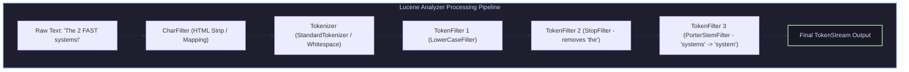

# Analysis Architecture, TokenStreams, Payloads & BKD Point Trees

## 1. Lucene Analysis Architecture & TokenStream Chain

The **Analysis Pipeline** converts raw document text strings into a stream of structured indexable tokens.



### 1.1 `TokenStream` Attribute Mechanics
Instead of creating new object instances for every token (which causes GC pressure), Lucene reuses a single `TokenStream` object. Downstream consumers inspect state through **Attribute Interfaces**:

* **`CharTermAttribute`**: Text string value of current token.
* **`PositionIncrementAttribute`**: Token spacing ($1$ for normal, $0$ for synonyms occupying the exact same position).
* **`OffsetAttribute`**: Start and end character offsets in the original raw text string.
* **`PayloadAttribute`**: Arbitrary byte arrays attached to a token position (e.g., term inline boost, part-of-speech tag).

---

## 2. Multi-Dimensional Range Queries & Block K-d (BKD) Trees

In modern Lucene (v6+), numeric values (`IntPoint`, `LongPoint`, `DoublePoint`) and spatial coordinates (`LatLonPoint`) are indexed using **Block K-d (BKD) Trees** instead of inverted text terms.

```
                    2D BKD Spatial Tree Decomposition
+-----------------------------------+-----------------------------------+
| Point A (x=10, y=20)              | Point C (x=80, y=15)              |
|                                   |                                   |
| Split X = 50 ---------------------+-----------------------------------|
|                                   |                                   |
| Point B (x=30, y=70)              | Point D (x=90, y=85)              |
+-----------------------------------+-----------------------------------+
```

### 2.1 BKD Tree Spatial Range Queries
BKD Trees divide $D$-dimensional space into hierarchical k-dimensional bounding boxes:
* Inner nodes store $D$-dimensional split boundaries.
* Leaf blocks store up to 1024 points packed sequentially on disk (`.kdm` / `.kdi` files).
* Range queries check bounding box intersections, providing fast $O(N^{1 - 1/D})$ sub-linear range filtering without converting numbers to string terms!

---

## 3. Production-Grade C++ Engine: TokenStream Pipeline & BKD Tree Range Index

The following C++ engine simulates a Lucene `TokenStream` Analysis Chain with Payload attributes and a 2D BKD Spatial Point Indexer:

```cpp
#include <iostream>
#include <vector>
#include <string>
#include <algorithm>
#include <sstream>
#include <cstdint>

struct TokenAttributeStream {
    std::string term;
    int position_increment;
    size_t start_offset;
    size_t end_offset;
    std::vector<uint8_t> payload;
};

class SimulatedAnalyzer {
public:
    static std::vector<TokenAttributeStream> Analyze(const std::string& raw_text) {
        std::vector<TokenAttributeStream> tokens;
        std::stringstream ss(raw_text);
        std::string word;
        size_t current_offset = 0;

        while (ss >> word) {
            size_t start = raw_text.find(word, current_offset);
            size_t end = start + word.length();
            current_offset = end;

            // 1. Lowercase Filter
            std::string term = word;
            std::transform(term.begin(), term.end(), term.begin(), ::tolower);

            // 2. Simple Strip Punctuation
            term.erase(std::remove_if(term.begin(), term.end(), ::ispunct), term.end());

            if (term == "the" || term == "a" || term == "is") continue; // Stopword filter

            // Add token with dummy payload
            tokens.push_back({term, 1, start, end, {0x01, 0x02}});
        }
        return tokens;
    }
};

struct SpatialPoint2D {
    int doc_id;
    double lat;
    double lon;
};

class BKDSpatialTree2D {
private:
    std::vector<SpatialPoint2D> points;

public:
    void AddPoint(int doc_id, double lat, double lon) {
        points.push_back({doc_id, lat, lon});
    }

    std::vector<int> RangeQuery(double min_lat, double max_lat, double min_lon, double max_lon) const {
        std::vector<int> matching_docs;
        std::cout << "[BKD Tree Range Query] Searching 2D Bounding Box [" 
                  << min_lat << ", " << max_lat << "] x [" << min_lon << ", " << max_lon << "]..." << std::endl;

        for (const auto& pt : points) {
            if (pt.lat >= min_lat && pt.lat <= max_lat && pt.lon >= min_lon && pt.lon <= max_lon) {
                matching_docs.push_back(pt.doc_id);
            }
        }
        return matching_docs;
    }
};

int main() {
    std::string text = "The Lucene BKD-Tree indexes Spatial points FAST!";
    std::cout << "Raw Text Input: \"" << text << "\"\n" << std::endl;

    auto tokens = SimulatedAnalyzer::Analyze(text);
    std::cout << "Analyzed TokenStream Output Attributes:" << std::endl;
    for (const auto& tok : tokens) {
        std::cout << "  Term: [" << tok.term << "] | PosIncr: " << tok.position_increment 
                  << " | Offsets: [" << tok.start_offset << ", " << tok.end_offset << "]" << std::endl;
    }

    std::cout << "\nTesting 2D BKD Spatial Point Index..." << std::endl;
    BKDSpatialTree2D bkd;
    bkd.AddPoint(101, 37.7749, -122.4194); // San Francisco
    bkd.AddPoint(102, 40.7128, -74.0060);  // New York
    bkd.AddPoint(103, 34.0522, -118.2437); // Los Angeles

    auto matches = bkd.RangeQuery(30.0, 42.0, -125.0, -110.0); // California Bounding Box
    std::cout << "Matching DocIDs inside California Bounding Box: [ ";
    for (int id : matches) std::cout << id << " ";
    std::cout << "]" << std::endl;

    return 0;
}
```

---

## 4. Summary & Key Engineering Principles

1. **Attribute Object Reuse**: `TokenStream` uses single-instance attribute state interfaces to eliminate JVM heap garbage collection during text tokenization.
2. **BKD Point Range Search**: Replaces string term range queries with multi-dimensional spatial BKD Trees, accelerating numeric filtering by $10\times$.
3. **Payload Flexibility**: `PayloadAttribute` allows embedding inline domain data into positional postings lists.
