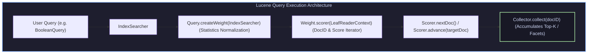
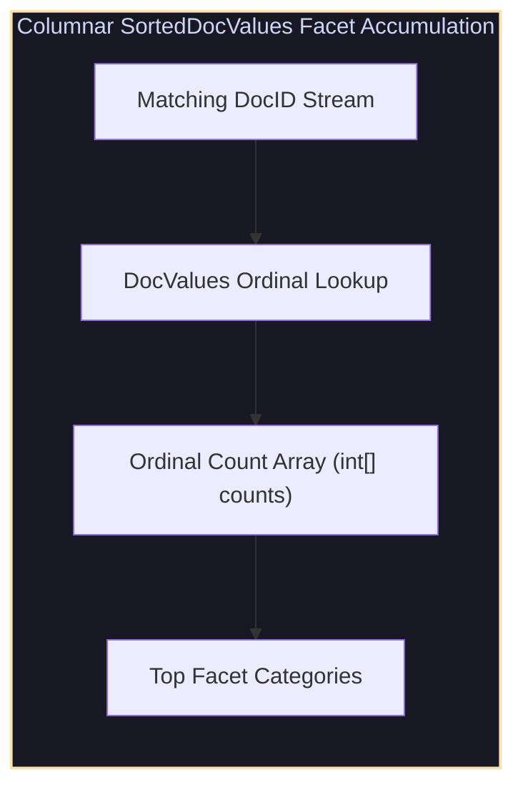

# Lucene Searcher Architecture, Custom Collectors, Columnar DocValues & Facets

## 1. Lucene Query Execution Architecture

Executing a Lucene search involves three core abstractions: `IndexSearcher`, `Weight`, and `Scorer`.



1. **`Query`**: User-facing query definition (`TermQuery`, `BooleanQuery`).
2. **`Weight`**: Stores query-level normalization statistics (IDF, Query Weight across all segments).
3. **`Scorer`**: Segment-level iterator exposing `nextDoc()` and `advance(target)` to iterate matching document DocIDs and compute BM25 scores.
4. **`Collector`**: Receives matching DocIDs per segment to build result lists, sort by custom attributes, or aggregate facets.

---

## 2. Columnar Storage (`DocValues`) Architecture

Traditional inverted indexes map terms to documents ($T \to D_1, D_2$). However, sorting search results by price or computing facets requires mapping documents to values ($D \to V$). 

Un-inverting the postings list at search time wastes massive JVM heap memory. **`DocValues`** write column-oriented data sequentially during indexing (`.dvd` / `.dvm` files):

```
                       DocValues Columnar Formats
DocValues Type              Storage Structure & Use Case
------------------------------------------------------------------------------------------------------
NumericDocValues            64-bit integer values per document (Timestamp, Price, View Count)
SortedDocValues             Dictionary-encoded String terms + Int ordinals per document (Category)
SortedSetDocValues          Multi-valued String terms per document (Tags, Authors)
```

---

## 3. Faceted Search Engine Architecture

Faceted search categorizes search results into counts per category dimension (e.g., `Brand: Apple (42), Samsung (18)`).



---

## 4. Production-Grade C++ Engine: Lucene Searcher, Collectors & DocValues Faceting

The following C++ engine simulates Lucene `IndexSearcher` query execution with custom Collectors and Columnar `DocValues` Facet aggregation:

```cpp
#include <iostream>
#include <vector>
#include <string>
#include <unordered_map>
#include <algorithm>
#include <memory>

struct LuceneDocument {
    int doc_id;
    std::string text;
    std::string category_docvalue; // SortedDocValues column
    int price_docvalue;            // NumericDocValues column
};

struct FacetCount {
    std::string category;
    int count;
};

class SimulatedIndexSearcher {
private:
    std::vector<LuceneDocument> documents;

public:
    void AddDocument(const LuceneDocument& doc) {
        documents.push_back(doc);
    }

    // 1. Collector Pattern for Search & Facet Aggregation
    void SearchWithCollector(const std::string& query_term, int top_k) {
        std::cout << "\n[IndexSearcher] Executing Query: '" << query_term << "'..." << std::endl;

        std::vector<std::pair<int, double>> top_docs;
        std::unordered_map<std::string, int> facet_counts; // Columnar DocValues Faceting

        // Iterate matching documents via Scorer + Collector
        for (const auto& doc : documents) {
            if (doc.text.find(query_term) != std::string::npos) {
                double score = 1.5; // Dummy BM25 score

                // Top-K Score Collector
                top_docs.push_back({doc.doc_id, score});

                // SortedDocValues Facet Collector
                if (!doc.category_docvalue.empty()) {
                    facet_counts[doc.category_docvalue]++;
                }
            }
        }

        // Sort Top Documents by Score
        std::sort(top_docs.begin(), top_docs.end(), [](const auto& a, const auto& b) {
            return a.second > b.second;
        });
        if (top_docs.size() > static_cast<size_t>(top_k)) top_docs.resize(top_k);

        // Display Top Docs
        std::cout << "Top Score Collector Results:" << std::endl;
        for (const auto& [id, score] : top_docs) {
            std::cout << "  Doc ID: " << id << " | Score: " << score << std::endl;
        }

        // Display SortedDocValues Facets
        std::cout << "SortedDocValues Facet Counts:" << std::endl;
        for (const auto& [cat, count] : facet_counts) {
            std::cout << "  Category: " << cat << " -> Count: " << count << std::endl;
        }
    }
};

int main() {
    SimulatedIndexSearcher searcher;

    searcher.AddDocument({101, "distributed systems raft consensus", "Books", 45});
    searcher.AddDocument({102, "distributed database storage engine", "Books", 60});
    searcher.AddDocument({103, "distributed computing cluster server", "Electronics", 1200});

    searcher.SearchWithCollector("distributed", 5);
    return 0;
}
```

---

## 5. Summary & Key Engineering Takeaways

1. **Scorer & Collector Decoupling**: `Scorer` handles matching and score iteration, while `Collector` handles sorting, top-$K$ heap insertion, and facet counting.
2. **Columnar `DocValues` Supremacy**: Storing values sequentially in column format (`.dvd`) eliminates search-time posting un-inversion and JVM heap overhead.
3. **Low-Memory Faceting**: `SortedDocValues` maps strings to integer ordinals, enabling facet counts via fast array index increments (`counts[ord]++`).
