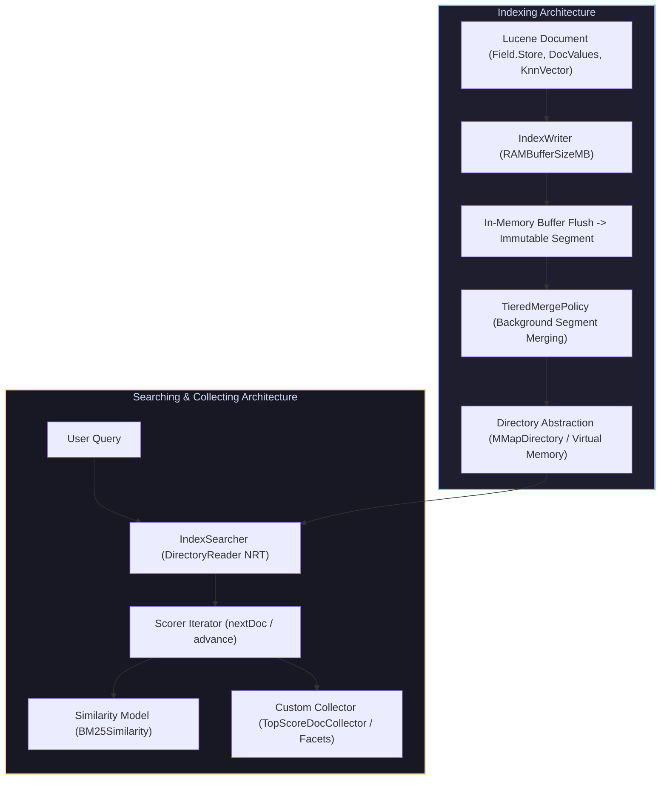

# Lucene in Action (McCandless, Hatcher, Gospodnetić)

Welcome to the **Lucene in Action Masterclass Module**. This module covers the low-level library internals of Apache Lucene, including the `Directory` I/O abstraction (`MMapDirectory`), `IndexWriter` segment creation, `TieredMergePolicy`, Near-Real-Time (NRT) search, the `Analyzer` & `TokenStream` pipeline, Block K-d (BKD) Trees for spatial/numeric range queries, custom `Similarity` scoring, the `Collector` API, Columnar `DocValues`, and Faceted Search.

---

## 1. Lucene Core Architecture

---

## 2. Module Navigation Map

| File | Description | Core Topics |
| :--- | :--- | :--- |
| **[`00_lucene_cheatsheet.md`](00_lucene_cheatsheet.md)** | 30-Second Lucene Cheatsheet | Index files map (`.tim`, `.tip`, `.doc`, `.fdx`, `.dvd`), TokenStream attributes, `Directory` comparison (`MMapDirectory` vs `NIOFSDirectory`), BKD Tree math, Merge policy formulas. |
| **[`01_directory_indexwriter_and_segment_merging.md`](01_lucene_indexing_directory_and_segment_merging/01_directory_indexwriter_and_segment_merging.md)** | Directory & Segment Merging | `MMapDirectory` kernel page cache mapping, `IndexWriter` buffer flushing, `TieredMergePolicy`, Commit points (`segments_N`), Near-Real-Time (NRT) `DirectoryReader`, Complete C++ Directory Engine, Mermaid diagram. |
| **[`02_analyzer_tokenstream_payloads_and_bkd_points.md`](02_analysis_pipeline_tokenstreams_and_bkd_trees/02_analyzer_tokenstream_payloads_and_bkd_points.md)** | Analysis Pipeline & BKD Trees | `Analyzer`, `Tokenizer`, `TokenFilter` chain, Reusable `TokenStream` attributes (`CharTermAttribute`, `PayloadAttribute`), Block K-d (BKD) Tree spatial indexing, Complete C++ TokenStream & BKD Engine, Mermaid diagram. |
| **[`03_query_scoring_collectors_docvalues_and_facets.md`](03_searching_custom_collectors_docvalues_and_facets/03_query_scoring_collectors_docvalues_and_facets.md)** | Searchers, Collectors & DocValues | `IndexSearcher`, `Weight`, `Scorer` iterator (`nextDoc()`), Custom `Collector` API (`TopScoreDocCollector`), Columnar `DocValues` (`SortedDocValues`), Taxonomy Faceting, Complete C++ Custom Searcher Engine, Mermaid flowchart. |

---

## 3. Key Lucene Engineering Laws

1. **Segment Immutability**: Lucene segments are strictly write-once, read-many (WORM) immutable data files. Deletions use bitset tombstones (`.del`) reconciled during background segment merges.
2. **`MMapDirectory` Dominance**: For production Linux search systems, `MMapDirectory` leverages OS virtual memory mapping (`mmap`), allowing zero-copy memory reads directly from the OS page cache without JVM heap overhead.
3. **Columnar `DocValues` for Sorting/Faceting**: Avoid un-inverting the row-based inverted index at search time! `DocValues` store column-oriented data sequentially on disk (`.dvd` / `.dvm`), enabling instantaneous sorting, aggregation, and faceting.
